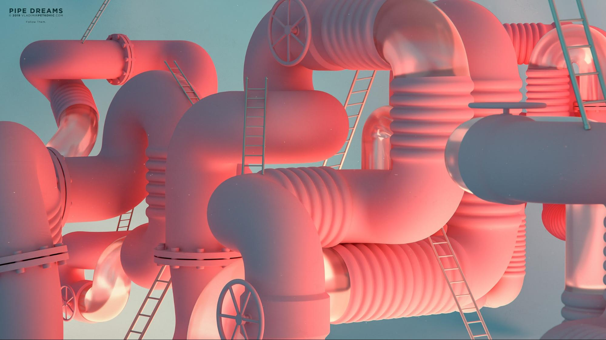
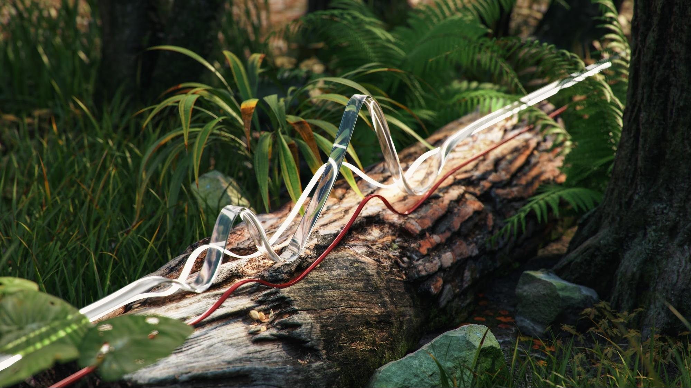
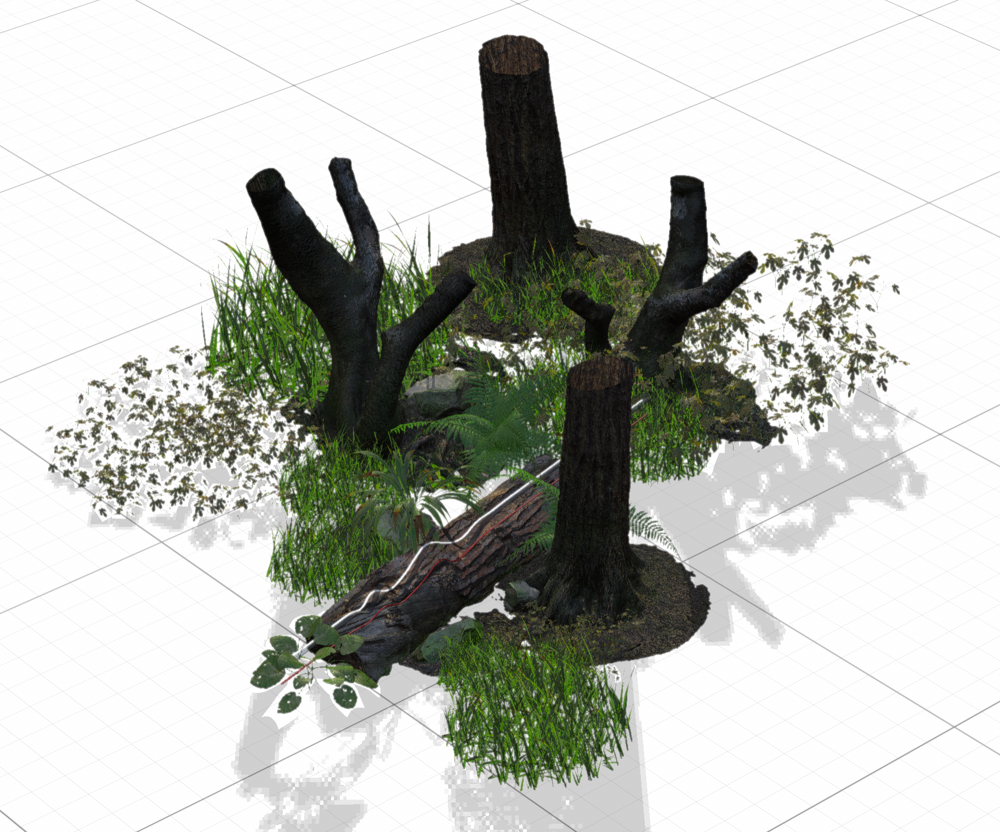

# CGI에서 3D 조명 마스터를 위한 팁 및 기술

3D 조명 및 컴퓨터에서 생성된 장면을 완전히 바꿀 수 있는 다양한 조명 조건을 만드는 방법과 개체가 조명 안에서 표시되는 방식에 대해 알아봅니다.

우리는 감각을 이용해서 우리 주변의 세계를 감지합니다. 우리는 듣고, 느끼고, 냄새를 맡고, 봅니다. 우리가 볼 수 있는 것은 우리의 눈이 광자라는 소립자가 우리에게 가져온 정보를 포착하기 때문입니다. 이 정보는 우리의 뇌에서 처리되어 이미지를 만들어냅니다. 우리가 개체 색상, 광택, 투명도 또는 금속성으로 해석하는 것은 모두 광자와 개체 표면 사이의 상호 작용의 산물입니다.

컴퓨터에서 생성된 3D 장면의 조명 역학은 광자 산란과 동일한 자연 원리를 따른다는 과정을 거친다 [광선 추적](https://en.wikipedia.org/wiki/Ray_tracing_(graphics)). 광선은 모양에서 산란되고 해당 재질과 상호 작용하여 개체가 최종 이미지에 나타나는 방식을 효과적으로 정의합니다. 조명은 3D 장면에 있는 모든 항목의 차원을 노출합니다.

어떤 재질은 다른 재질보다 조명 조건에 더 민감합니다. 예를 들어 금속을 예로 들 수 있습니다. 크롬 개체는 기본적으로 주변의 모든 것을 반사합니다. 조명이 이동하거나, 더 밝아지거나, 커지면 모든 정보가 거울과 같은 수준으로 크롬 표면에 직접 표시되어 조명 조건에 따라 완전히 다르게 보일 수 있습니다.

## 3D 조명을 사용하여 효과적인 3D 렌더링을 만드는 방법

3D 렌더링을 만드는 프로세스는 완전히 동일하지는 않지만 가장 일반적인 단계는 다음과 같습니다.

1. 객체 생성 또는 획득
1. 장면 어셈블리
1. 장면 프레임 지정
1. **조명**
1. 재료 생성 또는 지정
1. 렌더링

조명 단계가 되면 재질 작업을 하기 전에 조명을 설정하는 것이 좋습니다. 이를 위해 전체 장면에 중간 톤의 회색 매트 재질을 지정할 수 있습니다. 이렇게 하면 조명이 장면에서 개체 실루엣에 어떤 영향을 미치는지 보다 명확하게 파악하고 이해할 수 있습니다. 재질이 완성되면 조명을 더 정교하게 다듬어야 할 수도 있습니다.

조명은 한 번에 하나씩 켜는 것이 가장 좋습니다. 활성 조명은 장면에 표시되는 유일한 조명이어야 하며 다른 모든 조명은 일시적으로 꺼야 합니다. 이렇게 하면 특정 조명이 장면에 어떻게 영향을 주는지 확인하고 위치, 방향, 강도 등의 속성을 사용하여 변경할 수 있습니다.

또 다른 유용한 방법은 반짝이는 금속 재질(크롬 또는 거울)로 구를 만드는 것입니다. 이 &quot;미러 볼&quot;은 볼을 둘러 싼 전체 장면을 효과적으로 비추므로 조명의 위치, 방향 또는 크기를 쉽게 확인할 수 있습니다. 환경 조명의 경우, 미러 볼에 반사된 모습을 볼 수 있으며, 이것은 공간에서 방향을 설정하는 데 도움이 됩니다.

## Adobe의 조명 유형 [!DNL Dimension]

### 환경 조명

환경 조명은 전체 장면 주위를 감싸는 정방형(구형) 이미지입니다. 이름에서 알 수 있듯이, 이러한 조명은 자체에 저장된 광원을 포함하여 전체 환경을 모방하는 역할을 합니다.

에서 새 장면을 만들 때 [[!DNL Dimension]](https://www.adobe.com/products/dimension.html)에서 기본 환경 조명이 자동으로 생성됩니다. 이것이 바로 여러분이 장면에서 즉시 어떤 것을 실제로 볼 수 있는 이유입니다. Adobe [!DNL Dimension] 스타터 에셋에는 즉시 사용할 수 있는 특정 개수의 환경 조명이 포함되어 있습니다. 게다가 [Adobe [!DNL Stock]](https://stock.adobe.com/search?filters[content_type:3d]=1&amp;filters[3d_type_id][0]=2&amp;load_type=3d+lp) 는 방대한 양의 큐레이션된 환경 조명을 제공합니다.

환경 조명은 매우 현실적인 결과를 만들어 내고 시간을 많이 절약할 수 있습니다. 이와 유사한 결과를 수동으로 달성하려면 실제로 전체 환경을 3D(다양한 광원 포함)로 생성해야 하는데, 이 작업량은 상당히 많습니다.

3D 장면이나 사진에서 캡처하고 파라메트릭 시스템을 사용하는 등 다양한 방법으로 환경 조명을 만들 수 있습니다. 3D 장면으로 환경 조명을 만드는 경우 프로세스는 간단합니다. 출력 이미지는 32비트여야 하며, 이는 장면에 있는 모든 조명의 조명 정보를 캡처합니다. 3D 카메라는 구형 이미지를 출력하기 위해 정방형 투영을 사용해야 합니다.

실제 사진을 캡처하여 환경 조명을 만들 수도 있습니다. 이 작업 과정에는 360 카메라가 필요합니다(예: [Ricoh Theta Z1](https://theta360.com/en/about/theta/z1.html)). 이 카메라는 노출 브래키팅에 사용되거나 다양한 노출 값 범위(노출 부족에서 과다 노출)로 동일한 환경을 여러 번 촬영하는 데 사용됩니다. 이러한 샷은 HDR(High Dynamic Range)이라고도 하는 32비트 이미지를 만드는 데 사용됩니다. 이러한 이미지를 결합하는 한 가지 방법은 Photoshop의 HDR로 병합 기능을 사용하는 것입니다. 포함된 노출 범위는 강도 속성이 됩니다.

두 경우 모두 광원(및 강도)이 이러한 이미지에 &quot;적용&quot;되며, 사용된 후에 빛을 방출합니다 [!DNL Dimension].

이러한 방법으로 필요한 모든 조명, 반사 및 세부 사항을 캡처했지만 3D 앱을 사용하면 3D 공간에서 계속 편집할 수 있으므로 조명 회전을 조정하고 전체 강도와 색상을 변경할 수 있습니다.

### 직접 조명

360도에서 빛을 발산하는 환경 조명 외에도 한 방향에서만 빛을 발산하는 직접 조명도 있습니다. 직접 조명은 정확히 조율된 방출기에서 나오는 플래시 및 기타 유형의 조명을 모방하는 데 사용되며, 원이나 사각형 모양으로 형성될 수 있습니다.

직접 조명을 사용하면 조명 설정을 완벽하게 제어할 수 있습니다. 이러한 조명을 사용하여 장면에 조명을 비추는 것은 기존 사진과 동일한 방식으로 이루어지며, 각 조명을 독립적으로 제어할 수 있어 자신만의 가상 사진 조명을 구축할 수 있습니다. 가장 일반적으로 사용되는 조명 설정 중 하나는 3점 조명 시스템입니다.

[!DNL Dimension] 3D 개체를 클릭하고 드래그하여 회전과 높이를 제어할 수 있는 지점에 조명 조준이라는 편리한 작업이 있습니다. 이렇게 하면 광선을 동적으로 조정할 수 있습니다. 이러한 매개 변수는 수동으로 조정할 수도 있습니다.

직접 조명의 색상과 강도를 변경할 수 있을 뿐만 아니라 광원의 모양을 원형이나 직사각형으로 만들거나, 늘이거나, 더 크게 만들면서 조정할 수 있습니다. 마지막으로 광원의 가장자리를 부드럽게 만들 수 있습니다.

![Adobe에서 직접 조명의 모양 수정 [!DNL Dimension]](assets/Mastering3dlighting_12.gif)

광원을 개체보다 작게 만들면 광선이 조명이 비추는 개체를 통과하지 못하므로 그림자가 뚜렷한 윤곽선으로 더 선명해집니다. 광원이 클수록 그림자가 부드러워집니다. 이 경우 광선이 개체의 모든 측면(아래 그림에서 빨간색으로 표시됨)에서 나와 그림자 배열을 만들기 때문입니다. 이러한 그림자는 반대 방향에서 나오는 광선에 의해 부드러워집니다.

### 태양과 하늘

햇빛은 특별한 유형의 직접 조명입니다. 설정 과정은 일반 직접 조명과 매우 유사하지만 이 조명은 높이에 따라 자동으로 색상을 변경합니다. 수평선에 가까워지면(높이 각도 값이 낮음) 일몰을 시뮬레이션하기 위해 점차 따뜻해집니다. 사전 설정을 사용하여 색상을 변경할 수도 있습니다. 한편, 흐림은 그림자 부드러움에 영향을 줍니다.

![Adobe에서 3D 자동차 모델의 햇빛 조명을 위해 조명 속성 조작 [!DNL Dimension]](assets/Mastering3dlighting_15.gif)

환경 조명을 사용하여 하늘을 모방할 수 있으며 하늘의 특징을 구현한 모든 환경 조명을 사용할 수 있습니다. 이제 햇빛을 정렬해야 합니다. [!DNL Dimension]) 를 환경 조명에서 캡처한 태양과 함께 이를 위한 빠른 방법은 구를 만들고 금속 재료를 구에 지정하는 것입니다. 이를 통해 환경의 실시간 반사를 제공하므로 지점에 조명 조준을 사용하여 햇빛을 태양과 함께 정렬할 수 있습니다.

환경 조명이 흐린 하늘을 표현하는 경우, 흐림 속성을 사용하여 이러한 조건을 더욱 근접하게 일치시킬 수 있습니다.

![Adobe에서 3D 자동차 모델의 하늘 환경 조명을 위해 흐림 속성 조작 [!DNL Dimension]](assets/Mastering3dlighting_17.gif)

햇빛과 하늘 환경 조명이 페어링되면 전체 회전 속성을 사용하여 함께 회전할 수 있습니다.

### 개체 기반 조명

재질에 대해 광선 속성을 설정하여 개체를 광원으로 바꿀 수 있습니다. 이렇게 하면 전구, 네온 조명, 소프트박스, 모든 종류의 스크린과 디스플레이 같은 개체를 만들 수 있습니다.

이러한 유형의 조명을 사용할 때의 주요 이점은 매우 자연스러운 결과를 생성하는 강도 밝기 감소입니다. 이는 제품 시각화 또는 기타 스튜디오 기반 장면에 매우 유용합니다.

변형 도구를 사용하여 광선 개체의 크기를 위나 아래로 조정함으로써 그림자의 부드러움을 제어할 수 있습니다. 또한 더 크게 만들면 조명 강도가 높아집니다.

앞서 살펴본 조명 유형과 달리 이러한 조명은 일반 색상 외에도 텍스처를 활용할 수 있습니다. 텍스처는 재질의 기본 색상에 부착될 수 있으며 조명 강도는 광선 슬라이더를 통해 제어됩니다.

## 효과적인 3D 조명의 예

### 제품 조명

다양한 사진 기술로 제품 사진의 조명을 설정할 수 있습니다. 가장 일반적으로 사용되는 설정 중 하나인 3점 조명 시스템을 사용하겠습니다.

이 설정은 세 개의 조명으로 구성됩니다.

1. **키 표시등:** 기본 광원으로 사용되는 이것은 대략적으로 카메라의 방향에서 비춥니다.

   

1. **역광 조명:** 키에서 반대쪽을 향하여 대상의 실루엣을 노출하는 데 사용됩니다.

   

1. **보조광:** 덜 집중되고 어두운 영역을 채우기 위해 사용됩니다. 이 설정은 이전 두 개의 조명이 도달하지 못하는 영역에 사용됩니다.

   

에서 3점 조명을 만드는 방법에는 두 가지가 있습니다 [!DNL Dimension] - 직접 조명 사용(장면에 개별적으로 조명을 추가하거나 3점 조명 사전 설정 사용) 또는 광선 개체 사용

### 크리에이티브 조명

크리에이티브 조명은 물리적인 정확성이 주요 목표가 아닌 경우에 사용됩니다. 여기에는 모든 종류의 추상적이고 초현실적인 장면들이 포함되므로, 우리의 상상력이 우리를 끌어갈 수 있는 진정한 경계는 없다.

위의 예에서, 그 아이디어는 꿈과 같은 환경을 묘사하는 것이었다: 캔디, 파스텔 색상, 부드러운 표면 등 조명 시스템은 3개의 광선 플레이트(측면에 2개, 하단에서 비추는 메인 플레이트 1개)로 만들어집니다. 광선 플레이트는 비현실적으로 커서 매우 부드러운 그림자와 하이라이트를 만듭니다. 광원은 색상이 지정되고 해당 색상은 장면의 개체에 지정된 재질로 전달됩니다.

장면의 대상(파이프)은 벽 도형으로 완전히 둘러싸여 있습니다. 그러면 광선이 앞뒤로 산란되어 흥미로운 방식으로 혼합됩니다. 시원한 톤과 따뜻한 톤을 대조하여 활용하면 멋진 대비가 생성되는 경우가 많습니다(인물 사진 촬영에 종종 사용되는 기법).

### 내부 시각화

3D 실내 공간의 시각화를 만드는 것은 거의 항상 좋은 결과를 보장하는 특정 규칙 세트를 따릅니다. 이 사용 사례에서는 자연광만 고려합니다(램프와 같은 인공 광원 없음).

무엇보다도 이와 같은 장면은 폐쇄된 환경에 있어야 합니다. 실생활과 마찬가지로 실내에도 벽, 바닥, 천장, 창문이 필요합니다. 이렇게 하면 조명이 창을 통해 들어온 다음 광선 추적이라는 프로세스를 통해 주변으로 산란됩니다. 이 동작은 매우 자연스러운 조명을 만듭니다. 예를 들어, 모퉁이와 같이 가려진 영역은 더 어두워집니다.

이 장면은 건축학적 도형으로 거의 완전히 둘러싸여 있으므로 조명이 거의 보이지 않고 환경 조명에서 반사가 거의 발생하지 않습니다. 하지만 이 경우, 우리는 실내장인 우리 자신의 환경을 실제로 만들고 있습니다. 따라서 조명은 개체와 주변 벽에서 산란되면서 장면의 개체와 반응합니다. 개체는 서로와 주변의 벽만 반사합니다. 그럼에도 불구하고 하늘의 특징을 구현한 환경 조명을 추가하는 것이 좋습니다. 그러면 분산된 파란색 채우기가 추가됩니다.

이 조명을 설정하는 가장 쉬운 방법은 광선 재질의 평면을 사용하는 것입니다. 이 사용 사례에는 3개의 평면이 있으며, 이 평면은 실내의 모든 입구를 덮습니다.

조명의 강도는 평면 재질의 광선 속성에 의해 제어됩니다. 색상 또는 텍스처를 추가할 수 있으며, 이를 사용하여 흥미로운 그림자를 만들 수 있습니다. 광선 재질을 사용하면 조명 강도 밝기 감소도 제공되므로 실내 조명에 매우 중요합니다.

### 야외 조명

야외 조명을 만드는 것은 매우 간단하며 태양과 하늘 조명 시스템을 사용하는 것으로 요약됩니다(위 참조). 햇빛을 하늘 기반의 환경 조명과 정확하게 일치시키는 것이 중요하며, 방향과 흐림 값 모두에 주의를 기울입니다.

여기에 장면 자체가 큰 역할을 한다. 매력적인 결과를 얻으려면 장면에 있는 개체를 조명과 상호 작용하는 촉매로 사용합니다. 위에 표시된 숲 렌더링에서 개체(다양한 식물, 통나무 및 나무)는 서로 가까이 배치됩니다.

즉, 조명이 개체 간에 산란되므로 복잡한 광선 추적 상호 작용이 많이 발생합니다. 그늘진 부분은 예상대로 어둡게 나타나는 반면, 노출된 부분은 밝습니다.

![Adobe에서 전역 회전 사용 [!DNL Dimension] 3D 장면에서 태양과 하늘 조명 시스템의 방향 재조정](assets/Mastering3dlighting_34.gif)

이 개요가 다양한 상황에서 3D 조명 마스터의 중요성을 설명했으면 합니다. 보다 매력적인 결과를 만들 준비가 되어 있어야 합니다.

좋은 조명! 다운로드 [최신 릴리스](https://creativecloud.adobe.com/apps/download/Dimension) 얻을 수 있는 이점
