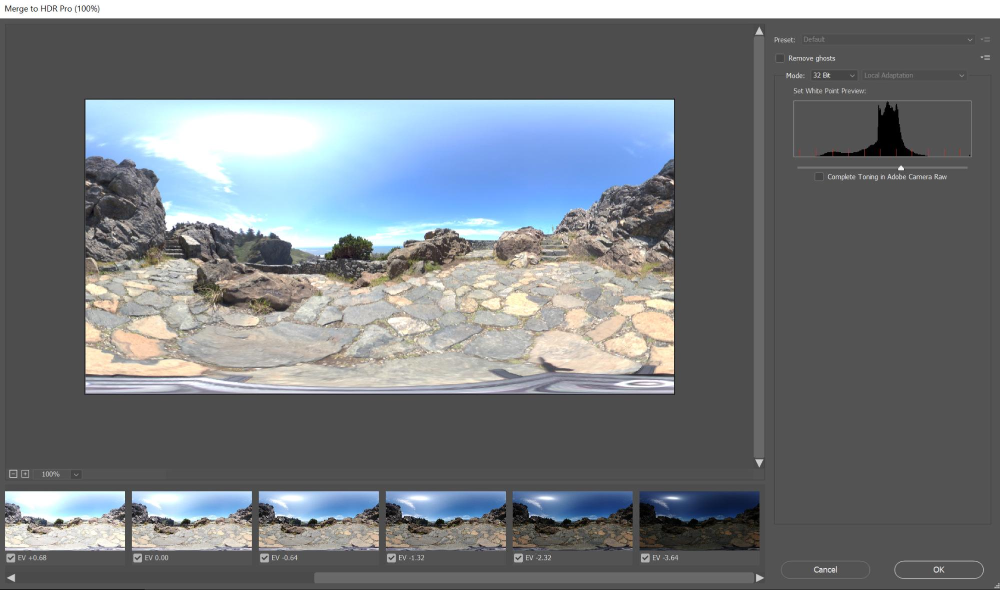

# CGI에서 3D 조명을 마스터하기 위한 팁 및 기술

3D 조명에 대해 알아보고 컴퓨터에서 생성된 장면과 개체가 표시하는 방식을 완전히 변경할 수 있는 다양한 조명 조건을 만드는 방법에 대해 알아봅니다.

우리는 우리의 감각을 이용하여 우리 주변의 세계를 인식합니다. 우리는 듣고, 느끼고, 냄새를 맡고, 봅니다. 우리는 우리의 눈이 광자라고 불리는 초입자들에 의해 우리에게 가져온 정보를 포착하고 있기 때문에 우리는 볼 수 있습니다. 이 정보는 우리의 뇌가 이미지를 만들기 위해 처리한다. 우리가 개체 색상, 광택성, 환광성 또는 금속성으로 해석하는 것은 광자와 물체의 표면 사이의 상호작용의 모든 산물입니다.

컴퓨터에서 생성된 3D 장면의 광 역학은 [ray tracing](https://en.wikipedia.org/wiki/Ray_tracing_(graphics))이라는 과정을 통해 광자 비산의 같은 자연 원리를 따릅니다. 광선은 모양을 반사하고 재료와 상호 작용하여 최종 이미지에 사물이 어떻게 나타나는지 효과적으로 정의합니다. 조명은 3D 장면에 존재하는 모든 것의 차원을 표시합니다.

어떤 재료들은 다른 재료들보다 조명 조건에 더 민감하다. 금속을 예로 들어보자: 크롬 물체는 기본적으로 그 주변의 모든 것을 반영한다. 빛이 이동되거나 밝아지거나 커지면 크롬 표면에 모든 정보가 거의 거울과 같은 세부 정보로 직접 표시되므로 한 광원 상태에서 다른 광원 상태로 완전히 다르게 나타날 수 있습니다.

에서 나오는 네온 LED로 바뀝니다.

## 3D 광원을 사용하여 효과적인 3D 렌더링을 만드는 방법

3D 렌더링을 만드는 과정은 전혀 동일하지 않지만 다음과 같은 일반적인 단계가 있습니다.

1. 객체 생성 또는 인수
1. 장면 어셈블리
1. 장면 프레임
1. **조명**
1. 자재 생성 또는 지정
1. 렌더링

조명 단계에 이르면 재료를 사용하기 전에 조명을 설치하는 것이 좋습니다. 이렇게 하려면 중간 회색 매트 재질을 전체 장면에 할당할 수 있습니다. 이렇게 하면, 여러분은 광원이 장면에서 사물의 윤곽에 어떤 영향을 미치는지 더 명확하게 보고 이해할 수 있을 것입니다. 재료가 완성되면, 조명은 더 세련되어야 할 것이다.

한 번에 하나씩 불을 켜는 것이 가장 좋다. 활성 광원은 장면에서 볼 수 있는 유일한 광원이어야 하고 다른 모든 광원은 일시적으로 꺼져야 합니다. 이렇게 하면 특정 빛이 어떻게 장면에 영향을 미치는지 볼 수 있고, 위치, 방향, 강도 등과 같은 속성을 사용하여 그것을 바꿀 수 있습니다.

빛나는 금속 재질(크롬 또는 거울)으로 구를 만드는 것도 유용한 방법이다. 이 &quot;미러 볼&quot;은 전체 장면을 효과적으로 반사하므로 빛의 위치, 방향 또는 크기를 쉽게 결정할 수 있습니다. 환경 조명의 경우, 거울 볼에 반사되는 반사를 볼 수 있습니다. 이것은 공간에서 방향을 설정하는 데 도움이 됩니다.

## Adobe [!DNL Dimension]의 광원 유형

### 환경 표시등

환경 광원은 동일한 사각형(구형) 이미지로서 전체 장면 주위에 싸여 있습니다. 이름에서 알 수 있듯이, 이 빛들은 빛원을 포함한 전체 환경을 모방하는 역할을 합니다.

[[!DNL Dimension]](https://www.adobe.com/products/dimension.html)에 새 장면을 만들면 기본 환경 표시등이 만들어집니다. 이것이 바로 여러분이 현장에서 실제로 어떤 것을 볼 수 있는 이유입니다. Adobe [!DNL Dimension] 시작 에셋에는 특정 수의 환경 표시등이 포함되어 있으므로 즉시 시도할 수 있습니다. 또한 [Adobe [!DNL Stock]](https://stock.adobe.com/search?filters[content_type:3d]=1&amp;filters[3d_type_id][0]=2&amp;load_type=3d+lp)에서는 커닝된 환경 조명을 다양하게 제공합니다.

환경 조명은 매우 현실적인 결과를 만들어내고 많은 시간을 절약할 수 있습니다. 이와 유사한 것을 수동으로 성취하기 위해서는 3D(다양한 광원 포함)로 전체 환경을 만들어야 하는데, 이는 상당한 양의 작업이다.

3D 장면에서 캡처하고 패라메트릭 시스템을 사용하는 등 여러 가지 방법으로 환경 조명을 만들 수 있습니다. 환경광이 3D 장면으로 만들어지면 그 과정은 간단하다. 출력 이미지는 32비트여야 합니다. 그러면 장면에 있는 모든 조명의 광원 정보가 캡처됩니다. 3D 카메라는 등사각형의 투영을 사용하여 구형 이미지를 출력해야 합니다.

또한 실제 세상의 사진을 캡처하여 환경 조명을 만들 수도 있습니다. 이 워크플로의 경우 360 카메라가 필요합니다(예: [Ricoh Theta Z1](https://theta360.com/en/about/theta/z1.html)). 그런 다음 이 카메라는 노출 금지 또는 동일한 환경에서 여러 번 촬영하는 데 사용되며 노출 값이 불규칙에서 과다 노출에 이르기까지 다양한 노출 값으로 촬영됩니다. 그런 다음 이러한 샷은 HDRs(High Dynamic Range의 경우 짧음)라는 32비트 이미지를 생성하는 데 사용됩니다. 이러한 이미지를 어셈블하는 한 가지 방법은 Photoshop에서 HDR에 병합 함수를 사용하는 것입니다. 포함된 노출 범위는 강도 속성이 됩니다.

두 경우 모두 광원과 그 증도가 이러한 이미지에 &quot;구워&quot;되어 [!DNL Dimension]에서 사용되면 빛을 방출합니다.

이러한 방법을 사용하면 필요한 모든 조명, 반사 및 세부 정보를 캡처했지만 3D 앱을 사용하면 3D 공간에서 계속 편집할 수 있으므로 조명 회전을 조정할 수 있을 뿐 아니라 전반적인 강도와 색상을 변경할 수도 있습니다.

### 방향 광원

360도에서 빛을 내뿜는 환경광 외에도 한 방향으로만 빛을 내뿜는 방향광도 있다. 이들은 잘 정의된 송신기에서 나오는 손전등 및 다른 형태의 빛들을 모방하는데 사용되며, 원이나 사각형으로 형성될 수 있습니다.

방향 표시등을 사용하면 조명 설정을 완전히 제어할 수 있습니다. 이러한 조명을 사용하여 장면을 조명하는 것은 기존의 사진과 같은 방식으로 이루어지며, 각 빛은 독립적으로 제어되어 가상 사진 조명을 직접 만들 수 있습니다. 가장 일반적으로 사용되는 조명 장치 중 하나는 3점 조명 시스템입니다.

[!DNL Dimension] 를 사용하면 3D 개체를 클릭하고 드래그하여 회전과 높이를 제어할 수 있는 [Aim Light at Point]를 쉽게 사용할 수 있습니다. 이렇게 하면 광선을 동적으로 직사할 수 있습니다. 이러한 매개변수도 수동으로 조정할 수 있습니다.

방향광의 색상과 강도를 변경할 수 있을 뿐 아니라 광원의 모양을 조정할 수 있습니다. 즉, 원형이나 직사각형으로 만들거나 늘이거나 크게 만들 수 있습니다. 마지막으로 광원의 가장자리를 부드럽게 할 수 있습니다.

![Adobe에서 방향 광원의 모양 수정  [!DNL Dimension]](assets/Mastering3dlighting_12.gif)

광원을 물체보다 작게 만들면, 광선이 조명 물체를 통과할 수 없기 때문에 그림자가 선명하고 윤곽이 선명합니다. 더 큰 광원 소스는 부드러운 그림자를 생성합니다. 이 경우 아래 그림에서 빨간색으로 표시된 광선이 객체의 모든 면에서 생성되므로 그림자의 배열이 생성됩니다. 이 그림자들은 반대 방향에서 오는 광선에 의해 부드러워진다.

### 태양과 하늘

햇빛은 특별한 형태의 방향성 빛이다. 이 조명을 설정하는 과정은 일반 방향광과 매우 비슷하지만 이 빛은 높이가 있는 색상을 자동으로 변경합니다. 지평선(낮은 높이 각도 값)에 가까워지면 점차 따뜻해져 일몰을 시뮬레이션하게 된다. 사전 설정을 사용하여 색상을 변경할 수도 있습니다. 한편, 흐린 날씨는 그림자 부드러움에 영향을 줄 것이다.

![Adobe의 3D 자동차 모델에서 일조 조명을 위한 조명 속성 조작  [!DNL Dimension]](assets/Mastering3dlighting_15.gif)

우리는 환경 조명을 사용하여 하늘을 모방할 수 있고, 하늘을 특징으로 하는 어떠한 환경 빛도 사용될 수 있습니다. 이제 우리는 (a0/>로 만들어진) 햇빛을 환경 빛에 포착된 태양과 맞춰야 합니다. [!DNL Dimension] 이것을 빠르게 하는 방법은 구를 만들고 그것에 금속 재료를 할당하는 것입니다. 이것은 우리에게 환경의 실시간 반사를 제공할 것입니다. 그래서 우리는 태양과 태양을 맞추기 위해 목표지점에 조준광을 사용할 수 있습니다.

환경 빛이 흐린 하늘을 특징으로 한다면, 구름이 없는 속성을 사용하여 이러한 조건을 보다 가깝게 맞출 수 있습니다.

![Adobe의 3D 자동차 모델에서 하늘 환경 조명을 위한 흐린 속성 조작  [!DNL Dimension]](assets/Mastering3dlighting_17.gif)

Sunlight와 Sky Environment 광원이 쌍을 이루면 글로벌 회전(Global Rotation) 속성을 사용하여 이러한 광원을 함께 회전할 수 있습니다.

### 개체 기반 조명

재료의 광선 속성을 켜면 객체를 광원 소스로 만들 수 있습니다. 이렇게 하면 전구, 네온 조명, 소프트박스, 모든 종류의 스크린과 디스플레이 같은 물체를 만들 수 있다.

이러한 유형의 조명을 사용하는 것의 주요 이점은 매우 자연적인 결과를 만들어내는 강도의 축소입니다. 제품 시각화 또는 기타 스튜디오 기반 장면에 매우 유용합니다.

변형 도구를 사용하여 빛나는 오브젝트를 위나 아래로 비율을 조정하여 그림자의 부드러움을 제어할 수 있습니다. 그것을 더 크게 만드는 것은 또한 빛의 강도를 증가시킬 것입니다.

우리가 덮었던 이전 유형의 조명과는 달리, 이 조명들은 일반 색상뿐만 아니라 텍스쳐도 활용할 수 있습니다. 텍스처는 재료의 기본 색상에 부착될 수 있으며 광도 슬라이더를 통해 조절됩니다.

## 효과적인 3D 조명의 예

### 제품 조명

제품 샷을 위한 조명을 설치하는 많은 사진 기술이 있다. 우리는 가장 흔히 사용되는 기구들 중 하나를 사용할 것인데, 그것은 3점 조명 시스템입니다.

이 설정은

1. **주요 광원:** 기본 소스로 사용되며 카메라 방향에서 빛이 납니다.

   

1. **림 광원:키** 와 반대 방향으로, 이것은 주제의 실루엣을 노출하는 데 사용됩니다.

   

1. **칠 조명:** 덜 집중적이고 어두운 영역을 채우기 위해 서비스를 합니다. 이 옵션은 이전 두 개의 조명이 닿지 않는 영역에 사용됩니다.

   

[!DNL Dimension]에는 방향 광원(장면에 개별적으로 추가 또는 3점 광원 사전 설정을 사용)을 사용하거나 빛나는 개체를 통해 3점 조명을 만드는 두 가지 방법이 있습니다.

### 창의적인 조명

창조적인 조명은 물리적 정확성이 주된 목표가 아닌 곳에서 사용됩니다. 이것은 모든 종류의 추상적이고 초현실적인 장면들을 포함하고 있어, 우리의 상상력이 우리를 사로잡을 수 있는 진정한 경계는 없다.

위의 예에서, 그 아이디어는 꿈과 같은 환경을 묘사하는 것이었다: 사탕, 파스텔 색, 그리고 부드러운 표면. 조명 시스템은 세 개의 빛나는 플레이트 (두 개의 측면과 아래쪽에서 빛나는 주 접시)로 만들어집니다. 빛나는 모든 판들은 비현실적으로 커서 매우 부드러운 그림자와 밝은 빛을 만들어 냅니다. 광원 소스는 색상이 지정되고 해당 색상은 장면의 객체에 지정된 재료로 전송됩니다.

장면(파이프)의 주제는 벽 형상으로 완전히 둘러싸여 있습니다. 이것은 광선이 앞뒤로 튀어 오르면서 흥미로운 방법으로 함께 섞이게 할 것입니다. 멋진 VS 따뜻한 색조로 연주하면 좋은 대비를 만들 수 있습니다(이 기법은 때때로 초상화에 사용됩니다).

### 내부 시각화

3D 내부를 시각화하는 것은 거의 항상 좋은 결과를 보장하는 특정한 규칙 세트를 따릅니다. 이 경우, 우리는 램프와 같은 인공 원천이 없는 자연 빛만을 고려할 것입니다.

무엇보다도, 이런 장면은 밀폐된 환경에 있어야 한다. 실생활과 마찬가지로 내부도 벽, 바닥, 천장, 창문이 필요할 것이다. 이렇게 하면 빛이 창문을 통해 들어오는 다음 (레이 트레이싱이라는 과정을 통해) 튀어 오른다. 이 동작은 매우 자연스러운 조명을 생성합니다. 예를 들어, 코너와 같이 클럽이 있는 영역은 어두워집니다.

그 장면은 거의 완전히 건축적인 기하학으로 둘러싸여 있기 때문에, 우리는 매우 적은 조명을 볼 수 있고 환경 빛에서 나오는 거의 반사가 없을 것입니다. 하지만, 이 경우에, 우리는 실제로 우리만의 환경을 만들고 있습니다. 내부 그 자체죠. 그래서 빛은 그것들과 주변 벽들에서 튀어 나와 현장의 물체들과 반응할 것입니다. 물체는 서로 반사하고 그 주변의 벽만 반사합니다. 그럼에도 불구하고 하늘을 특징으로 하는 환경 조명을 추가하는 것은 좋은 생각이다. 이렇게 하면 약간의 흐린 파란색 채우기가 추가됩니다.

이 빛을 설정하는 가장 쉬운 방법은 빛나는 재료가 있는 비행기를 사용하는 것이다. 이 경우 내부의 모든 구멍을 덮는 세 개의 비행기가 있습니다.

빛의 강도는 비행기의 재료의 광선 속성에 의해 제어됩니다. 색상이나 텍스처를 추가할 수 있으며, 이는 흥미로운 그림자를 그리는 데 사용할 수 있습니다. 또한 광선 소재를 사용하는 것은 실내 조명에 매우 중요한 조명 강도 가약을 제공할 것입니다.

### 야외 조명

야외 조명을 만드는 것은 매우 간단하며, 태양과 하늘의 빛 시스템을 사용하는 것으로 내려옵니다(위 참조). 햇빛을 하늘을 기반으로 하는 환경 빛과 정확하게 일치시키는 것이 중요합니다. 방향과 흐린 가치 모두에 주의를 기울입니다.

장면 자체가 큰 역할을 합니다. 놀라운 결과를 얻으려면 장면의 물체를 빛과 상호작용하는 촉매제로 사용합니다. 위에 표시된 포리스트에서 개체(다양한 식물, 로그 및 트리)가 서로 가까이 배치됩니다.

이것은 빛이 물체 사이에서 튕겨 나갈 때 많은 복잡한 광선 추적 상호작용이 있을 것이라는 것을 의미합니다. 음영처리된 점은 예상대로 어둡게 표시되지만 노출된 영역은 밝은 상태로 유지됩니다.

![Adobe의 [전역 회전] [!DNL Dimension] 을 사용하여 3D 장면에서 Sun 및 Sky 조명 시스템의 방향을 다시 설정합니다.](assets/Mastering3dlighting_34.gif)

이 개요가 다양한 상황에서 3D 조명 마스터링의 중요성을 설명했으면 합니다. 여러분은 더 많은 설득력 있는 결과를 내기 시작할 준비를 해야 합니다.

즐거운 조명! 오늘 Dimension의 [최신 릴리스](https://creativecloud.adobe.com/apps/download/[!DNL Dimension])를 다운로드합니다.
