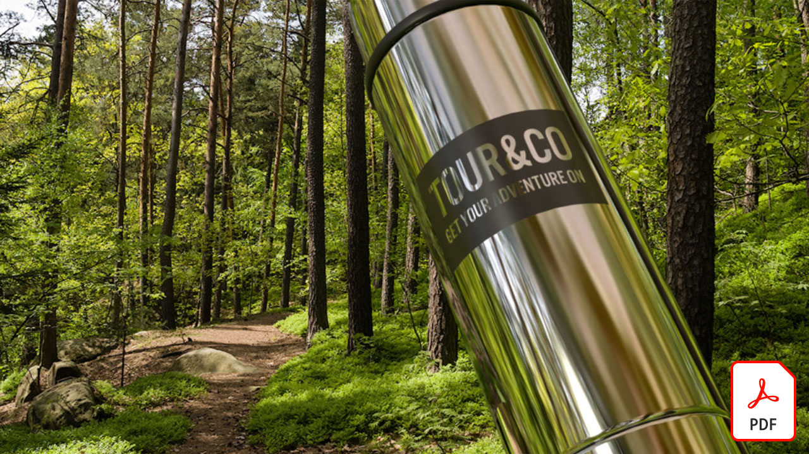

# Adobe 3D 및 VR 자습서

고품질 모델, 재료 및 조명을 통해 3D로 매력적인 콘텐츠를 빠르게 만듭니다. [!DNL Dimension] 브랜드 시각화, 그림, 제품 모크업, 패키징 디자인 및 기타 창의적인 작업을 쉽게 만들 수 있습니다.

## Adobe 3D 및 VR 자습서를 보려면 클릭하십시오.

<table>
<tr>
 <td>
   
    

   <a href="assets/CreateRealistic3DMockupswithAdobeStockandDimension.pdf"><strong>Adobe [!DNL Stock] 및 [!DNL Dimension](PDF)을 사용하여 현실적인 3D Mock-ups 만들기</strong></a>
    

    <em>Adobe [!DNL Stock]을 사용하여 2D 디자인과 3D 모델을 쉽게 조합하고 Adobe [!DNL Dimension]에 그래픽을 배치했습니다.</em>
     
  </td>
  <td>
   
    

   <a href="assets/VisualizeTextileDesignsorPatternson3DObjectswithAdobeDimension.pdf"><strong>Adobe [!DNL Dimension](PDF)을 사용하여 3D 개체에서 섬유 디자인 또는 패턴 시각화</strong></a>
    

    <em>몇 분 안에 최종 제품에 대한 초현실적인 표현 작성</em>
     
  </td>
  <td>
   
    

   <a href="../cce/assets/VisualizeyourProductinaRealisticEnvironment.pdf"><strong>현실적인 환경에서 제품 시각화(PDF)</strong></a>
    

    <em>실제 환경에서 제품의 모양을 확인하려면 Adobe [!DNL Dimension]이 바로 가기 앱입니다.</em>
     
  </td>
</tr>
   <tr>
 <td>
   
    

   <a href="mastering3dlighting.md"><strong>CGI에서 3D 조명을 마스터하기 위한 팁 및 기술</strong></a>
    

    <em>3D 조명에 대해 알아보고 컴퓨터에서 생성된 장면과 개체가 표시하는 방식을 완전히 변경할 수 있는 다른 조명 조건을 만드는 방법에 대해 알아봅니다.</em>
     
  </td>
  <td>
   
    

   <a href="photorealistic.md"><strong>3D 렌더링 및 합성을 사용하여 포토리얼리즘 가상 사진 만들기</strong></a>
    

    <em>Adobe [!DNL Dimension]에서 3D 이미지 합성 및 렌더링을 사용하여 놀랍도록 기만적이고 사실적인 가상 사진을 만드는 방법 알아보기</em>
     
  </td>
  <td>
   
    

   <a href="3ddimensionstock.md"><strong>[!DNL Dimension] 및 Adobe [!DNL Stock]을(를) 사용하여 3D 모델 사용자 지정 및 브랜드 지정</strong></a>
    

    <em>모든 디자인 프로젝트를 위한 사진 현실감 있는 이미지를 만들기 위해 [!DNL Dimension]에서 재료, 환경 특성, 조명 및 사진을 사용하여 3D 모델을 사용자 정의하고 브랜드를 지정합니다.</em>
     
  </td>
</tr>
</table>
