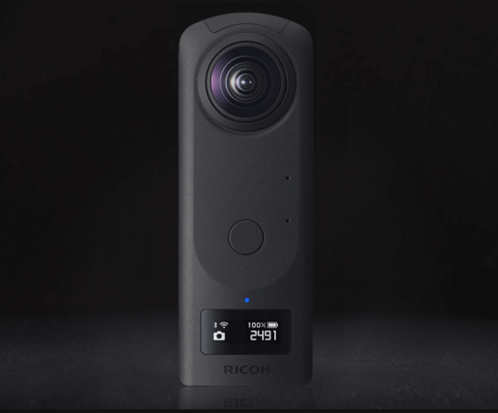
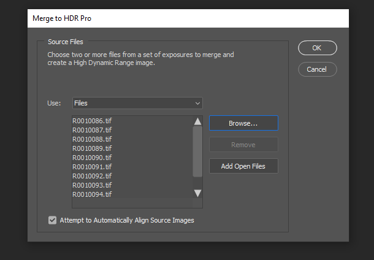
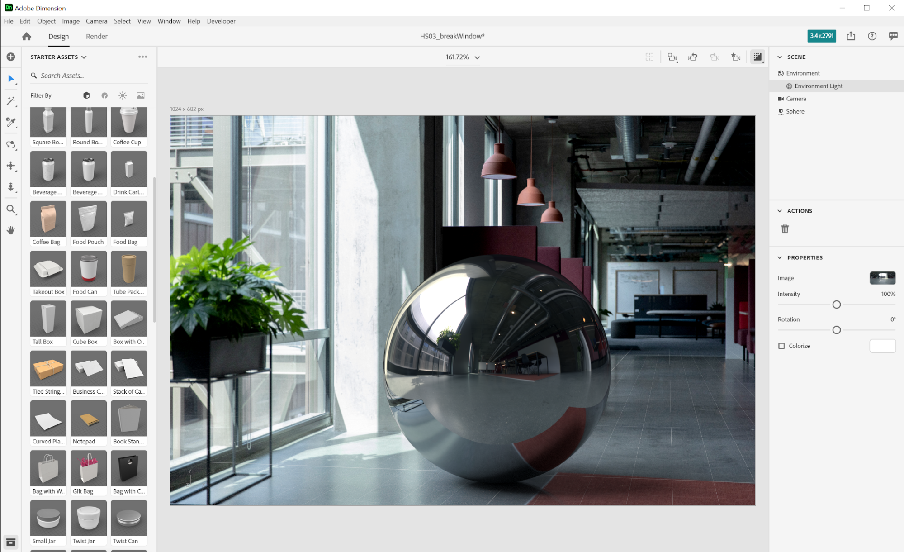

# 3D 렌더링 및 합성을 사용하여 실사적인 가상 사진 만들기

![Adobe [!DNL Dimension]](assets/Photorealistic_1.png)을(를) 사용하여 디자인된 실사적인 가상 사진의 특징을 구현한 콜라주 예시

위의 이미지를 보면, 보이는 모든 것이 실재한다고 가정해도 무리가 아닙니다. 그러나 실사적인 3D 이미지 렌더링의 기술적 진보로 인해 무엇이 실제이고 무엇이 가상인지 파악하는 것이 그 어느 때보다 어려워졌습니다. 이 경우 이미지는 실제, 사진, 렌더링된 3D 콘텐츠가 혼합되어 있으며, 이는 바로 기업이 투자하고 있는 3D 디자인 유형입니다.

James Cameron의 The Abyss에서 Mary Mastrantonio가 CGI 물 촉수를 만지기 위해 손을 뻗는 장면](assets/Photorealistic_2.jpg)![

3D 모델을 이미지나 비디오에 레이어링 또는 &#39;합성&#39;하는 이 기법은 새로운 것이 아니며, 기원은 초기 VFX(1980년대)로 거슬러 올라갑니다. 새롭고 흥미진진한 점은 이 기술이 [Adobe [!DNL Dimension]](https://www.adobe.com/products/dimension.html) 사용자를 위한 강력한 도구이자 포토그래퍼를 위한 흥미롭고 새로운 작업 과정이 되었다는 점입니다.

## [!DNL Dimension] Adobe에서 합성 이미지를 만드는 기술

![Adobe [!DNL Dimension] 합성에서 금속 구 모델의 평면 편집](assets/Photorealistic_3.png)

Adobe [!DNL Dimension]이(가) Adobe Sensei에서 제공하는 이미지 일치 기능을 사용하여 사용자가 앱에서 직접 2D와 3D 요소를 원활하게 결합할 수 있도록 했습니다. 이러한 방식으로 요소를 합성했을 때 가장 큰 이점은 완전히 구현된 3D 장면을 현실의 배경 이미지로 대체하여 실사적인 이미지를 만드는 프로세스를 더욱 효과적으로 향상시킬 수 있다는 것입니다.

![Adobe [!DNL Dimension]의 이미지 일치 기능은 배경 이미지를 분석하고, 이를 캡처하는 데 사용한 카메라의 초점 거리와 위치를 예상합니다.](assets/Photorealistic_4.gif)

이미지 일치 기능은 배경 이미지를 분석하고, 이를 캡처하는 데 사용한 카메라의 초점 거리와 위치를 예상합니다. 그러면 배경 이미지와 동일한 원근 내에서 3D 요소를 렌더링하는 데 사용할 수 있는 3D 카메라가 [!DNL Dimension] 장면에서 만들어져 함께 합성됩니다.

하지만 카메라 프레임 안에 포착되지 않은 것들은 어떨까요?  이미지가 캡처되는 전체 환경은 그 안의 모든 것이 어떻게 보이는지를 정의하기 때문에 매우 중요합니다. 이미지 안의 개체는 카메라 뒤의 모든 것을 포함하여, 그것을 둘러싼 세계의 조명을 반사하고 있습니다. 따라서 레이어 3D 요소가 이미지의 배경과 제대로 혼합되도록 하려면 이미지가 촬영된 환경의 조명을 완전히 반사해야 합니다.

이미지 일치를 사용하면 촬영한 배경 이미지의 조명 환경이 &#39;환각&#39;을 일으키려고 합니다. 간단한 순서로 훌륭한 결과를 얻을 수 있는 인상적인 작업을 수행하지만 배경 이미지와 함께 환경을 캡처하면 훨씬 더 실사적인 결과를 얻을 수 있습니다. 이는 Adobe Sensei 기능이 이를 자체적으로 수행하도록 훈련하는 데 사용되는 방법이기도 합니다.

360° HDR 파노라마 이미지의 세계에 대해 알아보십시오. 이러한 이미지는 3D 그래픽에서 오랫동안 사용되어 전 세계 조명 환경의 조명 효과를 발전시키고 있습니다. 과거에 이러한 이미지를 캡처하는 과정은 높은 수준의 지식과 특수 장비가 필요했기 때문에 꽤 복잡했습니다. 360° 카메라의 등장으로 이제 이러한 이미지를 만드는 것이 더욱 수월해졌습니다.

Ricoh Theta, Gopro MAX 및 Insta 360과 같은 카메라는 360 파노라마를 캡처할 수 있습니다. Ricoh Theta는 캡처 과정의 중요한 부분인 자동 노출 브래키팅이 내장되어 있습니다. 이를 통해 HDR을 캡처하는 시간과 노력을 줄이고 포토그래퍼에게 보다 친숙하게 다가갈 수 있습니다.

## 실사적인 합성 이미지 만들기 프로세스

### [!DNL Capture]

합성을 위해 환경 캡처를 시작하려면 두 가지 주요 요소가 필요한데, 바로 고품질의 배경 이미지와 이미지가 촬영된 환경의 360° HDR 파노라마입니다.

이러한 유형의 콘텐츠를 효과적으로 캡처하는 데 있어 가장 중요한 요소 중 하나는 포토그래퍼의 기존 기술과 도구를 활용하는 것입니다. 아름다운 배경 이미지를 만들려면 합성을 위한 안목과 세부적인 요소에 대한 관심이 필요합니다. 배경 이미지의 경우에도 3D 요소를 합성하는 데 유용한 요소를 만들기 위한 특별한 사고방식이 필요합니다.

### 위치 선택

컨텍스트와 조명을 위한 흥미로운 위치를 찾습니다. 컨텍스트를 고려할 때는 장면의 잠재적 사용에 대해 상상하는 것이 도움이 될 수 있습니다. 예를 들어, 빈 도로 뷰는 3D 자동차에 추가할 때 사용할 수 있고 커피숍의 테이블 뷰는 식품의 [포장 표시](https://www.adobe.com/products/dimension/packaging-design-mockup.html)에 사용할 수 있습니다.

가상 사진의 

배경 이미지를 캡처할 때는 3D 요소가 배경 이미지에 합성된다는 점에 유의해야 합니다. 이러한 개체를 위한 공간을 남기기 위해 빈 포커스 영역이 있어야 합니다. 3D 콘텐츠는 대개 최종 합성의 기본 포커스가 되므로 배경 자체가 과도하게 두드러지지 않도록 해야 합니다.

또한 합성된 3D 콘텐츠에 큰 영향을 미치기 때문에 이미지 내의 조명 상태도 중요합니다. 조명은 어깨 위나 측면에서 사진을 비추어야 합니다. 이것은 3D 개체가 장면에 배치될 때 키 조명으로 작동하기 때문에 최상의 결과를 얻을 수 있습니다. 포커스 요소가 보이지 않을 때 조명을 향해 찍으려고 할 수도 있지만, 이 경우 콘텐츠가 항상 역광이 된다는 것을 기억하십시오. 장면에 임시의 대리 개체를 추가하는 것이 조명을 구성하고 평가하는 데 도움이 될 수도 있습니다.

## HDR 파노라마 캡처

### 카메라 배치

배경의 캡처를 위해 포커스를 맞추고 있는 영역의 중심에 360° 카메라를 배치합니다. 이는 모노포드가 있는 카메라를 지면에서 들어올리기 위해 배경이 더 넓은 장면을 표시하는 경우에 이상적입니다. 그렇지 않으면 카메라를 직접 바닥에 장착할 수 있습니다.

### 색상

이미지들은 함께 사용될 것이기 때문에 환경을 촬영하는 데 사용되는 카메라와 배경을 촬영하는 데 사용되는 카메라 사이의 색상을 유지하는 것이 매우 중요합니다. 여기에서 두 카메라의 색상 온도가 모두 5000k로 설정되어 있습니다. 게시물에서 추가로 정렬하기 위해 색상 차트 사진을 두 카메라로 찍었습니다.

### 일괄 노출 값

360° 카메라를 사용하여 HDR 환경을 만들려면 여러 EV를 캡처하여 게시물에서 HDR 이미지로 결합해야 합니다. EV의 양은 표준화되어 있지 않지만 일반적으로 노출 범위의 높은 값은 그림자에 더 이상의 정보가 없는 지점으로 가고, 노출 범위의 낮은 값은 하이라이트에 더 이상의 정보가 없는 지점으로 가는 것을 선호합니다.

360° 카메라에는 카메라로 다양한 노출을 일괄 처리할 수 있는 자동 브래키팅 기능이 있는 것이 이상적입니다. 노이즈를 방지하기 위해 가장 낮은 ISO 값을 사용하고 선명도를 위해 높은 조리개 값을 사용하는 것이 이상적인 설정입니다. 그런 다음 셔터 속도를 사용하여 노출 값을 변경할 수 있으며 노출을 절반으로 줄이거나 두 배로 늘려 정지점별로 분리할 수 있습니다.

다음은 IBL 야외에서 촬영하는 데 사용되는 EV의 예시입니다.

01 - F 5.6, ISO 80, 셔터 속도 1/25000, WB 5000 K

02 - F 5.6, ISO 80, 셔터 속도 1/12500, WB 5000 K

03 - F 5.6, ISO 80, 셔터 속도 1/6400, WB 5000 K

...

16 - F 5.6, ISO 80, 셔터 속도 1, WB 5000 K

사용된 360° 파노라마가 RAW 이미지를 출력할 수 있는 경우, EV는 JPEG과 같은 8비트 이미지보다 더 많은 정보를 보유하므로 2-4 정지점 단위로 분할할 수 있습니다.

EV에 대해 색상을 조정한 후 개별 파일로 임시로 내보내고 Photoshop에서 병합할 수 있습니다. 파일 유형은 소스에 따라 다르지만 두 경우 모두 JPEG과 같은 압축된 형식은 사용하지 않습니다. Photoshop에서 파일 > 자동화 > HDR Pro로 병합을 선택한 뒤 내보낸 모든 EV를 선택합니다.

&#39;모드&#39;가 32비트로 설정되어 있는지 확인하세요. &#39;고스트 제거&#39;를 사용하면 EV 간에 변경된 세부 사항을 제거하는 데 도움이 될 수 있지만 필요하지 않은 경우 사용하지 마십시오. 히스토그램 아래의 슬라이더는 미리보기 노출에만 영향을 주므로 무시합니다. &#39;Adobe Camera Raw에서 톤 조절 완료&#39;의 선택을 취소하고 확인을 누릅니다.

그 결과 3D에서 장면을 밝히는 데 사용할 수 있는 HDR 이미지가 만들어집니다.

마지막 단계는 이미지의 바닥에 보이는 모든 그림자와 삼각대 다리를 제거하고 이미지의 기본 노출을 조정하여 장면에 정확하게 조명을 비추는 것입니다. Photoshop의 복제 도구를 사용하여 세부 사항을 제거할 수 있습니다. HDR IBL의 노출 값은 3D 개체의 조명 값이므로 노출 조정은 [!DNL Dimension]의 배경과 함께 수행해야 합니다.

### 배경 캡처

이제 환경을 캡처한 후 원하는 카메라를 사용하여 배경을 캡처할 수 있습니다. 품질이 높을수록 해상도가 높아집니다. 이것은 포토그래퍼가 갖고 있는 합성에 대한 안목과 함께 이 과정의 주요 이점입니다. 위의 이미지들은 Canon 5D MK IV로 촬영되었습니다.

여러 가지 방법을 통해 배경에 프레임을 지정하고 합성할 수 있습니다. 카메라는 다양한 필드 깊이를 위해 높거나 낮은 조리개를 가질 수 있으며 길거나 짧은 초점 거리를 사용하고 위아래로 각도를 조정할 수 있습니다. 주요 요건은 카메라가 환경이 360 카메라로 캡처된 중심점을 향해야 한다는 것입니다.

캡처가 완료되면 가능한 한 근접한 환경 색상과 일치하도록 이미지를 사후 처리해야 합니다. 색상과 노출은 가능한 한 중간톤으로 자연스러워야 합니다. Adobe [!DNL Dimension]을(를) 사용하여 3D 요소를 이미지에 합성한 후에는 스타일화된 모양을 적용해야 합니다.

## [!DNL Dimension]에서 합성 이미지 조합

이러한 요소를 모아 완성하면 이제 [!DNL Dimension] Adobe의 장면에서 조합할 수 있습니다. 이는 배경을 장면으로 드래그하는 것만큼 간단하며, 배경에 적용한 다음 HDR 파노라마를 환경 조명 이미지 슬롯에 추가합니다.

배경 이미지를 캔버스의 빈 영역으로 드래그하여 놓거나, 장면 패널 내에서 환경을 선택하고 배경 입력에 이미지를 추가합니다.

![가상 사진의 배경 이미지는 [!DNL Dimension]](assets/Photorealistic_20.png) Adobe의 속성 메뉴에서 선택할 수 있습니다.

환경 조명을 선택하고 이미지 입력에 추가하여 HDR 파노라마를 추가합니다.

![환경 광원을 [!DNL Dimension]](assets/Photorealistic_21.png) Adobe의 장면 메뉴에서 가상 사진의 배경 이미지에 추가할 수 있습니다.

그런 다음 배경에서 &quot;이미지 일치&quot;를 사용하여 해상도와 모양 및 카메라 원근과 일치시킬 수 있습니다. 배경 이미지에서 환경을 생성하는 대신, 캡처한 HDR 파노라마 이미지를 사용하여 장면에 조명을 적용하므로 &#39;조명 만들기&#39; 옵션을 선택 해제할 수 있습니다.

![Adobe [!DNL Dimension]의 이미지 일치 기능을 사용하여 HDR 파노라마에서 환경 조명으로 3D 금속 구 이미지 렌더링](assets/Photorealistic_22.png)

이제 장면에 추가된 개체는 이미지가 촬영된 환경에 의해 조명을 받고 있으므로 배경에 사실적으로 합성됩니다.

배경에 대한 HDR 파노라마의 방향과 노출을 빠르게 평가하기 위해 [!DNL Dimension]의 무료 에셋 패널에서 가져온 금속 재질의 구 기본 모양을 장면에 배치할 수 있습니다. 그런 다음 반사가 올바르게 보이도록 환경 조명의 회전을 배치할 수 있습니다. HDR 파노라마의 조명이 구를 과도하게 노출하거나 부족하게 노출하는 경우, HDR 파노라마의 노출을 늘리거나 줄여 보정할 수 있습니다.

배경에 대한 HDR 파노라마의 방향과 노출을 빠르게 평가하기 위해 [!DNL Dimension]의 무료 에셋 패널에서 가져온 금속 재질의 구 기본 모양을 장면에 배치할 수 있습니다. 그런 다음 반사가 올바르게 보이도록 환경 조명의 회전을 배치할 수 있습니다. HDR 파노라마의 조명이 구를 과도하게 노출하거나 부족하게 노출하는 경우, HDR 파노라마의 노출을 늘리거나 줄여 보정할 수 있습니다.

## 최종 결과: 실사적인 합성 이미지

![Adobe [!DNL Dimension]](assets/Photorealistic_24.gif)에서 가상 제품 사진에 대한 3D 합성 및 렌더링의 타임랩스

장면이 완료되면 최종 사용자의 작업 과정이 간단해집니다. 자신의 모델이나 [Adobe [!DNL Stock] 3D](https://stock.adobe.com/3d-assets) 콘텐츠를 이미지에 직접 끌어서 놓으면 사진을 찍었을 때 원래 현장에 있던 것처럼 렌더링할 수 있습니다. 이렇게 하면 매우 현실적인 광고 콘텐츠를 만들거나 다양한 컨텍스트 내에서 디자인을 반복할 수 있는 새로운 길이 열립니다.

최종 결과는 최종 사용자가 최소한의 노력으로 실사적인 이미지를 만드는 목표를 달성하도록 지원하는 현실과 3D의 설득력 있는 혼합입니다. 작업 과정을 시연하기 위해 만든 [무료 [!DNL Dimension] 장면](https://assets.adobe.com/public/3926726a-2a17-43d4-4937-6d84a4d29338)을 사용해 보세요.

지금 [최신 릴리스](https://creativecloud.adobe.com/apps/download/dimension)([!DNL Dimension])를 다운로드하고 사실적인 이미지를 만들어 보세요.
