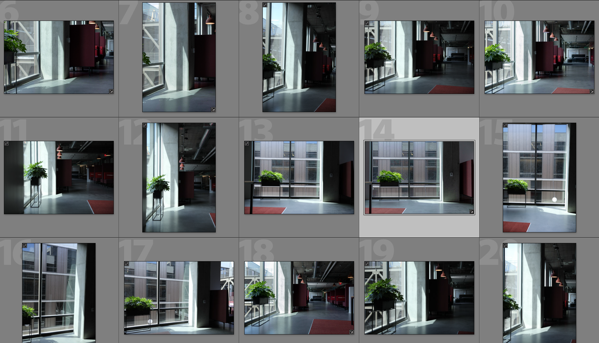
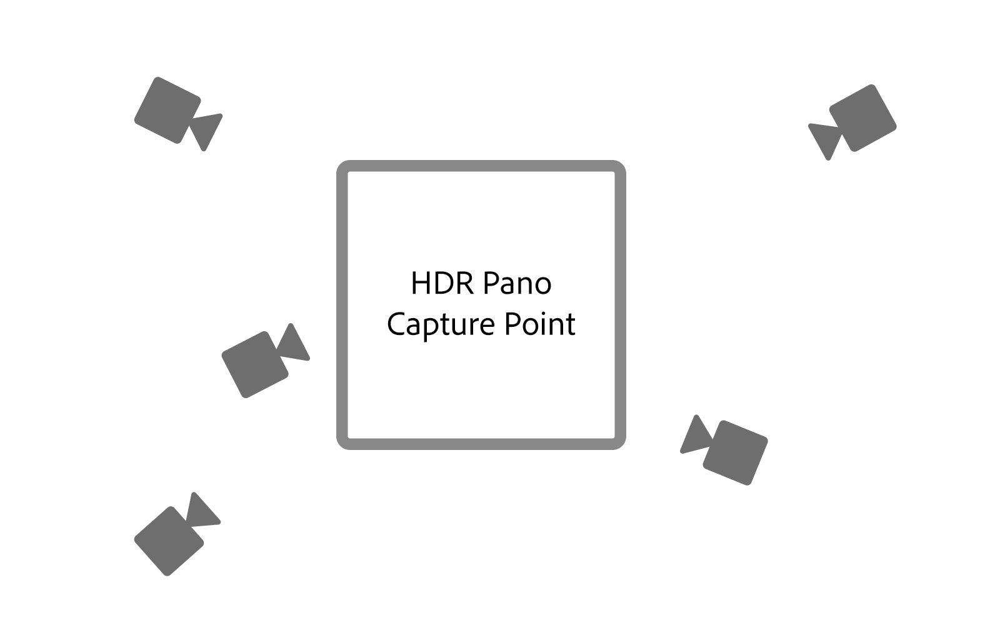

# 3D 렌더링 및 합성을 사용하여 포토리얼리즘 가상 사진 만들기

![Adobe와 함께 설계된 사진과 실제 가상 사진을 제공하는 예제  [!DNL Dimension]](assets/Photorealistic_1.png)

위의 이미지를 보면, 당신이 보는 모든 것이 진짜라고 생각하는 것은 용서받을 것이다. 하지만, 포토리얼리즘 3D 이미지를 렌더링하는 기술의 발전으로, 무엇이 진짜이고 무엇이 가상인지 결정하는 것은 그 어느 때보다 어렵습니다. 이 경우, 이미지는 실제, 사진, 렌더링된 3D 컨텐츠의 조합이며, 이것은 기업들이 투자하고 있는 3D 디자인의 형태입니다.

3D 모델을 이미지 또는 비디오로 겹쳐서 합성하는 이 기술은 새로운 것이 아니며, 사실 그 기원은 VFX의 초기(1980년대까지)로 거슬러 올라간다. 새롭고 흥미로운 것은 이 기술이 [Adobe [!DNL Dimension]](https://www.adobe.com/products/dimension.html) 사용자들에게 강력한 도구가 되었으며 사진작가들을 위한 흥미로운 새로운 작업 과정이 되었다는 것입니다.

## Adobe [!DNL Dimension]에서 합성 이미지를 만드는 기술

![Adobe 합성에서 금속 구 모델의 평면  [!DNL Dimension] 편집](assets/Photorealistic_3.png)

Adobe [!DNL Dimension]에서는 Adobe Sensey에서 제공하는 일치 이미지 함수를 사용하여 2D 및 3D 요소를 앱에서 직접 원활하게 결합할 수 있습니다. 이러한 방식으로 요소를 합성하는 것의 주된 이점은 완전히 실현된 3D 장면을 현실에서 포착할 수 있는 배경 이미지로 대체하여 현실적인 모양의 이미지를 만드는 과정을 향상시키는 것입니다.

![Adobe의 [이미지 일치] 기능은 배경 이미지를  [!DNL Dimension] 분석하고 카메라를 캡처하는 데 사용된 카메라의 초점 길이 및 위치를 추정합니다](assets/Photorealistic_4.gif)

[이미지 일치] 기능은 배경 이미지를 분석하고 카메라를 캡처하는 데 사용된 카메라의 초점 거리와 위치를 추정합니다. 그런 다음 [!DNL Dimension] 장면에서 3D 카메라가 만들어집니다. 이 카메라는 배경 이미지와 동일한 원근 내에서 3D 요소를 렌더링하는 데 사용할 수 있으므로 함께 합성됩니다.

하지만 카메라의 프레임 안에 포착되지 않은 모든 것은 어떨까요?  전체 환경에서 이미지가 차지하는 중요성은 모든 이미지가 차지하는 모양을 정의하기 때문입니다. 이미지 안에 있는 물체는 주변의 세상의 빛을 반사하는데, 그것은 카메라 뒤의 모든 것을 포함한다. 따라서 레이어가 있는 3D 요소가 이미지의 배경과 잘 어울리기 위해서는 이미지를 촬영한 환경에 조명을 완전히 반영해야 합니다.

Match Image는 배경 이미지가 찍힌 조명 환경을 &#39;환각제&#39;하려고 합니다. 짧은 순서로 좋은 결과를 얻을 수 있는 인상적인 일을 하지만, 배경 이미지와 함께 환경을 포착하면 훨씬 더 현실적인 결과를 얻을 수 있을 것이다. 이것은 심지어 Adobe Sensey 기능을 스스로 하도록 훈련시키는 데 사용되는 방법입니다.

360° HDR 파노라마 이미지의 세계를 소개합니다. 이러한 이미지들은 전세계의 조명 환경의 조명 효과를 촉진시키기 위해 3D 그래픽에서 오랫동안 사용되어 왔습니다. 과거에 그들을 잡는 과정은 그것들을 만드는 데 필요한 높은 수준의 지식과 전문 장비로 인해 꽤 복잡했다. 360° 카메라의 출현으로 이러한 이미지를 만들 수 있게 되었습니다.

Ricoh Theta, Gopro MAX, Insta 360과 같은 카메라는 360개의 파노라마를 찍을 수 있습니다. Ricoh Theta는 캡처 프로세스의 주요 부분인 자동 노출 브래킷을 내장했습니다. 이것은 HDR을 캡처하는 시간과 노력을 줄이고 사진작가들이 보다 쉽게 접근할 수 있도록 합니다.

## 사진과 같은 합성 이미지를 만드는 프로세스

### [!DNL Capture]

합성을 위한 환경 캡처를 시작하려면 두 가지 주요 요소가 필요합니다. 고품질 배경 이미지 또는 이미지 및 촬영한 환경의 360° HDR 파노라마

이러한 유형의 컨텐츠를 효과적으로 캡처하는 가장 중요한 측면 중 하나는 사진사의 기존 기술과 도구를 활용하는 것입니다. 아름다운 배경 이미지를 만드는 것은 작문과 세부 묘사에 대한 관심을 필요로 한다. 또한 배경 이미지는 3D 요소를 에 합성하는 데 유용한 요소를 만들기 위해 특별한 마인드가 필요합니다.

### 위치 선택

컨텍스트와 조명 모두에 관심 있는 위치를 찾습니다. 상황을 고려할 때, 장면의 잠재적 사용을 상상하는 것이 도움이 될 수 있다. 예를 들어, 3D 차에 빈 도로를 보는 것은 3D 차를 추가하는 데 사용할 수 있으며, 커피숍의 테이블 뷰는 [의 식품 제품 패키지](https://www.adobe.com/products/dimension/packaging-design-mockup.html)를 표시하는 데 사용될 수 있습니다.

배경 이미지를 캡처하는 경우에는 3D 요소가 해당 요소에 합성된다는 점을 명심해야 합니다. 이러한 개체를 위한 공간을 남겨두려면 포커스가 비어 있어야 합니다. 3D 콘텐츠는 종종 최종 구성의 주요 초점이 될 수 있기 때문에 배경이 자신만의 것으로 지나치게 두드러지지 않는 것이 중요하다.

또한 이미지 내의 조명 상황이 종합된 3D 내용에 큰 영향을 미치므로 매우 중요합니다. 빛은 어깨 너머나 측면에서 샷을 해야 합니다. 3D 물체가 현장에 배치될 때 주요 빛으로 작용하기 때문에 가장 좋은 결과를 얻을 수 있습니다. 시야에 초점을 맞출 요소가 없을 때 조명을 향해 쏘는 유혹이 있을 수 있지만, 이것은 항상 백라이트가 되는 컨텐츠를 초래할 수 있다는 것을 기억하세요. 장면에 임시로 독립형 객체를 추가하는 것은 조명을 작성하고 평가하는 데 유용할 수 있습니다.

## HDR Pano 캡처

### 카메라 배치

배경을 캡처하기 위해 초점을 맞출 영역의 일반 가운데에 360° 카메라를 놓습니다. 배경이 카메라를 단조로 땅에서 올리기 위해 더 넓은 장면을 보여주는 경우에, 그렇지 않으면 카메라를 땅에 직접 설치할 수 있는 경우에 이상적일 수 있습니다.

### 색상

환경촬영에 사용되는 카메라와 배경촬영에 사용되는 카메라 사이의 색깔을 유지하는 것은 이미지가 함께 사용되기 때문에 매우 중요하다. 여기에 두 카메라의 색상 온도가 5000k로 설정되어 있고, 포스트에 더 정렬하기 위해 두 카메라가 있는 컬러 차트의 사진을 찍었습니다.

### 괄호로 묶은 노출 값

360° 카메라로 HDR 환경을 만들려면 여러 EV를 캡처하여 HDR 이미지를 게시물에 결합해야 합니다. EV의 양은 표준화되지는 않지만 일반적으로 노출 범위의 더 높은 끝이 어두운 영역에 더 이상 정보가 없고 노출 범위의 낮은 끝이 밝은 영역에 더 이상 정보가 없는 지점으로 이동하기를 원합니다.

360° 카메라에는 다양한 노출을 카메라에 고정시킬 수 있는 자동 괄호식 기능이 있습니다. 노이즈를 피하려면 가장 낮은 ISO 값을 사용하고 선명도에 대한 높은 구경 값을 사용하는 것이 가장 좋습니다. 그런 다음 셔터 속도를 사용하여 노출 값을 변경하고 정점으로 나눌 수 있습니다. 노출을 절반으로 또는 두 배로

다음은 IBL 야외에서 촬영에 사용되는 EV의 예입니다.

01 - F 5.6, ISO 80, 셔터 속도 1/25000, WB 5000 K

02 - F 5.6, ISO 80, 셔터 속도 1/12500, WB 5000 K

03 - F 5.6, ISO 80, 셔터 속도 1/6400, WB 5000 K

...

16 - F 5.6, ISO 80, 셔터 속도 1, WB 5000 K

사용된 360°가 RAW 이미지를 출력할 수 있는 경우 EV는 JPEG와 같은 8비트 이미지보다 많은 정보를 보관하므로 2-4 정지 단위로 분할할 수 있습니다.

![Adobe Photoshop의 [HDR Pro 파일에 병합] 선택 메뉴](assets/Photorealistic_13.png)

EV에 색상 조정을 한 후 해당 EV를 개별 파일로 임시로 내보낸 다음 Photoshop에서 병합할 수 있습니다. 파일 형식은 소스에 따라 달라야 하지만, 두 경우 모두 JPEG와 같은 압축 형식을 사용하지 마십시오. Photoshop에서는 [파일] > [자동화] > [HDR Pro에 병합...]을 사용하고 내보낸 모든 EV를 선택합니다.

‘모드’가 32비트로 설정되어 있는지 확인합니다. &#39;유령 제거&#39;를 사용하면 EV 간에 변경된 세부 사항을 제거하는 데 도움이 되지만, 필요하지 않은 경우 사용하지 마십시오. 히스토그램 아래의 슬라이더는 미리 보기 노출에만 영향을 주기 때문에 무시하십시오. [Adobe Camera Raw에서 색조 완료]의 선택을 취소하고 [확인]을 누릅니다.

결과는 3D에서 장면을 표시하는 데 사용할 수 있는 HDR 이미지입니다.

마지막 단계는 이미지의 나디르에 표시되는 섀도우와 삼각대 다리를 제거하고 이미지의 기본 노출을 조정하여 장면을 정확하게 표시하는 것입니다. Photoshop의 복제 도구를 사용하여 세부 정보를 제거할 수 있습니다. HDR IBL의 노출 값은 3D 개체의 조명 값이므로 노출 조정은 [!DNL Dimension]의 배경과 함께 수행해야 합니다.

### 배경 캡처

환경을 캡처한 후 원하는 카메라를 사용하여 배경을 캡처할 수 있습니다. 품질이 높고 해상도가 높을수록 좋습니다. 이것은 사진작가들이 가지고 있는 작문에 대한 안목과 함께 이 과정의 주요 이점이다. 위의 이미지는 캐논 5D MK IV로 캡처되었습니다.

배경과 함께 틀을 짜는 것과 구성에 많은 여지가 있다. 카메라는 다양한 장의 깊이에 대한 고강도 또는 낮은 구멍을 가질 수 있으며, 길고 짧은 초점 길이를 사용하고 위아래로 기울일 수 있습니다. 주된 요구사항은 카메라가 360 카메라로 환경이 포착된 중심지점을 겨냥하는 것이다.

캡처가 완료되면 가능한 가까운 환경의 색상과 일치하도록 이미지를 게시해야 합니다. 색깔과 노출은 가능한 한 중립적이고 자연적이어야 한다. Adobe [!DNL Dimension]을 사용하여 3D 요소를 이미지에 합성한 후 스타일화된 모양을 적용해야 합니다.

## [!DNL Dimension]에서 합성 이미지 어셈블

이러한 요소를 취합하고 완성하면 Adobe [!DNL Dimension]의 한 장면에서 어셈블할 수 있습니다. 배경을 장면으로 드래그하면 배경에 적용되는 것처럼 간단합니다. 그런 다음 환경 조명 이미지 슬롯에 HDR pano를 추가합니다.

배경 이미지를 캔버스의 빈 영역으로 드래그하여 놓거나 장면 패널 내의 환경을 선택하고 이미지를 배경 입력에 추가합니다.

![가상 사진의 배경 이미지는 Adobe의 [속성] 메뉴에서 선택할 수 있습니다  [!DNL Dimension]](assets/Photorealistic_20.png)

환경 광원을 선택하고 이미지 입력에 추가하여 HDR 파노를 추가합니다.

![환경 광원 소스는 Adobe의 [장면] 메뉴에서 가상 사진의 배경 이미지에 추가할 수 있습니다  [!DNL Dimension]](assets/Photorealistic_21.png)

그런 다음 배경에 있는 &quot;이미지 일치&quot;를 사용하여 해상도 및 측면과 카메라 원근을 일치시킬 수 있습니다. 배경 이미지에서 환경을 생성하는 대신 캡처된 HDR 파노 이미지를 사용하여 장면을 표시하므로 &#39;광원 만들기&#39; 옵션을 선택 취소할 수 있습니다.

![Adobe의 [이미지 일치] 기능 [!DNL Dimension] 을 사용하여 HDR 파노라마의 환경 조명과 함께 3D 금속 구 이미지를 렌더링합니다.](assets/Photorealistic_22.png)

이제 장면에 추가되는 오브젝트는 이미지를 촬영한 환경에서 조명을 받고 있기 때문에 배경에 사실적으로 합성됩니다.

배경과 관련된 HDR pano의 방향과 노출을 신속하게 평가하기 위해 [!DNL Dimension]의 자유 에셋 패널에서 가져온 금속 재료가 포함된 구 프리미티브 구를 장면에 배치할 수 있습니다. 그러면 반사가 올바르게 보이도록 환경 광원의 회전을 배치할 수 있습니다. HDR pano의 조명이 구를 위 또는 아래로 노출하면, HDR pano의 노출이 증가하거나 감소하여 보정해야 합니다.

배경과 관련된 HDR pano의 방향과 노출을 신속하게 평가하기 위해 [!DNL Dimension]의 자유 에셋 패널에서 가져온 금속 재료가 포함된 구 프리미티브 구를 장면에 배치할 수 있습니다. 그러면 반사가 올바르게 보이도록 환경 광원의 회전을 배치할 수 있습니다. HDR pano의 조명이 구를 위 또는 아래로 노출하면, HDR pano의 노출이 증가하거나 감소하여 보정해야 합니다.

## 최종 결과: 사진을 현실화한 합성 이미지

![Adobe의 가상 제품 사진을 위한 3D 합성 및 렌더링 시간  [!DNL Dimension]](assets/Photorealistic_24.gif)

장면이 완료되면 최종 사용자에 대한 워크플로우는 간단합니다. 사진을 찍을 때 있는 것처럼 렌더링하려면 자신의 모델 또는 [Adobe [!DNL Stock] 3D](https://stock.adobe.com/3d-assets) 내용을 이미지에 직접 끌어 놓기만 하면 됩니다. 이렇게 하면 매우 현실적인 광고 컨텐츠를 만들거나 다양한 컨텍스트 내에서 디자인을 반복할 수 있는 새로운 방법이 열립니다.

최종 결과는 최종 사용자들이 최소한의 노력으로 포토리얼리즘 이미지를 만드는 목표를 달성하도록 도와주는 현실과 3D의 설득력 있는 혼합입니다. 워크플로를 보여주기 위해 만든 [free [!DNL Dimension] scenes](https://assets.adobe.com/public/3926726a-2a17-43d4-4937-6d84a4d29338)에서 직접 사용해 보십시오.

[오늘 최신 ](https://creativecloud.adobe.com/apps/download/dimension) 릴리스 [!DNL Dimension] 를 다운로드하고 사진과 관련된 이미지를 만들기 시작하세요.
