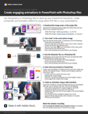

# 그래픽 형식의 알파벳 수프 디코딩

JPG, PNG, SVG, GIF 및 EPS 파일은 모두 디자인에 일반적으로 사용되며, 일부는 웹 페이지에, 다른 일부는 프레젠테이션, 출판 및 크리에이티브 프로젝트에 사용됩니다. 하지만, 그들은 무엇을 의미하며, 당신은 무엇을 선택해야 합니까? 15분 분량의 실습 워크숍에서 그 내용을 확인해 보십시오. Photoshop에서 다양한 그래픽 내보내기 및 최적화 설정을 살펴보면서 프레젠테이션 스킬을 강화할 수 있는 투명도 효과를 적용하는 방법을 빠르게 살펴봅니다. 디자이너/개발자인 Chris Converse와 함께 Photoshop에서 내보낸 맞춤형 그래픽을 사용하여 PowerPoint에서 매력적인 애니메이션을 제작해 보십시오.

>[!VIDEO](https://video.tv.adobe.com/v/333805?hidetitle=true)

  

[**빠른 참조 PDF 안내서 다운로드**](../quick-reference/Decodingthealphabetsoupofgraphicformats.pdf)

