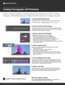

# Photoshop으로 시네마그래프 만들기

이 단계별 워크샵 비디오 튜토리얼에서는 Adobe [!DNL Stock]의 비디오와 Photoshop의 현명한 마스크 기술을 결합하여 생동감 있는 사진을 만듭니다.

>[!VIDEO](https://video.tv.adobe.com/v/331002?hidetitle=true)

  

[**빠른 참조 PDF 가이드 다운로드**](../quick-reference/CreatingCinemagraphswithPhotoshop.pdf)

