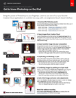

# Adobe [!DNL Stock] 및 iPad용 Photoshop으로 고유한 합성 이미지 만들기

Photoshop의 강력한 기능을 손쉽게 사용할 수 있습니다. 새롭게 디자인된 터치 기반 인터페이스를 사용하여 즐겨 사용하는 Creative Cloud 애플리케이션 중 하나를 완전히 새로운 방식으로 사용하는 방법을 알아보십시오.

>[!VIDEO](https://video.tv.adobe.com/v/331004?hidetitle=true)

  

[**빠른 참조 PDF 가이드 다운로드**](../quick-reference/GettoknowPhotoshopontheiPad.pdf)

