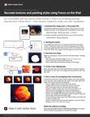

# iPad(및 iPhone)에서 Fresco 기능을 사용해 보세요.

15분 동안 진행되는 이 실습형 워크숍에서 Adobe Fresco을 통해 디지털 드로잉 및 페인팅의 완전히 새로운 세계를 살펴보세요. 레이어와 클리핑 마스크를 사용하여 페인트 및 텍스처를 기본 모양에 맞추는 방법을 빠르게 알아봅니다. 디자이너/개발자 Chris Converse와 함께 Fresco 및 Adobe Stock을 사용하여 정물 일러스트레이션의 일부를 재현해 보십시오.

>[!VIDEO](https://video.tv.adobe.com/v/333804?hidetitle=true)

  

[**빠른 참조 PDF 가이드 다운로드**](../quick-reference/Frescoworkshop.pdf)

