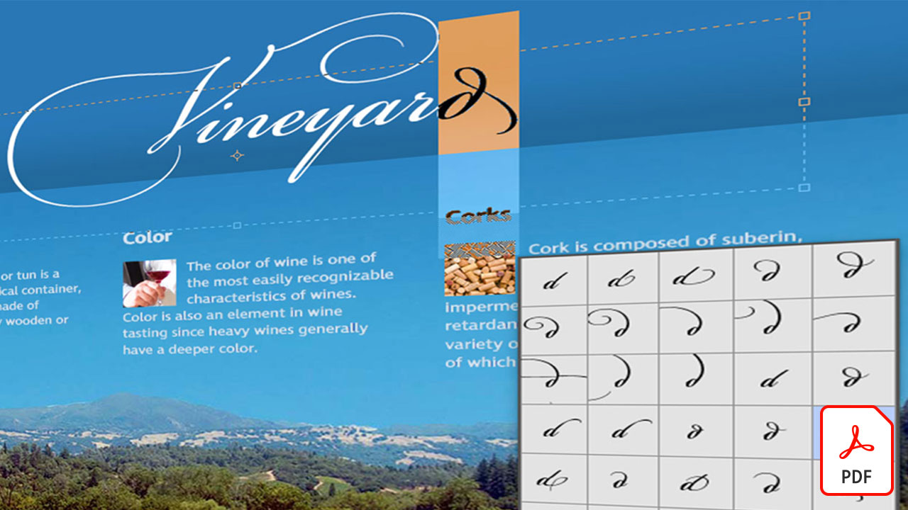

# Creative Cloud for enterprise 튜토리얼

기업 크리에이티브 팀은 분산된 팀과 협업하고 확장 가능한 프로세스를 설정하며 기업 시스템과 지침을 준수해야 합니다. 이 튜토리얼은 기업의 관점에서 Creative Cloud의 새로운 기능을 배우는 데 도움이 됩니다.

## 제품 자습서를 보려면 클릭(알파벳 순서로 나열됨)

### Adobe Acrobat

<table style="table-layout:fixed">
<tr>
 <td>
   
    

   <a href="acrobat-content-creators.md"><strong>콘텐츠 제작자를 위한 Acrobat</strong></a>
    

    <em>크리에이티브 워크플로우를 간소화하는 데 도움이 되는 Acrobat 툴을 살펴보세요</em>
     
  </td>
  <td>
    
    

     
  </td>
  <td>
    
    

     
  </td>
  <td>
    
    

     
  </td>
</tr>
</table>

### Adobe Express(이전의 Adobe Spark)

<table style="table-layout:fixed">
<tr>
 <td>
   
    

   <a href="adobe-express-content-that-stands-out.md"><strong>Adobe Express: 탁월한 콘텐츠</strong></a>
    

    <em> Adobe Express을 사용하여 멋진 그래픽, 웹 페이지, 동영상 스토리를 신속하게 제작</em>
     
  </td>
  <td>
   
    

   <a href="assets/CreatingYourBrandinAdobeSpark.pdf"><strong>Adobe Spark(PDF)에서 브랜드 만들기</strong></a>
    

    <em>Adobe Spark을 사용하면 브랜드를 손쉽게 정의할 수 있습니다</em>
     
  </td>
  <td>
   
    

   <a href="assets/AddingaGlideshowtoyourSparkPageAdobeBlog.pdf"><strong>Spark Page에 글라이드쇼 추가(PDF)</strong></a>
    

    <em>Adobe Spark은 웹 스토리를 생동감 있게 표현해주는 놀랍고 사용하기 쉬운 레이아웃 구성 요소를 제공합니다</em>
     
  </td>
  <td>
   
    

   <a href="assets/CreatingYourBrandinAdobeSpark.pdf"><strong>Adobe Spark(PDF)에서 브랜드 만들기</strong></a>
    

    <em>Adobe Spark을 사용하면 브랜드를 손쉽게 정의할 수 있습니다</em>
     
  </td>
  <td>
   
    

   <a href="assets/MeetYourNewProductionArtistAdobeSparkPost.pdf"><strong>새로운 프로덕션 아티스트를 만나보십시오. Adobe Spark Post (PDF)</strong></a>
    

    <em>Adobe Spark은 레이아웃을 만들고, 색상을 정의하고, 아트웍을 가져오고, 컴포지션 내의 요소를 정렬하는 과정을 학습합니다</em>
     
  </td>
</tr>
</table>

### Adobe Portfolio

<table  style="table-layout:fixed">
<tr>
   <td>
   
    

   <a href="assets/GettingStartedWithAdobePortfolio.pdf"><strong>Adobe Portfolio 시작하기(PDF)</strong></a>
    

    <em>Adobe Portfolio을 사용하여 최고의 작품을 공유하는 것은 성공을 공유하고 새로운 크리에이티브 인재를 끌어들이는 효과적인 방법입니다</em>
     
  </td>
  <td>
   
    

   <a href="assets/ConnectingLightroomandBehancetoYourAdobePortfolio.pdf"><strong>Adobe Portfolio에 Lightroom 및 Behance 연결(PDF)</strong></a>
    

    <em>포트폴리오의 페이지로 Behance 프로젝트 사용</em>
     
  </td>
  <td>
   
    

   <a href="assets/ShowYourBestWorkwithAdobePortfolio.pdf"><strong>Adobe Portfolio(PDF)에서 최고의 작업 표시</strong></a>
    

    <em>Adobe Portfolio을 사용하면 전 세계의 잠재적 직원 및 클라이언트와 작업을 업로드, 구성 및 공유할 수 있습니다</em>
     
  </td>
  <td>
    
    

     
  </td>
 </tr>
 </table>

### CC Libraries

<table  style="table-layout:fixed">
<tr>
  <td>
   
   

   <a href="cc-workflows-cc-libraries.md"><strong>CC Libraries를 사용하여 CC 작업 과정 개선</strong></a>
    

    <em>Creative Cloud 라이브러리로 디자인 요소를 함께 유지하여 디자이너와 팀의 프로젝트 일관성을 유지하는 방법을 살펴보세요</em>
     
  </td>
  <td>
   
   

   <a href="ccteamlibraries.md"><strong>팀용 Creative Cloud 라이브러리 만들기</strong></a>
    

    <em>팀용 Creative Cloud 라이브러리를 사용하여 그룹 또는 팀 내에서 에셋을 공유하는 방법에 대해 알아봅니다</em>
     
  </td>
  <td>
   
   

   <a href="sharecclibraries.md"><strong>팀용 Creative Cloud 라이브러리와 브랜딩 에셋 공유</strong></a>
    

    <em>팀용 Creative Cloud 라이브러리를 사용하여 그룹 또는 팀의 브랜딩 에셋을 만들고, 사용하고, 공유하는 방법에 대해 알아봅니다</em>
     
  </td>
  <td>
   
    

   <a href="assets/CreateAddandShareYourBrandAssetswithCreativeCloudLibraries.pdf"><strong>Creative Cloud 라이브러리(PDF)을 사용하여 브랜드 에셋 제작, 추가, 공유</strong></a>
    

    <em>Creative Cloud 라이브러리는 디자이너가 크리에이티브 팀 전체에 걸쳐 브랜드 에셋을 공유할 수 있도록 하는 내장 브랜드 시스템을 제공합니다</em>
     
  </td>
  </tr>
  <tr>
  <td>
   
    

   <a href="assets/ShareTextStylesFromIllustratorwithCreativeCloudLibraries.pdf"><strong>Creative Cloud 라이브러리와 Illustrator의 텍스트 스타일 공유(PDF)</strong></a>
    

    <em>Illustrator에서 스마트하고 효율적으로 작업</em>
     
  </td>
  <td>
    
    

     
  </td>
  <td>
    
    

     
  </td>
  <td>
    
    

     
  </td>
</tr>
</table>

### Creative Cloud for enterprise

<table style="table-layout:fixed">
<tr>
 <td>
   
    

   <a href="collaboration-the-future-of-creativity.md"><strong>공동 작업: 창의성의 미래</strong></a>
    

    <em>Adobe Creative Cloud 구독의 많은 혜택 중 무료로 이용할 수 있는 것은 Adobe Fonts에서 전문적으로 디자인되고 선별된 20,000개 이상의 글꼴입니다</em>
     
  </td>
  <td>
   
    

   <a href="assets/FromHandLetteringtoIllustratorviaCreativeCloud.pdf"><strong>Creative Cloud(PDF)을 통해 손글씨에서 Illustrator으로</strong></a>
    

    <em>강력한 Creative Cloud 기능을 갖춘 엔터프라이즈, Adobe 모바일 및 데스크탑 앱을 사용하면 어디에서나 모든 디바이스에서 캡처, 변환, 제작이 가능합니다</em>
     
  </td>
  <td>
   
    

   <a href="assets/FromLightroomWebtoInDesignviaCreativeCloud.pdf"><strong>Creative Cloud(PDF)을 통해 Lightroom 웹에서 InDesign으로</strong></a>
    

    <em>Creative Cloud 파일 및 라이브러리를 사용하여 카메라에서 최종 디자인으로 창의력을 발휘할 수 있습니다</em>
     
  </td>
</tr>
</table>

### [!DNL Dimension]

<table  style="table-layout:fixed">
<tr>
   <td>
   
    

   <a href="assets/VisualizeyourProductinaRealisticEnvironment.pdf"><strong>실제 환경에서 제품 시각화(PDF)</strong></a>
    

    <em>제품이 실제로 어떻게 보이는지 확인하려면 Adobe [!DNL Dimension] 은(는)</em>
     
  </td>
  <td>
    
    

     
  </td>
  <td>
    
    

     
  </td>
  <td>
    
    

     
  </td>
</tr>
</table>

### Fresco

<table>
<tr>
 <td>
   
    

   <a href="frescoworkshop.md"><strong>iPad(및 iPhone)에서 Fresco 시도</strong></a>
    

    <em>15분 분량의 실습 워크숍을 통해 Adobe Fresco의 디지털 드로잉 및 페인팅의 새로운 세계를 탐험해 보십시오</em>
     
  </td>
  <td>
    
    

     
  </td>
  <td>
    
    

     
  </td>
  <td>
    
    

     
  </td>
</tr>
</table>

### 글꼴

<table  style="table-layout:fixed">
<tr>
<td>
   
    

   <a href="taming-type-anxiety.md"><strong>길들이기 식 불안</strong></a>
    

    <em>Creative Cloud에서 전문적으로 디자인된 20,000개 이상의 글꼴에 액세스하고 사용하는 방법에 대해 알아봅니다</em>
     
  </td>
  <td>
   
    

   <a href="assets/CreatingBeautifulTypographywithCreativeCloud.pdf"><strong>Creative Cloud을 사용하여 멋진 타이포그래피 만들기(PDF)</strong></a>
    

    <em>자주 사용하는 디자인 툴에서 제공되는 최첨단 타이포그래피 컨트롤의 이점을 살펴봅니다</em>
     
  </td>
   <td>
   
    

   <a href="assets/DiscoveringFontswithCreativeCloud.pdf"><strong>Creative Cloud(PDF)으로 글꼴 검색</strong></a>
    

    <em>프로젝트에 적합한 글꼴을 찾는 것이 부담스러운 경우가 있습니다. 다양한 Creative Cloud 앱 및 서비스를 통해 적합한 글꼴을 찾는 것이 이제 재미있고 영감을 줍니다</em>
     
  </td>
  <td>
   
    

   <a href="assets/UnleashHiddenGemsinOpenTypefonts.pdf"><strong>OpenType 글꼴에서 숨겨진 보석 불러오기(PDF)</strong></a>
    

    <em>OpenType 형식을 사용하면 글꼴에 최대 65,536개의 글리프를 포함할 수 있습니다</em>
     
  </td>
</table>

### Illustrator

<table  style="table-layout:fixed">
<tr>
   <td>
   
    

   <a href="assets/GettoKnowGraphicStylesinIllustrator.pdf"><strong>Illustrator의 그래픽 스타일 알아보기(PDF)</strong></a>
    

    <em>Illustrator에서는 텍스트에 스타일을 지정할 때와 거의 같은 방식으로 아트웍에 스타일을 지정할 수 있습니다</em>
     
  </td>
   <td>
   
    

   <a href="assets/WorkSmarterNotHarderwithIllustrator.pdf"><strong>Adobe Illustrator CC(PDF)으로 스마트하고 효율적으로 작업</strong></a>
    

    <em>Illustrator에서 벡터 드로잉 속도 높이기</em>
     
  </td>
  <td>
   
    

   <a href="assets/IllustratorSymbolsandLayersequalsPerfectStructureforResponsiveSVG.pdf"><strong>Illustrator 심볼 + 레이어 = 반응형 SVG을 위한 완벽한 구조! (PDF)</strong></a>
    

    <em>Illustrator은 아트워크의 심볼, 그룹, ID 및 정확한 벡터 정의를 만드는 기능을 포함하여 SVG 형식에 대한 탁월한 지원을 제공합니다</em>
     
  </td>
  <td>
    
    

     
  </td>
</tr>
</table>

### InDesign

<table  style="table-layout:fixed">
<tr>
  <td>
   
    

   <a href="assets/CreatingInteractivePDFsfromInDesign.pdf"><strong>InDesign(PDF)에서 대화형 PDF 만들기</strong></a>
    

    <em>InDesign에는 문서의 내용에 서식을 지정하고, 스타일을 지정하고, 내용을 관리하고 추적하는 데 도움이 되는 많은 기능이 포함되어 있습니다</em>
     
  </td>
   <td>
   
    

   <a href="assets/EasilyGatherandIncorporateDesignFeedbackwithAdobeAcrobatandInDesign.pdf"><strong>Adobe Acrobat 및 InDesign(PDF)을 사용하여 디자인 피드백을 쉽게 수집하고 통합</strong></a>
    

    <em>이해 관계자가 Acrobat을 사용하여 상세한 댓글과 주석을 추가한 다음 해당 마크업을 Adobe InDesign으로 다시 빠르게 가져와 레이아웃 컨텍스트에서 볼 수 있습니다</em>
     
  </td>
  <td>
   
    

   <a href="assets/StyleWebContentwithInDesign.pdf"><strong>Adobe InDesign CC으로 웹 내용 스타일 지정(PDF)</strong></a>
    

    <em>강력한 InDesign 기능을 활용하여 HTML 및 웹 그래픽을 출력할 수 있다는 사실을 알고 계십니까?</em>
     
  </td>
  <td>
   
    

   <a href="assets/InteractivePDFBookmarksandLinkedTOCsfromInDesign.pdf"><strong>대화형 PDF: InDesign(PDF)에서 책갈피 및 연결된 목차</strong></a>
    

    <em>InDesign의 목차 기능을 사용하여 독자가 PDF 파일에서 정보를 빠르게 찾을 수 있도록 하는 책갈피와 하이퍼링크를 모두 생성하는 방법에 대해 알아봅니다</em>
     
  </td>
</tr>
<tr>
  <td>
   
    

   <a href="assets/InteractivePDFGraphicalHyperlinksandNestedMasterPagesinInDesign.pdf"><strong>대화형 PDF: InDesign(PDF)의 그래픽 하이퍼링크 및 중첩된 마스터 페이지</strong></a>
    

    <em>마스터 페이지와 하이퍼링크를 적용하면 모든 페이지에서 탐색 시스템을 빠르게 관리할 수 있습니다</em>
     
  </td>
  <td>
    
    

     
  </td>
  <td>
    
    

     
  </td>
  <td>
    
    

     
  </td>
</tr>
</table>

### Photoshop

<table style="table-layout:fixed">
<tr>
  <td>
    
    

    <a href="alphabetsoup.md"><strong>그래픽 형식의 알파벳 수프 디코딩</strong></a>
    

    <em>JPG, PNG, SVG, GIF 및 EPS 파일은 모두 디자인에 일반적으로 사용되며, 일부는 웹 페이지에, 다른 일부는 프레젠테이션, 출판 및 크리에이티브 프로젝트에 사용됩니다. 하지만 그게 무슨 뜻이고 어떤 걸 골라야 하나요?</em>
     
  </td>
  <td>
    
    

    <a href="compositepsipad.md"><strong>Adobe을 사용하여 독특한 합성 이미지 만들기 [!DNL Stock] 및 iPad용 Photoshop</strong></a>
    

    <em>Photoshop의 강력한 기능을 간편하게 이용하세요. 새롭게 디자인된 터치 기반 인터페이스를 통해 자주 사용하는 Creative Cloud 애플리케이션을 사용하는 방법에 대해 알아보십시오</em>
     
  </td>
  <td>
    
    

    <a href="cinemagraphps.md"><strong>Photoshop을 사용하여 시네마그래프 만들기</strong></a>
    

    <em>이 단계별 워크숍 비디오 튜토리얼에서는 Adobe의 비디오를 결합하여 살아있는 사진을 만듭니다 [!DNL Stock] Photoshop의 유용한 마스크 기법</em>
     
  </td>
  <td>
    
    

    <a href="assets/AddRemarkableLightingtoaPhotowithPhotoshopandAfterEffects.pdf"><strong>Photoshop 및 After Effects(PDF)을 사용하여 사진에 멋진 조명 추가</strong></a>
    

    <em>Adobe After Effects에서 조명 버스트 효과를 사용하여 사진을 극적으로 개선하는 방법 알아보기</em>
     
  </td>
</tr>
<tr>
  <td>
    
    

    <a href="assets/CreateCinemagraphsinaSnapwithPhotoshopandAdobeStock.pdf"><strong>Photoshop 및 Adobe을 사용하여 신속하게 시네마그래프 만들기 [!DNL Stock] (PDF)</strong></a>
    

    <em>Adobe에서 원활하게 반복되는 비디오 검색 [!DNL Stock] Photoshop에서 시선을 사로잡는 시네마그래프를 빠르게 조합하기 위해</em>
     
  </td>
  <td>
    
    

    <a href="assets/CreatingaLivingPhotographwithPhotoshopPart1.pdf"><strong>Photoshop을 사용하여 살아있는 사진 만들기 — 1부(PDF)</strong></a>
    

    <em>Adobe Photoshop을 사용하면 짧은 동영상을 모든 소셜 플랫폼에서 시선을 사로잡는 살아있는 사진으로 빠르게 변환할 수 있습니다</em>
     
  </td>
  <td>
    
    

    <a href="assets/CreatingaLivingPhotographwithPhotoshopPart2.pdf"><strong>Photoshop을 사용하여 살아있는 사진 만들기 — 2부(PDF)</strong></a>
    

    <em>사진과 비디오를 결합하는 것은 원본 이미지의 메시지나 톤을 훼손하지 않고 사진에 매력적인 품질을 추가할 수 있는 강력한 방법입니다</em>
     
  </td>
  <td>
    
    

    <a href="assets/PhotoshopAfterEffectsAwesomenessAdobeMAX2018LabRecap.pdf"><strong>Photoshop + After Effects = 참고 사항: Adobe MAX 2018 Lab 개요(PDF)</strong></a>
    

    <em>이 실습에서는 Photoshop과 After Effects을 결합하여 모든 매체에서 사용하기에 적합한 놀라운 이미지와 효과를 만듭니다</em>
     
  </td>
</tr>
<tr>
  <td>
    
    

    <a href="assets/QuicklyBrandYourInstagramPhotoswithAdobePhotoshopActions.pdf"><strong>Adobe Photoshop 작업(PDF)을 사용하여 빠르게 Instagram 사진 브랜딩</strong></a>
    

    <em>Photoshop에서 동작을 사용하여 지루함을 없애고 시간을 많이 절약하세요</em>
     
  </td>
  <td>
    
    

    <a href="assets/WorkSmarterNotHarderwithPhotoshop.pdf"><strong>Photoshop(PDF)으로 스마트하고 효율적으로 작업</strong></a>
    

    <em>Photoshop을 변경하면 많은 시간이 소요될 수 있지만 그럴 필요가 없습니다</em>
     
  </td>
  <td>
    
    

    <a href="assets/AnyoneCanBeCreativewithAdobeCreativeCloud.pdf"><strong>크리에이티브 스킬 세트에 간단한 Adobe Photoshop 추가 (PDF)</strong></a>
    

    <em>크리에이티브 스킬에 Adobe Photoshop 추가</em>
     
  </td>
  <td>
    
    

    <a href="assets/GreenScreenisNotJustforVideo.pdf"><strong>그린 스크린은 비디오만을 위한 것이 아닙니다(PDF).</strong></a>
    

    <em>사진 스튜디오에서 그린 스크린을 사용하고 After Effects을 사용하여 Photoshop에서 사진 사용을 준비할 수 있습니다</em>
     
  </td>
</tr>  
</table>
