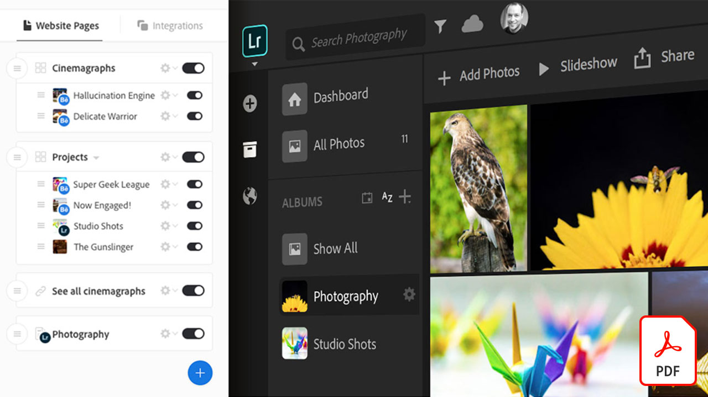

# 엔터프라이즈 자습서용 Creative Cloud

기업의 창조적 역할을 하기 위해서는 분산된 팀과 협업하고 확장 가능한 프로세스를 수립하며 기업 시스템과 지침을 준수해야 합니다. 이 자습서를 통해 엔터프라이즈 관점에서 Creative Cloud의 새로운 기능을 배울 수 있습니다.

## 제품 자습서를 보려면 클릭하십시오.

### Creative Cloud for enterprise

<table style="table-layout:fixed">
<tr>
 <td>
   
    

   <a href="assets/FromHandLetteringtoIllustratorviaCreativeCloud.pdf"><strong>Creative Cloud를 통해 Illustrator로 손 문자 보내기(PDF)</strong></a>
    

    <em>엔터프라이즈용 Creative Cloud의 강력한 기능을 사용하는 Adobe 모바일 및 데스크톱 앱을 사용하면 모든 장치에서 어디에서나 캡처, 변환 및 만들 수 있습니다.</em>
     
  </td>
  <td>
   
    

   <a href="assets/FromLightroomWebtoInDesignviaCreativeCloud.pdf"><strong>Lightroom Web에서 Creative Cloud를 통한 InDesign(PDF)</strong></a>
    

    <em>Creative Cloud 파일 및 라이브러리를 사용하여 카메라에서 최종 디자인으로 창의성 활용</em>
     
  </td>
  <td>
    
    

     
  </td>
</tr>
</table>

### Spark

<table style="table-layout:fixed">
<tr>
 <td>
   
    

   <a href="assets/AddingaGlideshowtoyourSparkPageAdobeBlog.pdf"><strong>Spark 페이지에 글라이더 추가(PDF)</strong></a>
    

    <em>Adobe Spark Page는 웹 스토리를 생생하게 표현하는 놀랍고 사용하기 쉬운 레이아웃 구성 요소를 제공합니다</em>
     
  </td>
  <td>
   
    

   <a href="assets/CreatingYourBrandinAdobeSpark.pdf"><strong>Adobe Spark에서 브랜드 만들기(PDF)</strong></a>
    

    <em>Adobe Spark를 사용하면 브랜드를 쉽게 정의할 수 있습니다.</em>
     
  </td>
  <td>
   
    

   <a href="assets/MeetYourNewProductionArtistAdobeSparkPost.pdf"><strong>새로운 프로덕션 아티스트를 만나보십시오. Adobe Spark 포스트(PDF)</strong></a>
    

    <em>레이아웃을 만들고, 색상을 정의하고, 아트웍을 가져오고, 컴포지션 내에서 요소를 정렬하면 Adobe Spark가 사용자로부터 학습합니다</em>
     
  </td>
</tr>
</table>

### Photoshop

<table style="table-layout:fixed">
<tr>
   <td>
    
    

    <a href="alphabetsoup.md"><strong>그래픽 형식의 알파벳 수프 디코딩</strong></a>
    

    <em>JPG, PNG, SVG, GIF 및 EPS 파일은 모두 디자인에 일반적으로 사용되며, 일부는 웹 페이지에 사용되고, 다른 일부는 프레젠테이션, 출판 및 크리에이티브 프로젝트에 사용됩니다. 그러나 무엇을 의미하며, 무엇을 선택해야 합니까?</em>
     
  </td>
  <td>
    
    

    <a href="compositepsipad.md"><strong>Adobe [!DNL Stock] 및 iPad용 Photoshop을 사용하여 고유한 합성 만들기</strong></a>
    

    <em>Photoshop의 강력한 성능을 손가락 끝으로 가져옵니다. 새롭게 설계된 터치 기반 인터페이스</em>를 사용하여 좋아하는 Creative Cloud 어플리케이션 중 하나를 완전히 새로운 방식으로 사용하는 방법을 배웁니다.
     
  </td>
  <td>
    
    

    <a href="cinemagraphps.md"><strong>Photoshop으로 영화관 만들기</strong></a>
    

    <em>이 단계별 워크숍 비디오 자습서에서는 Adobe [!DNL Stock]의 비디오를 Photoshop에서 정교한 마스킹 기술과 결합하여 살아있는 사진을 만듭니다</em>
     
  </td>
</tr>
<tr>
   <td>
    
    

    <a href="assets/AddRemarkableLightingtoaPhotowithPhotoshopandAfterEffects.pdf"><strong>Photoshop 및 After Effects를 사용하여 사진에 놀라운 조명 추가(PDF)</strong></a>
    

    <em>Adobe After Effects에서 [광선 버스트] 효과를 사용하여 사진을 크게 향상하는 방법 알아보기</em>
     
   </td>
   <td>
    
    

    <a href="assets/CreateCinemagraphsinaSnapwithPhotoshopandAdobeStock.pdf"><strong>Photoshop 및 Adobe [!DNL Stock](PDF)을 사용하여 스냅에서 CinemaHs 만들기</strong></a>
    

    <em>Photoshop에서 눈길을 끄는 영화관을 빠르게 조립하기 위해 Adobe [!DNL Stock]에서 비디오를 매끄럽게 반복하는 중</em>
     
  </td>
   <td>
    
    

    <a href="assets/CreatingaLivingPhotographwithPhotoshopPart1.pdf"><strong>Photoshop으로 살아있는 사진 만들기 — Part 1(PDF)</strong></a>
    

    <em>Adobe Photoshop을 사용하면 짧은 동영상을 다른 소셜 플랫폼에서 청중을 매료시키는 살아있는 사진으로 빠르게 전환할 수 있습니다</em>
     
  </td>
</tr>
<tr>
   <td>
    
    

    <a href="assets/CreatingaLivingPhotographwithPhotoshopPart2.pdf"><strong>Photoshop으로 살아있는 사진 만들기 — Part 2(PDF)</strong></a>
    

    <em>사진과 비디오를 결합하면 원본 이미지의 메시지나 톤을 그대로 유지하면서 사진에 매력적인 품질을 추가할 수 있습니다</em>
     
  </td>
  <td>
    
    

    <a href="assets/PhotoshopAfterEffectsAwesomenessAdobeMAX2018LabRecap.pdf"><strong>Photoshop + After Effects = [동일성]: Adobe MAX 2018 Lab Recap(PDF)</strong></a>
    

    <em>이 실습에서는 Photoshop과 After Effects를 결합하여 임의의 미디어에 사용하기에 적합한 입이 벌어지는 이미지와 효과를 만듭니다</em>
     
  </td>
  <td>
    
    

    <a href="assets/QuicklyBrandYourInstagramPhotoswithAdobePhotoshopActions.pdf"><strong>Adobe Photoshop Actions(PDF)를 사용하여 인스타그램 사진 빠르게 브랜드</strong></a>
    

    <em>Photoshop에서 [액션]을 사용하여 테디움 제거 및 시간 절약</em>
     
  </td>
</tr>
<tr>
    <td>
    
    

    <a href="assets/WorkSmarterNotHarderwithPhotoshop.pdf"><strong>Photoshop(PDF)을 사용하여 보다 효율적으로 작업</strong></a>
    

    <em>Photoshop의 변경 사항은 시간이 많이 걸릴 수 있지만</em>
     
  </td>
   <td>
    
    

    <a href="assets/AnyoneCanBeCreativewithAdobeCreativeCloud.pdf"><strong>창의적인 기술 세트에 Adobe Photoshop을 조금 추가합니다(PDF).</strong></a>
    

    <em>창의적인 기술 세트에 Adobe Photoshop을 조금 추가합니다.</em>
     
  </td>
  <td>
    
    

    <a href="assets/GreenScreenisNotJustforVideo.pdf"><strong>녹색 화면은 비디오용이 아닙니다(PDF).</strong></a>
    

    <em>사진 스튜디오에서 녹색 화면을 사용하고 After Effects를 사용하여 Photoshop에서 사진 사용을 준비할 수 있습니다</em>
     
  </td>
</tr>  
</table>

### Fresco

<table>
<tr>
 <td>
   
    

   <a href="frescoworkshop.md"><strong>iPad의 프레스코와 iPhone을 사용해 보십시오.</strong></a>
    

    <em>Adobe Fresco와 함께 15분 분량의 실습을 통해 디지털 드로잉과 그림의 새로운 세계를 경험해 보십시오.</em>
     
  </td>
  <td>
    
    

     
  </td>
  <td>
    
    

     
  </td>
</tr>
</table>

### Adobe Portfolio

<table  style="table-layout:fixed">
<tr>
   <td>
   
    

   <a href="assets/GettingStartedWithAdobePortfolio.pdf"><strong>Adobe 포트폴리오 시작(PDF)</strong></a>
    

    <em>Adobe Portfolio와 최상의 작업을 공유하는 것은 성공을 공유하고 새로운 창의적인 인재를 끌어들이는 효과적인 방법입니다</em>
     
  </td>
   <td>
   
    

   <a href="assets/ConnectingLightroomandBehancetoYourAdobePortfolio.pdf"><strong>Adobe Portfolio에 Lightroom 및 Biniance 연결(PDF)</strong></a>
    

    <em>포트폴리오의 페이지로 Babliance 프로젝트 사용</em>
     
  </td>
  <td>
   
    

   <a href="assets/ShowYourBestWorkwithAdobePortfolio.pdf"><strong>Adobe Portfolio(PDF)에서 최상의 작업 표시</strong></a>
    

    <em>Adobe Portfolio를 사용하면 전 세계의 잠재적 직원 및 클라이언트와 작업을 업로드, 구성 및 공유할 수 있습니다</em>
     
  </td>
 </tr>
 </table>

### 참조 라이브러리

<table  style="table-layout:fixed">
<tr>
  <td>
   
   

   <a href="ccteamlibraries.md"><strong>팀을 위한 Creative Cloud 라이브러리 만들기</strong></a>
    

    <em>팀의 Creative Cloud Library를 사용하여 그룹 또는 팀 내에서 자산을 공유하는 방법 알아보기</em>
     
  </td>
  <td>
   
   

   <a href="sharecclibraries.md"><strong>팀용 Creative Cloud Library와 브랜딩 자산 공유</strong></a>
    

    <em>팀용 Creative Cloud Libraries를 사용하여 그룹 또는 팀의 브랜딩 자산을 생성, 사용 및 공유하는 방법 알아보기</em>
     
  </td>
  <td>
   
    

   <a href="assets/CreateAddandShareYourBrandAssetswithCreativeCloudLibraries.pdf"><strong>Creative Cloud Libraries(PDF)를 사용하여 브랜드 자산을 작성, 추가 및 공유합니다.</strong></a>
    

    <em>Creative Cloud Libraries는 디자이너가 창의적인 팀에서 브랜드 자산을 공유할 수 있도록 하는 내장 브랜드 시스템을 제공합니다.</em>
     
  </td>
</tr>
<tr>
  <td>
   
    

   <a href="assets/ShareTextStylesFromIllustratorwithCreativeCloudLibraries.pdf"><strong>Illustrator의 텍스트 스타일을 Creative Cloud Library와 공유(PDF)</strong></a>
    

    <em>Illustrator에서 보다 효율적으로 작업</em>
     
  </td>
  <td>
    
    

     
  </td>
  <td>
    
    

     
  </td>
</tr>
</table>

### 글꼴

<table  style="table-layout:fixed">
<tr>
  <td>
   
    

   <a href="assets/CreatingBeautifulTypographywithCreativeCloud.pdf"><strong>Creative Cloud(PDF)를 사용하여 아름다운 입력 체계 만들기</strong></a>
    

    <em>좋아하는 디자인 도구에서 제공하는 최첨단 입력 그래픽 컨트롤을 활용하는 방법</em>
     
  </td>
   <td>
   
    

   <a href="assets/DiscoveringFontswithCreativeCloud.pdf"><strong>Creative Cloud로 글꼴 검색(PDF)</strong></a>
    

    <em>프로젝트에 적합한 글꼴을 찾는 것은 때때로 압도적으로 보일 수 있습니다. 다양한 Creative Cloud 앱 및 서비스를 통해 올바른 글꼴을 찾는 것은 이제 즐겁고 고무적인 </em>
     
  </td>
  <td>
   
    

   <a href="assets/UnleashHiddenGemsinOpenTypefonts.pdf"><strong>OpenType 글꼴에서 숨겨진 보석(PDF)을 표시합니다.</strong></a>
    

    <em>OpenType 형식을 사용하면 글꼴에 최대 65,536개의 글리프 문자를 포함할 수 있습니다</em>
     
  </td>
</tr>
</table>

### InDesign

<table  style="table-layout:fixed">
<tr>
  <td>
   
    

   <a href="assets/CreatingInteractivePDFsfromInDesign.pdf"><strong>InDesign에서 대화형 PDF 만들기(PDF)</strong></a>
    

    <em>InDesign에는 문서의 내용을 서식, 스타일, 관리 및 추적하는 데 도움이 되는 여러 기능이 포함되어 있습니다</em>
     
  </td>
   <td>
   
    

   <a href="assets/EasilyGatherandIncorporateDesignFeedbackwithAdobeAcrobatandInDesign.pdf"><strong>Adobe Acrobat 및 InDesign(PDF)을 사용하여 디자인 피드백을 쉽게 수집하고 통합합니다.</strong></a>
    

    <em>이해 관계자는 Acrobat을 사용하여 자세한 주석과 주석을 추가한 다음 해당 마크업을 Adobe InDesign으로 신속하게 다시 가져와서 레이아웃 컨텍스트에서 볼 수 있습니다</em>
     
  </td>
  <td>
   
    

   <a href="assets/StyleWebContentwithInDesign.pdf"><strong>Adobe InDesign CC(PDF)를 사용하여 웹 콘텐츠 스타일 지정</strong></a>
    

    <em>InDesign의 강력한 성능을 활용하여 HTML 및 웹 그래픽을 출력할 수 있다는 사실을 알고 계십니까?</em>
     
  </td>
</tr>
<tr>
   <td>
   
    

   <a href="assets/InteractivePDFBookmarksandLinkedTOCsfromInDesign.pdf"><strong>대화형 PDF: InDesign의 책갈피 및 연결된 목차(PDF)</strong></a>
    

    <em>InDesign의 목차 기능을 사용하여 PDF 파일에서 정보를 빠르게 찾을 수 있는 책갈피와 하이퍼링크를 모두 생성하는 방법을 알아봅니다.</em>
     
  </td>
   <td>
   
    

   <a href="assets/InteractivePDFGraphicalHyperlinksandNestedMasterPagesinInDesign.pdf"><strong>대화형 PDF: InDesign의 그래픽 하이퍼링크 및 중첩된 마스터 페이지(PDF)</strong></a>
    

    <em>마스터 페이지를 사용하여 하이퍼링크를 적용하면 모든 페이지에서 탐색 시스템을 빠르게 관리할 수 있습니다</em>
     
  </td>
  <td>
    
    

     
  </td>
</tr>
</table>

### Illustrator

<table  style="table-layout:fixed">
<tr>
   <td>
   
    

   <a href="assets/GettoKnowGraphicStylesinIllustrator.pdf"><strong>Illustrator의 그래픽 스타일 정보(PDF)</strong></a>
    

    <em>Illustrator에서는 텍스트를 스타일링하는 것과 같은 방식으로 아트웍을 스타일 지정할 수 있습니다</em>
     
  </td>
   <td>
   
    

   <a href="assets/WorkSmarterNotHarderwithIllustrator.pdf"><strong>Adobe Illustrator CC(PDF)를 사용하면 보다 효율적으로 작업할 수 있습니다.</strong></a>
    

    <em>Illustrator에서 벡터 드로잉 속도 향상</em>
     
  </td>
  <td>
   
    

   <a href="assets/IllustratorSymbolsandLayersequalsPerfectStructureforResponsiveSVG.pdf"><strong>Illustrator 심볼 + 레이어 = 응답 SVG를 위한 완벽한 구조! (PDF)</strong></a>
    

    <em>Illustrator에서는 아트웍의 심볼, 그룹, ID 및 정확한 벡터 정의를 만드는 기능을 비롯하여 SVG 형식을 완벽하게 지원합니다</em>
     
  </td>
</tr>
</table>

### [!DNL Dimension]

<table  style="table-layout:fixed">
<tr>
   <td>
   
    

   <a href="assets/VisualizeyourProductinaRealisticEnvironment.pdf"><strong>현실적인 환경에서 제품 시각화(PDF)</strong></a>
    

    <em>실제 환경에서 제품의 모양을 확인하려면 Adobe [!DNL Dimension]이 바로 가기 앱입니다.</em>
     
  </td>
  <td>
    
    

     
  </td>
  <td>
    
    

     
  </td>
</tr>
</table>
