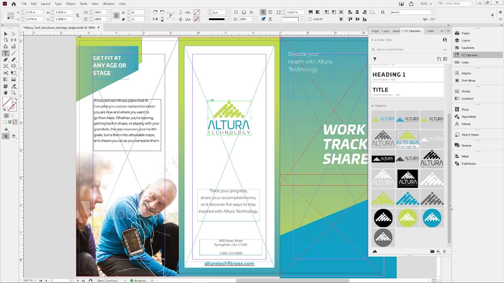
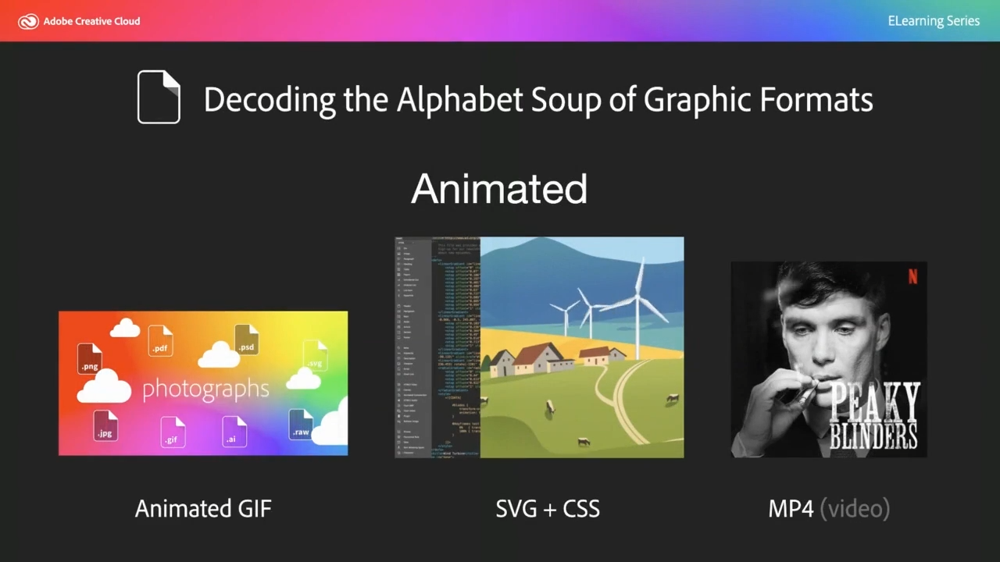

# 기업 튜토리얼에 대한 Creative Cloud

기업 크리에이티브는 분산된 팀과 공동 작업을 수행하고 확장 가능한 프로세스를 수립하며 기업 시스템 및 지침을 준수해야 합니다. 이 튜토리얼을 통해 기업의 관점에서 Creative Cloud의 새로운 기능을 학습할 수 있습니다.

## 확인할 제품(알파벳 순서로 나열됨) 튜토리얼 선택

### Adobe Acrobat

<table style="table-layout:fixed">
<tr>
 <td>
   
    

   <a href="acrobat-content-creators.md"><strong>콘텐츠 크리에이터용 Acrobat</strong></a>
    

    <em>크리에이티브 워크플로우를 간소화하는 데 도움이 되는 Acrobat 도구에 대해 알아봅니다</em>
     
  </td>
  <td>
    
    

     
  </td>
  <td>
    
    

     
  </td>
  <td>
    
    

     
  </td>
</tr>
</table>

### Adobe Portfolio

<table  style="table-layout:fixed">
<tr>
   <td>
   
    

   <a href="assets/GettingStartedWithAdobePortfolio.pdf"><strong>Adobe Portfolio 시작하기(PDF)</strong></a>
    

    <em>Adobe Portfolio과 최고의 작품을 공유하는 것은 여러분의 성공을 공유하고 새로운 창의적 인재를 끌어들이는 효과적인 방법입니다</em>
     
  </td>
  <td>
   
    

   <a href="assets/ConnectingLightroomandBehancetoYourAdobePortfolio.pdf"><strong>Lightroom 및 Behance를 Adobe Portfolio(PDF)에 연결</strong></a>
    

    <em>포트폴리오의 페이지로 Behance 프로젝트 사용</em>
     
  </td>
  <td>
   
    

   <a href="assets/ShowYourBestWorkwithAdobePortfolio.pdf"><strong>Adobe Portfolio(PDF)로 최고의 작품 표시하기</strong></a>
    

    <em>Adobe Portfolio을 사용하면 전 세계의 잠재 직원 및 고객과 작업을 업로드, 구성 및 공유할 수 있습니다</em>
     
  </td>
  <td>
    
    

     
  </td>
 </tr>
 </table>

### CC Libraries

<table  style="table-layout:fixed">
<tr>
  <td>
   
   

   <a href="cc-workflows-cc-libraries.md"><strong>CC Libraries를 통해 CC 워크플로우 개선</strong></a>
    

    <em>Creative Cloud 라이브러리가 디자인 요소를 함께 유지하여 디자이너와 팀의 프로젝트 일관성을 보장하는 방법에 대해 알아봅니다</em>
     
  </td>
  <td>
   
   

   <a href="ccteamlibraries.md"><strong>팀용 Creative Cloud 라이브러리 제작</strong></a>
    

    <em>팀용 Creative Cloud 라이브러리를 사용하여 그룹 또는 팀 내에서 에셋을 공유하는 방법 알아보기</em>
     
  </td>
  <td>
   
   

   <a href="sharecclibraries.md"><strong>팀용 Creative Cloud 라이브러리와 브랜딩 에셋 공유</strong></a>
    

    <em>팀용 Creative Cloud 라이브러리를 사용하여 그룹 또는 팀에 대한 브랜딩 에셋을 제작하고, 사용하고, 공유하는 방법에 대해 알아봅니다</em>
     
  </td>
  <td>
   
    

   <a href="assets/CreateAddandShareYourBrandAssetswithCreativeCloudLibraries.pdf"><strong>Creative Cloud 라이브러리(PDF)를 사용하여 브랜드 에셋 제작, 추가 및 공유</strong></a>
    

    <em>Creative Cloud 라이브러리는 디자이너가 크리에이티브 팀 전체에 브랜드 에셋을 공유할 수 있는 빌트인 브랜드 시스템을 제공합니다</em>
     
  </td>
  </tr>
  <tr>
  <td>
   
    

   <a href="assets/ShareTextStylesFromIllustratorwithCreativeCloudLibraries.pdf"><strong>Creative Cloud 라이브러리(PDF)를 사용하여 Illustrator의 텍스트 스타일 공유</strong></a>
    

    <em>Illustrator에서 더 스마트하게, 더 딱딱하게 작업</em>
     
  </td>
  <td>
    
    

     
  </td>
  <td>
    
    

     
  </td>
  <td>
    
    

     
  </td>
</tr>
</table>

### Creative Cloud for enterprise

<table style="table-layout:fixed">
<tr>
 <td>
   
    

   <a href="collaboration-the-future-of-creativity.md"><strong>공동 작업: 창의성의 미래</strong></a>
    

    <em>Adobe Creative Cloud 구독이 제공하는 다양한 혜택 중 하나는 Adobe Fonts에서 전문적으로 디자인 및 선별된 20,000개 이상의 글꼴을 무료로 이용할 수 있다는 것입니다</em>
     
  </td>
  <td>
   
    

   <a href="assets/FromHandLetteringtoIllustratorviaCreativeCloud.pdf"><strong>Creative Cloud(PDF)를 통한 손글씨에서 Illustrator으로</strong></a>
    

    <em>기업용 Adobe 모바일 및 데스크탑 앱에서 강력한 Creative Cloud 기능을 사용하여 장소에 상관없이 모든 디바이스에서 캡처하고, 변환하고, 제작할 수 있습니다</em>
     
  </td>
  <td>
   
    

   <a href="assets/FromLightroomWebtoInDesignviaCreativeCloud.pdf"><strong>Creative Cloud(PDF)를 통해 Lightroom 웹에서 InDesign으로</strong></a>
    

    <em>Creative Cloud 파일과 라이브러리를 사용하여 카메라에서 최종 디자인으로 창의력을 발휘하세요</em>
     
  </td>
  <td>
    
    

     
  </td>
</tr>
</table>

### [!DNL Dimension]

<table  style="table-layout:fixed">
<tr>
   <td>
   
    

   <a href="assets/VisualizeyourProductinaRealisticEnvironment.pdf"><strong>현실적인 환경에서 제품 시각화(PDF)</strong></a>
    

    <em>제품이 실제 어떻게 보이는지 확인하고 싶다면 Adobe [!DNL Dimension] 내 이동 앱임</em>
     
  </td>
  <td>
    
    

     
  </td>
  <td>
    
    

     
  </td>
  <td>
    
    

     
  </td>
</tr>
</table>

### Fresco

<table>
<tr>
 <td>
   
    

   <a href="frescoworkshop.md"><strong>iPad(및 iPhone)에서 Fresco 기능을 사용해 보세요.</strong></a>
    

    <em>15분 분량의 실습형 워크샵에서 Adobe Fresco을 통해 디지털 드로잉 및 페인팅의 완전히 새로운 세계를 살펴보세요.</em>
     
  </td>
  <td>
    
    

     
  </td>
  <td>
    
    

     
  </td>
  <td>
    
    

     
  </td>
</tr>
</table>

### 글꼴

<table  style="table-layout:fixed">
<tr>
<td>
   
    

   <a href="taming-type-anxiety.md"><strong>길들임형 불안</strong></a>
    

    <em>Creative Cloud에서 20,000개 이상의 전문적으로 디자인된 글꼴에 액세스하고 사용하는 방법에 대해 알아보십시오</em>
     
  </td>
  <td>
   
    

   <a href="assets/CreatingBeautifulTypographywithCreativeCloud.pdf"><strong>Creative Cloud(PDF)로 세련된 타이포그래피 만들기</strong></a>
    

    <em>자주 사용하는 디자인 툴에서 볼 수 있는 최첨단 타이포그래피 컨트롤을 활용하는 방법을 알아봅니다</em>
     
  </td>
   <td>
   
    

   <a href="assets/DiscoveringFontswithCreativeCloud.pdf"><strong>Creative Cloud을 사용하여 글꼴 검색(PDF)</strong></a>
    

    <em>프로젝트에 적합한 글꼴을 찾는 것은 때때로 부담스러워 보일 수 있습니다. 다양한 Creative Cloud 앱과 서비스를 통해 적합한 글꼴을 찾는 것은 이제 재미있고 영감을 줍니다</em>
     
  </td>
  <td>
   
    

   <a href="assets/UnleashHiddenGemsinOpenTypefonts.pdf"><strong>OpenType 글꼴에서 숨겨진 보석 풀기(PDF)</strong></a>
    

    <em>OpenType 형식을 사용하면 글꼴에 최대 65,536개의 글리프를 포함할 수 있습니다</em>
     
  </td>
</table>

### Illustrator

<table  style="table-layout:fixed">
<tr>
   <td>
   
    

   <a href="assets/GettoKnowGraphicStylesinIllustrator.pdf"><strong>Illustrator의 그래픽 스타일 알아보기(PDF)</strong></a>
    

    <em>Illustrator에서는 텍스트에 스타일을 지정하는 방식과 매우 유사하게 아트워크에 스타일을 적용할 수 있습니다</em>
     
  </td>
   <td>
   
    

   <a href="assets/WorkSmarterNotHarderwithIllustrator.pdf"><strong>Adobe Illustrator CC(PDF)로 더 스마트하게, 더 딱딱하게 작업</strong></a>
    

    <em>Illustrator에서 벡터 드로잉 속도 높이기</em>
     
  </td>
  <td>
   
    

   <a href="assets/IllustratorSymbolsandLayersequalsPerfectStructureforResponsiveSVG.pdf"><strong>Illustrator 심볼 + 레이어 = 반응형 SVG을 위한 완벽한 구조! (PDF)</strong></a>
    

    <em>Illustrator은 심볼, 그룹, ID 및 아트워크의 정확한 벡터 정의를 만드는 기능을 포함하여 SVG 형식에 대한 탁월한 지원을 제공합니다</em>
     
  </td>
  <td>
    
    

     
  </td>
</tr>
</table>

### InDesign

<table  style="table-layout:fixed">
<tr>
  <td>
   
    

   <a href="assets/CreatingInteractivePDFsfromInDesign.pdf"><strong>InDesign(PDF)에서 대화형 PDF 만들기</strong></a>
    

    <em>InDesign 에는 문서의 콘텐츠를 서식, 스타일, 관리 및 추적하는 데 도움이 되는 많은 기능이 포함되어 있습니다</em>
     
  </td>
   <td>
   
    

   <a href="assets/EasilyGatherandIncorporateDesignFeedbackwithAdobeAcrobatandInDesign.pdf"><strong>Adobe Acrobat 및 InDesign(PDF)를 사용하여 디자인 피드백을 간편하게 수집 및 통합</strong></a>
    

    <em>관련자는 Acrobat을 사용하여 자세한 주석과 주석을 추가할 수 있으며, 그런 다음 이러한 마크업을 Adobe InDesign으로 빠르게 다시 가져와 레이아웃 컨텍스트에서 볼 수 있습니다</em>
     
  </td>
  <td>
   
    

   <a href="assets/StyleWebContentwithInDesign.pdf"><strong>Adobe InDesign CC(PDF)를 사용하여 웹 콘텐츠에 스타일 지정</strong></a>
    

    <em>HTML 및 웹 그래픽을 출력할 때 InDesign 기능을 활용할 수 있다는 사실을 알고 계십니까?</em>
     
  </td>
  <td>
   
    

   <a href="assets/InteractivePDFBookmarksandLinkedTOCsfromInDesign.pdf"><strong>대화형 PDF: InDesign(PDF)의 책갈피 및 연결된 목차</strong></a>
    

    <em>PDF의 목차 기능을 사용하여 InDesign과 하이퍼링크를 모두 생성하여 독자가 파일에서 정보를 빠르게 찾는 방법을 살펴보세요</em>
     
  </td>
</tr>
<tr>
  <td>
   
    

   <a href="assets/InteractivePDFGraphicalHyperlinksandNestedMasterPagesinInDesign.pdf"><strong>대화형 PDF: InDesign(PDF)의 그래픽 하이퍼링크 및 중첩된 마스터 페이지</strong></a>
    

    <em>마스터 페이지에서 하이퍼링크를 적용하면 모든 페이지에서 빠르게 내비게이션 시스템을 관리할 수 있습니다</em>
     
  </td>
  <td>
    
    

     
  </td>
  <td>
    
    

     
  </td>
  <td>
    
    

     
  </td>
</tr>
</table>

### Photoshop

<table style="table-layout:fixed">
<tr>
  <td>
    
    

    <a href="alphabetsoup.md"><strong>그래픽 형식의 알파벳 수프 디코딩</strong></a>
    

    <em>JPG, PNG, SVG, GIF 및 EPS 파일은 모두 일반적으로 디자인에 사용되며, 일부는 웹 페이지용, 다른 일부는 프레젠테이션, 발행물 및 크리에이티브 프로젝트용으로 사용됩니다. 하지만 그게 무슨 뜻인데, 어떤 걸 골라야 하지?</em>
     
  </td>
  <td>
    
    

    <a href="compositepsipad.md"><strong>Adobe을 사용하여 고유한 합성 이미지 만들기 [!DNL Stock] 및 iPad용 Photoshop</strong></a>
    

    <em>Photoshop의 강력한 기능을 손쉽게 사용할 수 있습니다. 새롭게 디자인된 터치 기반 인터페이스를 사용하여 즐겨 사용하는 Creative Cloud 애플리케이션 중 하나를 완전히 새로운 방식으로 사용하는 방법을 알아보십시오</em>
     
  </td>
  <td>
    
    

    <a href="cinemagraphps.md"><strong>Photoshop으로 시네마그래프 만들기</strong></a>
    

    <em>이 단계별 워크숍 비디오 튜토리얼에서는 Adobe의 비디오를 결합하여 살아있는 사진을 만듭니다 [!DNL Stock] Photoshop의 현명한 마스크 기법 사용</em>
     
  </td>
  <td>
    
    

    <a href="assets/AddRemarkableLightingtoaPhotowithPhotoshopandAfterEffects.pdf"><strong>Photoshop 및 After Effects(PDF)를 사용하여 사진에 놀라운 조명 추가</strong></a>
    

    <em>Adobe After Effects에서 빛 폭발 효과를 사용하여 사진을 극적으로 향상시키는 방법을 알아봅니다</em>
     
  </td>
</tr>
<tr>
  <td>
    
    

    <a href="assets/CreateCinemagraphsinaSnapwithPhotoshopandAdobeStock.pdf"><strong>Photoshop 및 Adobe을 사용하여 Cinemagraphs를 빠르게 제작 [!DNL Stock] (PDF)</strong></a>
    

    <em>Adobe에서 원활하게 비디오가 반복되도록 검색 [!DNL Stock] Photoshop에서 시선을 사로잡는 영화용 사진을 신속하게 조합하기</em>
     
  </td>
  <td>
    
    

    <a href="assets/CreatingaLivingPhotographwithPhotoshopPart1.pdf"><strong>Photoshop으로 실물 사진 만들기 — Part 1 (PDF)</strong></a>
    

    <em>Adobe Photoshop을 사용하면 짧은 비디오를 모든 소셜 플랫폼에서 청중의 시선을 사로잡는 실물 사진으로 빠르게 변환할 수 있습니다</em>
     
  </td>
  <td>
    
    

    <a href="assets/CreatingaLivingPhotographwithPhotoshopPart2.pdf"><strong>Photoshop으로 실물 사진 만들기 — Part 2 (PDF)</strong></a>
    

    <em>사진과 비디오를 결합하면 원본 이미지의 메시지나 톤을 그대로 유지하면서 사진에 매력적인 품질을 추가할 수 있는 강력한 방법입니다</em>
     
  </td>
  <td>
    
    

    <a href="assets/PhotoshopAfterEffectsAwesomenessAdobeMAX2018LabRecap.pdf"><strong>Photoshop + After Effects = 훌륭함: Adobe MAX 2018 Lab 요약(PDF)</strong></a>
    

    <em>이 실습용 단계별 실습실에서는 Photoshop과 After Effects을 결합하여 모든 매체에서 사용하기에 적합한 놀라운 이미지와 효과를 만들어 냅니다</em>
     
  </td>
</tr>
<tr>
  <td>
    
    

    <a href="assets/QuicklyBrandYourInstagramPhotoswithAdobePhotoshopActions.pdf"><strong>Adobe Photoshop 동작(PDF)을 사용하여 빠르게 Instagram 사진 브랜딩</strong></a>
    

    <em>Photoshop에서 동작을 사용하여 지루함을 없애고 시간을 많이 절약하세요.</em>
     
  </td>
  <td>
    
    

    <a href="assets/WorkSmarterNotHarderwithPhotoshop.pdf"><strong>Photoshop(PDF)로 더 스마트하게, 더 딱딱하게 작업</strong></a>
    

    <em>Photoshop의 변경 사항은 시간이 많이 소요될 수 있지만 그럴 필요는 없습니다</em>
     
  </td>
  <td>
    
    

    <a href="assets/AnyoneCanBeCreativewithAdobeCreativeCloud.pdf"><strong>크리에이티브 스킬에 소규모 Adobe Photoshop 추가(PDF)</strong></a>
    

    <em>크리에이티브 스킬에 소량의 Adobe Photoshop 추가</em>
     
  </td>
  <td>
    
    

    <a href="assets/GreenScreenisNotJustforVideo.pdf"><strong>녹색 화면은 비디오에만 해당되지 않습니다(PDF).</strong></a>
    

    <em>사진 스튜디오에서 녹색 화면을 사용하고 After Effects을 사용하여 Photoshop에서 사용할 사진을 준비할 수 있습니다</em>
     
  </td>
</tr>  
</table>
