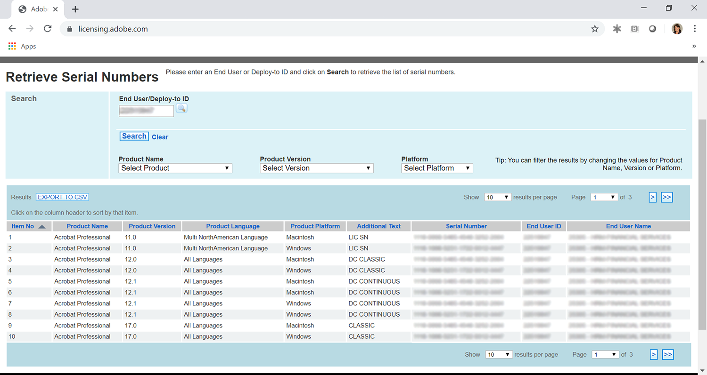
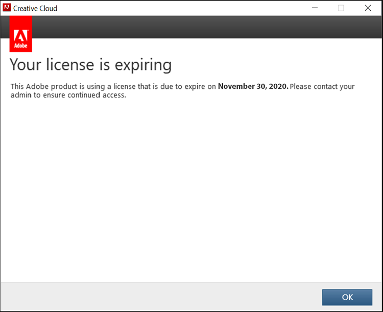

# 엔터프라이즈 및 Acrobat 일련 번호 만료를 위한 Creative Cloud 이해

지금까지 Adobe는 ETLA(Enterprise Term License Agreements)에 있는 고객에게 Creative Suite, Creative Cloud, Acrobat XI, Acrobat DC 등의 앱과 함께 일련 번호를 발행했습니다. 이러한 일련 번호에는 만료 날짜가 있습니다. 만료 날짜가 지나면 제품이 더 이상 작동하지 않으므로 일련 번호가 만료되기 전에 마이그레이션을 계획하는 것이 중요합니다. 이 페이지에서는 최종 사용자가 Adobe 앱과 서비스에 계속 액세스할 수 있도록 하는 데 필요한 단계를 간략하게 설명합니다.

## 만료 날짜에 대한 일련 번호 확인

### 일련 번호 찾기

ETLA 계약과 관련된 일련 번호 라이센스는 [Adobe 라이선스 웹 사이트](https://licensing.adobe.com/)(LWS)를 통해 구할 수 있습니다. 다음 지침에 따라 표시 및 다운로드:

1. Adobe ID와 암호를 사용하여 [Adobe 라이선스 웹 사이트](https://licensing.adobe.com/)(LWS)에 로그인합니다.
1. **라이센스 > 일련 번호 검색**&#x200B;을 선택합니다.
1. **최종 사용자 ID** 또는 **배포 대상 ID**&#x200B;를 입력하십시오.
1. (선택 사항) 결과를 필터링하려면 **제품 이름**, **제품 버전** 또는 **플랫폼**&#x200B;을 선택합니다.
1. 검색을 클릭합니다.
1. 제품 이름 및 시리얼 번호가 표시됩니다.
1. (선택 사항) &quot;CSV로 내보내기&quot;를 선택하여 일련 번호 목록을 다운로드합니다.

### 만료 날짜 확인

[AdobeExpiryCheck](https://helpx.adobe.com/enterprise/kb/volume-license-expiration-check.html)는 IT 관리자가 컴퓨터의 Adobe 제품에서 만료되었거나 만료되는 일련 번호를 사용하고 있는지 여부를 확인하는 명령줄 유틸리티입니다. 이 도구는 제품 라이센스 식별자(LEID), 암호화된 일련 번호 및 만료 날짜와 같은 정보를 표시합니다. 이 [페이지](https://helpx.adobe.com/enterprise/kb/volume-license-expiration-check.html)에는 Mac 또는 Windows 컴퓨터에서 도구를 다운로드하고 사용하는 방법에 대한 지침이 포함되어 있습니다.

## 일련 번호가 만료되기 전후의 최종 사용자 경험 이해

엔터프라이즈 앱용 Acrobat과 Creative Cloud 모두 만료 60일 전부터 메시지를 앱 내에 표시하기 시작합니다. 일련 번호가 만료되면 제품이 작동을 중지하고 사용자에게 조치를 취하라는 메시지를 표시합니다.

### 엔터프라이즈 환경을 위한 창조적 클라우드

다음 정보는 최종 사용자 경험을 간략하게 설명합니다. 아래에 짧은 비디오가 있고, 그 다음에 최종 사용자 경험에 대한 검토가 있습니다.

>[!VIDEO](https://video.tv.adobe.com/v/331746?hidetitle=true)

**만료 전**

일련 번호가 만료되기 60일 전부터 엔터프라이즈 앱용 Creative Cloud는 모든 최종 사용자에게 제품 대화 상자를 표시합니다. 이 메시지는 만료 30일 전까지는 매주 나타나다가 *라이센스가 만료됨을 나타내는 만료 날짜까지 매일 표시됩니다. 이 Adobe 제품은 2020년 11월 29일에 만료되는 라이센스를 사용하고 있습니다. 계속 액세스하려면 관리자에게 문의하십시오.*

**만료 후**

일련 번호가 만료되면 사용자는 엔터프라이즈 앱용 Creative Cloud에 더 이상 액세스할 수 없습니다. 만료 후 처음 시작할 때 *입력한 일련 번호가 만료되었다는 대화 상자가 표시됩니다. 이 제품은 라이센스를 받을 수 없습니다. 고객 지원 센터에 문의하십시오.*

이후에 앱을 시작하려는 모든 시도의 경우 최종 사용자에게 **지금 로그인**&#x200B;에 대한 메시지가 표시되고, 그 뒤에 Adobe ID를 직접 만들고 평가판 모드로 들어가는 옵션이 표시됩니다. 그러나 최종 사용자가 만든 새로운 Adobe ID는 조직의 라이센스와 연관되지 않으며 사용자에게 추가 혼란을 초래합니다. 업무 중단 및/또는 불필요한 혼란을 방지하려면 일련 번호가 만료되기 전에 사용자를 명명된 사용자 라이선스로 마이그레이션하십시오.

### Acrobat 경험

다음 정보는 최종 사용자 경험을 간략하게 설명합니다. 아래에 짧은 비디오가 있고, 그 다음에 최종 사용자 경험에 대한 검토가 있습니다.

>[!VIDEO](https://video.tv.adobe.com/v/331749?hidetitle=true)

**만료 전**

일련 번호가 만료되기 60일 전부터 Acrobat은 최종 사용자에게 제품 팝업 메시지를 표시합니다. 이것은 만료 7일 전까지 일주일에 한 번 나타납니다. 그러면 Adobe Acrobat 라이센스가 2020년 11월 30일에 만료됨을 알리는 *이(가) 매일 표시됩니다. 관리자에게 문의하여 중단 없이 Acrobat을 계속 사용하십시오.*

**만료 후**

일련 번호가 만료되면 사용자는 더 이상 Acrobat에 액세스할 수 없습니다. 만료 후 처음 시작할 때 *입력한 일련 번호가 만료되었다는 대화 상자가 표시됩니다. 이 제품은 라이센스를 받을 수 없습니다. 고객 지원 센터에 문의하십시오.*

이후에 Acrobat을 시작하려는 모든 시도의 경우, 최종 사용자에게 **지금 로그인**&#x200B;하라는 메시지가 표시되고, 그 뒤에 Adobe ID를 직접 만들고 시도 모드로 들어가는 옵션이 표시됩니다. 그러나 최종 사용자가 만든 새로운 Adobe ID는 조직의 라이센스와 연관되지 않으며 사용자에게 추가 혼란을 초래합니다.

## 도움이 필요하면 연락

[AdobeExpiryCheck](https://helpx.adobe.com/enterprise/kb/volume-license-expiration-check.html) 도구를 사용하는 방법에 대한 질문이 있거나 일련 번호 배포에서 명명된 사용자로 마이그레이션하는 데 도움이 필요한 경우 다음 옵션을 사용할 수 있습니다.
* Adobe Enterprise 온보딩 팀에 전자 메일 보내기 - **entonb@adobe.com**
* [관리 콘솔](https://adminconsole.adobe.com/support)에서 지원 티켓 열기
* Adobe Account Manager 또는 고객 성공 관리자에게 문의하십시오.
