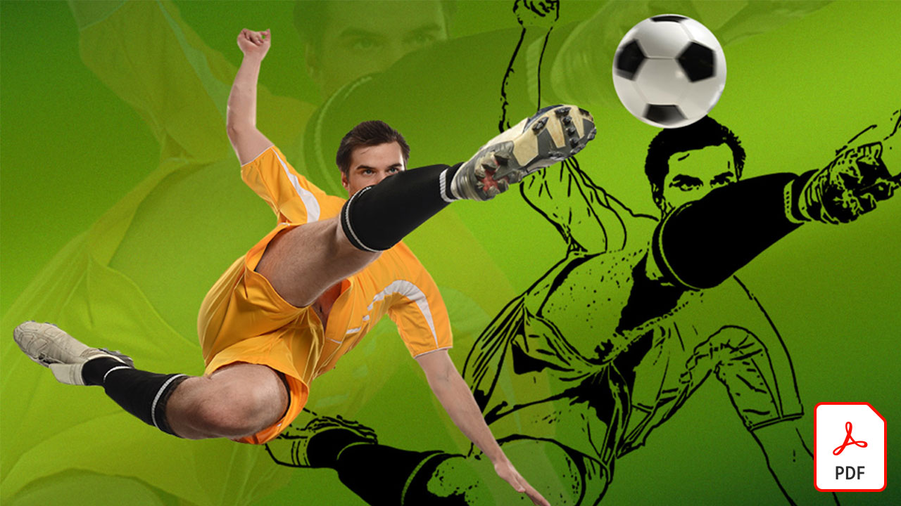
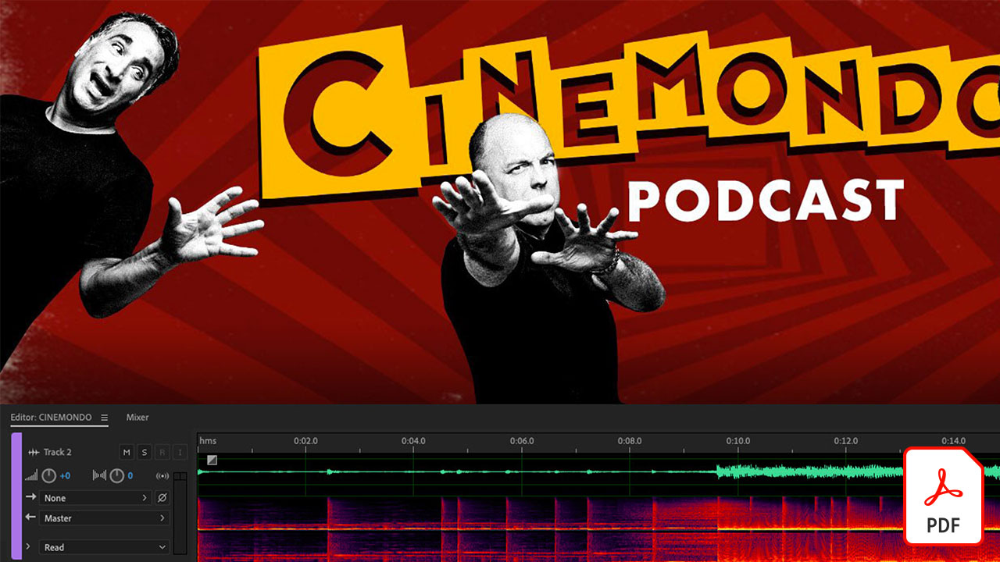
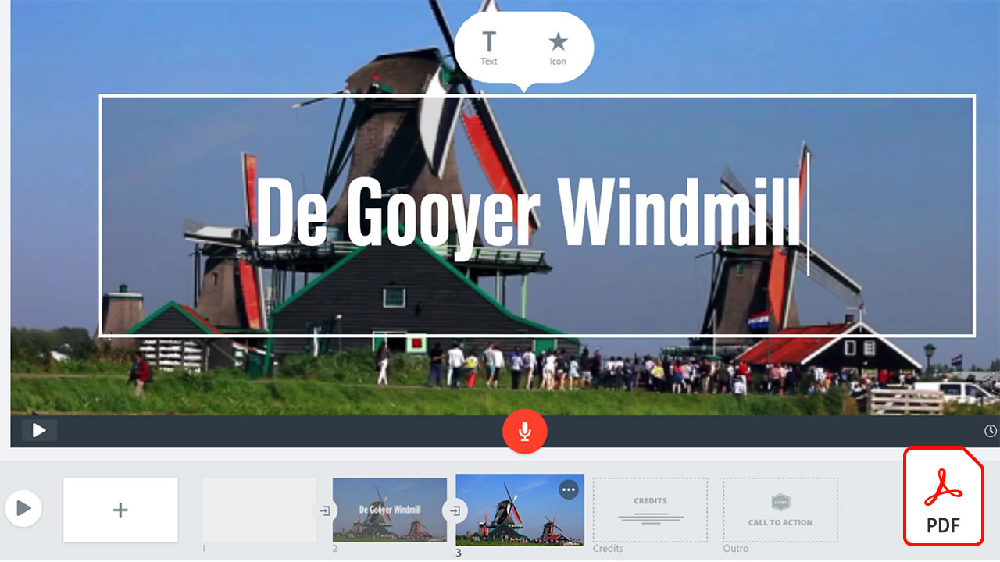

# Adobe 비디오 자습서

비디오 편집, 동작 그래픽, 시각 효과, 애니메이션 등을 위한 Adobe 소프트웨어 및 앱을 통해 아이디어를 현실로 끌어오세요.

## Adobe 비디오 자습서를 보려면 클릭하십시오.

<table>
<tr>
 <td>
   
    

   <a href="assets/AfterEffectsforPhotography.pdf"><strong>사진용 After Effects(PDF)</strong></a>
    

    <em>After Effects의 놀라운 효과를 사용하여 사진을 강화하는 방법을 알아봅니다.</em>
     
  </td>
  <td>
   
    

   <a href="assets/CinemagraphsTheMesmerizingPlaceBetweenaPhotoandaVideo.pdf"><strong>극장각: 사진과 비디오 사이의 매혹적인 장소(PDF)</strong></a>
    

    <em>영화관에 대해 자세히 알아보기 — 사진과 비디오 사이에 존재하는 눈길을 사로잡는 잡종</em>
     
  </td>
  <td>
   
    

   <a href="assets/CreateanIllustrationfromanAdobeStockPhotowithAfterEffects.pdf"><strong>After Effects를 사용하여 Adobe [!DNL Stock] 사진에서 그림 만들기(PDF)</strong></a>
    

    <em>Adobe [!DNL Stock] 사진에서 고유한 스타일화된 그림을 만들려면 After Effects의 [색조/채도] 및 [레벨]을 [만화] 효과와 결합합니다.</em>
     
  </td>
</tr>
<tr>
 <td>
   
    

   <a href="assets/CreateAnimatedTitlesUsingMotionGraphicsTemplatesinAdobePremiereRush.pdf"><strong>Adobe Premiere에서 모션 그래픽 템플릿을 사용하여 애니메이션 제목 만들기 [!DNL Rush](PDF)</strong></a>
    

    <em>스토리에 맞는 전문 디자인의 Motion Graphics 템플릿을 추가하거나 개인 브랜드와 어울리는 비디오를 더욱 놀라운 모습으로 만들어 보세요.</em>
     
  </td>
  <td>
   
    

   <a href="assets/CreateBeautifulKaleidoscopePatternswithAfterEffects.pdf"><strong>After Effects PDF로 아름다운 Kaleidoscope 패턴 만들기)</strong></a>
    

    <em>Adobe After Effects에서 CC Kaleida 효과를 사용하여 임의의 이미지에서 무한한 수의 패턴과 텍스처를 만듭니다.</em>
     
  </td>
  <td>
   
    

   <a href="assets/CreateIntricateTransparencyinyourPhotographswithKeyinginAfterEffects.pdf"><strong>After Effects에서 키잉을 사용하여 사진에서 복잡한 투명도 만들기(PDF)</strong></a>
    

    <em>키잉은 비디오에 많이 사용되며 디자인 프로젝트에 사진이 필요할 때 큰 도움이 될 수도 있습니다</em>
     
  </td>
</tr>
<tr>
 <td>
   
    

   <a href="assets/DazzlingLightEffectsforPhotographywithAfterEffects.pdf"><strong>After Effects를 사용한 사진용 눈부신 조명 효과(PDF)</strong></a>
    

    <em>Adobe After Effects의 조명 효과는 사진의 모양을 크게 변경할 수 있습니다</em>
     
  </td>
  <td>
   
    

   <a href="assets/EditingVRPhotography360photoswithAfterEffects.pdf"><strong>After Effects에서 VR 사진(360도 사진) 편집(PDF)</strong></a>
    

    <em>더 몰입감 있는 대화형 게임과 경험은 그다지 흔하지 않지만, 360도 사진은 이미 여기에 있습니다</em>
     
  </td>
  <td>
   
    

   <a href="assets/QuicklyRemoveUnwantedAudioContentwiththeSpotHealingBrushinAdobeAudition.pdf"><strong>Adobe Audition에서 스팟 복구 브러쉬를 사용하여 원하지 않는 오디오 내용 빠르게 제거(PDF)</strong></a>
    

    <em>Adobe Photoshop 스팟 복구 브러쉬를 사용하면 Adobe Audition의 오디오 파일에서 산만하게 들리는 소리를 제거할 수 있다는 사실을 알고 계십니까?</em>
     
  </td>
</tr>
<tr>
   <td>
   
    

   <a href="assets/ShowcaseyourSparkVideoinyourSparkPage.pdf"><strong>Spark 페이지에서 Spark 비디오 쇼케이스(PDF)</strong></a>
    

    <em>Adobe Spark 페이지에서는 Spark Video를 사용하여 만든 비디오를 비롯하여 다양한 소스에서 비디오를 로드할 수 있습니다.</em>
     
  </td>
  <td>
   
    

   <a href="assets/SmoothlyCombineMusicandDialogueorNarrationwithAutoduckinginAdobePremiereRush.pdf"><strong>Adobe Premiere에서 음악 및 대화 또는 내레이션을 자동 덕킹과 원활하게 결합 [!DNL Rush] Adobe(PDF)</strong></a>
    

    <em>Adobe Premiere [!DNL Rush]는 사용이 간편한 앱에서 고급 비디오 편집 기능을 제공하므로 누구나 몇 분 만에 고품질 비디오를 만들 수 있습니다.</em>
     
  </td>
</tr>
</table>
