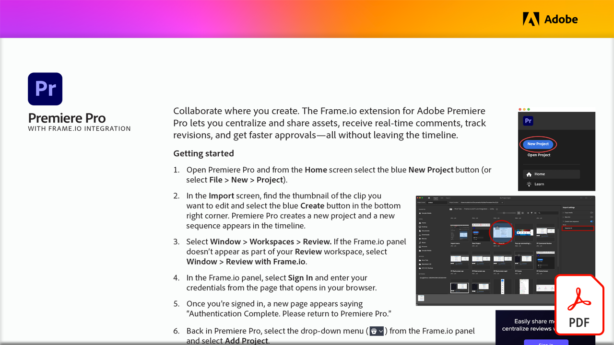

# Frame.io를 사용한 비디오 검토

어디에서나 공동 작업 이 실습 튜토리얼에서는 Adobe Premiere Pro용 Frame.io 확장을 통해 타임라인을 종료하지 않고도 에셋을 중앙 집중화하고 공유하고 실시간 주석을 수신하며 수정 내용을 추적하고 승인 속도를 높이는 방법을 살펴봅니다.

이 PDF 튜토리얼을 보거나 다운로드하려면 아래 이미지를 선택하십시오.

[{&quot;width=680&quot;}](assets/Video-review-with-Frame.io.pdf){target=&quot;blank&quot;}