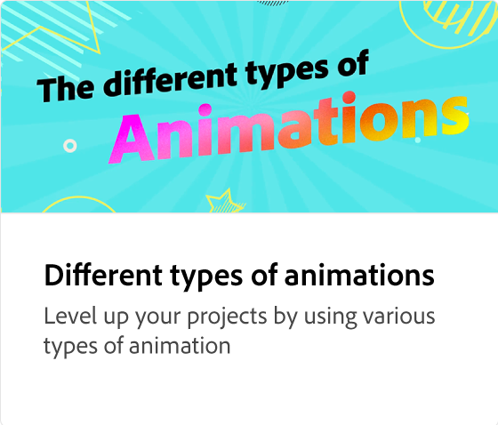

# 애니메이션에 섹션 추가

애니메이션에 이미지, 헤드라인 등의 요소를 추가하여 애니메이션의 수준을 높여 보세요. 애니메이션을 그대로 유지하면서 장면에 요소를 추가, 복제, 재정렬 또는 교체하는 방법을 알아봅니다.

>[!VIDEO](https://video.tv.adobe.com/v/3433927?quality=12&learn=on&hidetitle=true&captions=kor)

## 이 시리즈의 추가 비디오

<table style="table-layout:fixed">
<tr>
   <td>
         
   </td>
  <td>
         
   </td>
   <td>
         
   </td>
   <td>
         
   </td>
</tr>
<tr>
    <td>
         
   </td>
   <td>
         
   </td>
   <td>
         
   </td>
   <td>
         
   </td>
</tr>
</table>
