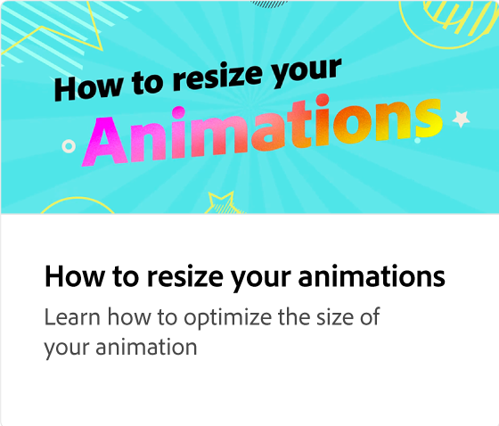

# 다양한 유형의 애니메이션

프로젝트에 더 매력적으로 보이도록 추가할 수 있는 세 가지 애니메이션 유형(인트로, 루핑, 아웃트로)에 대해 알아봅니다. 애니메이션마다 미리 보고 선택할 수 있는 스타일이 다릅니다.

>[!VIDEO](https://video.tv.adobe.com/v/3426976?quality=12&learn=on&hidetitle=true)

## 이 시리즈의 추가 비디오

<table style="table-layout:fixed">
<tr>
   <td>
         
   </td>
   <td>
         
   </td>
   <td>
         
   </td>
   <td>
         
   </td>
</tr>
<tr>
   <td>
         
   </td>
   <td>
         
   </td>
   <td>
         
   </td>
   <td>
         
   </td>
</tr>
</table>
