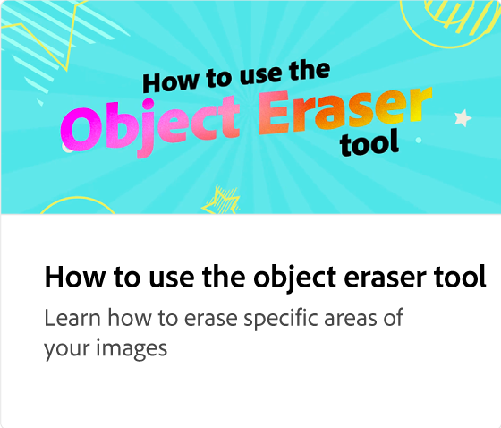

# PDF 편집 방법

시선을 사로잡는 텍스트, 이미지, 브랜드, 색상, 애니메이션 등을 추가하여 정적이고 오래된 PDF을 새롭게 만드는 방법을 살펴보세요. 편집이 완료되면 PDF을 다운로드하거나, 공유하거나, PDF과 같은 다른 파일 형식으로 변환할 수 있습니다.

>[!VIDEO](https://video.tv.adobe.com/v/3427024?quality=12&learn=on&hidetitle=true)

## 이 시리즈의 추가 비디오

<table style="table-layout:fixed">
<tr>
   <td>
         
   </td>
   <td>
         
   </td>
   <td>
         
   </td>
   <td>
         
   </td>      
</tr>
<tr>
   <td>
      
   </td>
   <td>
      
   </td>
   <td>
      
   </td>
    <td>
      
   </td>
</tr>
</table>
