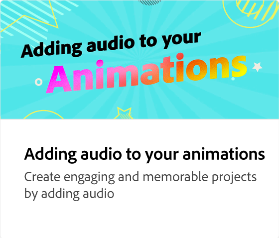

# 애니메이션 내보내기

편집하도록 사람들을 초대하거나, 웹에 게시하거나, 소셜 게시물을 예약하거나, 애니메이션을 다운로드하는 방법을 살펴보세요. Adobe Express은 상황에 따라 내보낼 파일 형식에 대한 권장 사항을 제공합니다.

>[!VIDEO](https://video.tv.adobe.com/v/3426985?quality=12&learn=on&hidetitle=true)

## 이 시리즈의 추가 비디오

<table style="table-layout:fixed">
<tr>
   <td>
         
   </td>
  <td>
         
   </td>
   <td>
         
   </td>
   <td>
         
   </td>
</tr>
<tr>
    <td>
         
   </td>
   <td>
         
   </td>
   <td>
         
   </td>
   <td>
         
   </td>
</tr>
</table>
