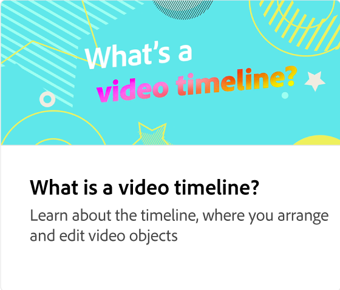

# 비디오 내보내기 방법

비디오 해상도를 설정하고, 다운로드하고, 소셜 채널에 비디오를 직접 공유하는 방법을 알아봅니다.

>[!VIDEO](https://video.tv.adobe.com/v/3427093?quality=12&learn=on&hidetitle=true)

## 이 시리즈의 추가 비디오

<table style="table-layout:fixed">
<tr>
   <td>
         
   </td>
  <td>
         
   </td>
   <td>
         
   </td>
   <td>
         
   </td>
</tr>
<tr>
  <td>
         
   </td>
   <td>
    
    

     
   </td>
   <td>
    
    

     
   </td>
   <td>
    
    

     
   </td>
</tr>
</table>
