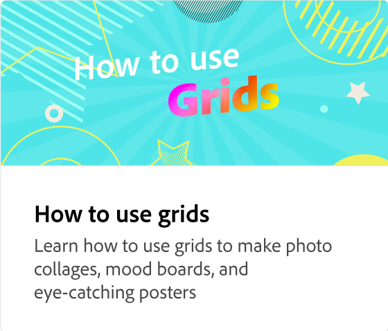

# 레이어 및 아트보드 작업

디자인 프로젝트에서 아트보드 및 레이어를 사용하여 작업하는 방법에 대해 알아봅니다. 다양한 소셜 채널에 대해 아트보드를 추가, 삭제, 복제, 순서 변경 및 크기 조정합니다. 레이어 스택에서 요소의 순서를 변경할 수도 있습니다.

>[!VIDEO](https://video.tv.adobe.com/v/3420214?quality=12&learn=on&hidetitle=true)

## 이 시리즈의 추가 비디오

<table style="table-layout:fixed">
<tr>
 <td>
      
  </td>
   <td>
      
  </td>
   <td>
      
  </td>
  <td>
      
  </td>
</tr>
<tr>
   <td>
      
  </td>
   <td>
      
  </td>
   <td>
      
  </td>
   <td>
         
   </td>
</tr>
<tr>
   <td>
   
   </td>
   <td>
   
   </td>
   <td>
   
   </td>
   <td>
      
      

       
   </td>
</tr>
</table>
