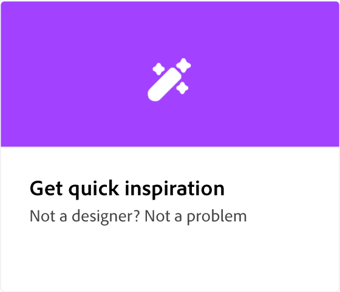

# Adobe [!DNL Express] 사용 방법 튜토리얼

Adobe Firefly 기반의 생성형 인공지능으로 돋보이는 놀라운 작품을 만들어 보세요. Adobe Express으로 전단지, 틱톡, 이력서, 릴 디자인하기

## 시작

<table style="table-layout:fixed">
<tr>
 <td>
      
 </td>
 <td>
      
 </td>
 <td>
      
 </td>
 <td>
      
      

       
   </td>
</tr>
</table>

## 기본 사항

<table style="table-layout:fixed">
<tr>
 <td>
      
  </td>
   <td>
      
  </td>
   <td>
      
  </td>
  <td>
      
  </td>
</tr>
<tr>
   <td>
      
  </td>
   <td>
      
  </td>
   <td>
      
  </td>
   <td>
         
   </td>
</tr>
<tr>
   <td>
         
   </td>
   <td>
   
   </td>
   <td>
   
   </td>
   <td>
   
   </td>
</tr>
<tr>
   <td>
      
   </td>
   <td>
      
  </td>
  <td>
      
      

       
   </td>
   <td>
      
      

       
   </td>
</tr>
</table>

## 애니메이션

<table style="table-layout:fixed">
<tr>
   <td>
         
   </td>
  <td>
         
   </td>
   <td>
         
   </td>
   <td>
         
   </td>
</tr>
</table>

## 고급 작업

<table style="table-layout:fixed">
<tr>
   <td>
      
   </td>
   <td>
   
   </td>
   <td>
         
   </td>
   <td>
      
  </td>
</tr>
<tr>
  <td>
      
  </td>
   <td>
      
  </td>
   <td>
         
   </td>
  <td>
         
   </td>
</tr>
</table>
