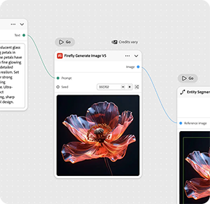

# &#x200B;3. 첫 번째 그래프 만들기

노드, 연결 및 템플릿이 무엇인지 알게 되면 첫 번째 워크플로우를 빌드할 준비가 된 것입니다.

1. Firefly을 열고 왼쪽 메뉴에서 **그래프**&#x200B;를 선택합니다.
1. **새 그래프 만들기**&#x200B;를 선택합니다.
1. 빈 캔버스를 마우스 오른쪽 단추로 클릭하고 **개 이상의 새 노드**&#x200B;를 선택합니다.
1. 왼쪽 메뉴에서 **입력**&#x200B;을 선택한 다음 **입력 이미지**&#x200B;를 선택합니다.
   
그래픽을 가져올 수 있는 노드입니다.
1. 이미지를 노드로 드래그하여 놓습니다.
   
1. 빈 캔버스를 마우스 오른쪽 버튼으로 클릭하고 **+ 새 노드**&#x200B;을(를) 선택한 다음 대화 상자에서 **그레이디언트 마스크**&#x200B;를 선택합니다.
1. 빈 캔버스를 마우스 오른쪽 버튼으로 클릭하고 **이상의 새 노드**&#x200B;을(를) 선택한 다음 대화 상자에서 **마스크 적용**&#x200B;을 선택합니다.

## 다음 단계

템플릿에서 시작하시겠습니까? [4로 이동합니다. 템플릿 &#x200B;](https://experienceleague.adobe.com/ko/docs/creative-cloud-enterprise-learn/cce-learning-hub/fireflyoverview/firefly-graph/customize-template)을(를) 사용자 정의하여 나만의 간단한 내용을 반영합니다.
