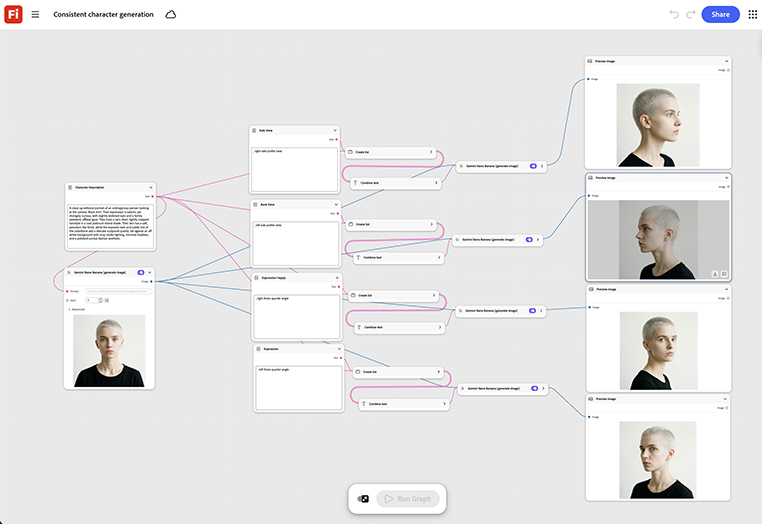

# 일관된 문자 생성

캐릭터의 참조 이미지 하나를 로드한 다음 새로운 샷마다 장면 또는 포즈 프롬프트를 바꾸는 방법을 알아봅니다. [일관된 문자 생성 서식 파일을 엽니다](https://firefly.adobe.com/graph/edit/id/urn:aaid:sc:US:6ab4c3c7-ead2-5fa5-9441-75b7a362ce11).

>[!TIP]
>
>**시작하기 전** - 최상의 결과를 얻으려면 이 템플릿을 나만의 브랜드, 제품 및 워크플로로 사용자 지정하세요. 출력을 사용하기 전에 참조 이미지, 프롬프트 및 사본을 스왑합니다.

[!BADGE 사용 사례]{type=Informative tooltip="사용 사례"}

* **여행** - 모든 장면에 대해 illustrator를 다시 설명하지 않고 반복 안내선 또는 마스코트 캐릭터를 멀티 비디오 대상 시리즈 및 소셜 콘텐츠에서 일관되게 유지합니다.
* **소매** - 수십 개의 시즌 제품 사진과 소셜 게시물에서 하나의 브랜드 스포크 캐릭터를 유지합니다.
* **교육** - 과정의 모든 강의 비디오에서 애니메이션 강사 캐릭터를 일관되게 유지합니다.

{align="center"}

[Firefly 그래프 시작하기](https://experienceleague.adobe.com/ko/docs/creative-cloud-enterprise-learn/cce-learning-hub/fireflyoverview/firefly-graph/overview-firefly-graph)&#x200B;(으)로 돌아갑니다.
