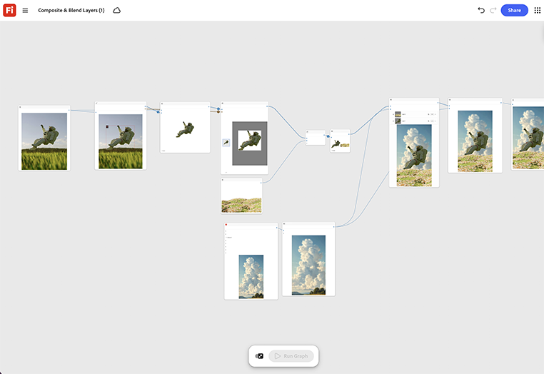

# 레이어 합성 및 혼합

제품 컷아웃과 배경 장면을 별도의 레이어 입력으로 누적하는 방법을 알아봅니다. 합성 이미지가 한 샷으로 읽혀질 때까지 혼합 모드와 조명 노드를 조정합니다. [합성 및 혼합 레이어 템플릿 열기](https://firefly.adobe.com/graph/edit/id/urn:aaid:sc:US:6ab4c3c7-ead2-5fa5-9441-75b7a362ce11).

>[!TIP]
>
>**시작하기 전** - 최상의 결과를 얻으려면 이 템플릿을 나만의 브랜드, 제품 및 워크플로로 사용자 지정하세요. 출력을 사용하기 전에 참조 이미지, 프롬프트 및 사본을 스왑합니다.

{align="center"}

[!BADGE 업계 예]{type=Informative tooltip="사용 사례"}

* **음료** - 여름 캠페인의 해변 라이프스타일 장면에 새로운 캔 디자인을 합성합니다.
사진 대원, 위치로 이동.
* **소매** - 홈페이지 배너를 위해 제품 컷아웃을 계절별 라이프스타일 배경에 혼합합니다.
* **여행** - 공동 브랜드 프로모션을 위해 제품 사진 뒤에 목적지 배경을 합성합니다.

{align="center"}

[Firefly 그래프 시작하기](https://experienceleague.adobe.com/en/docs/creative-cloud-enterprise-learn/cce-learning-hub/fireflyoverview/firefly-graph/overview-firefly-graph)&#x200B;(으)로 돌아갑니다.
