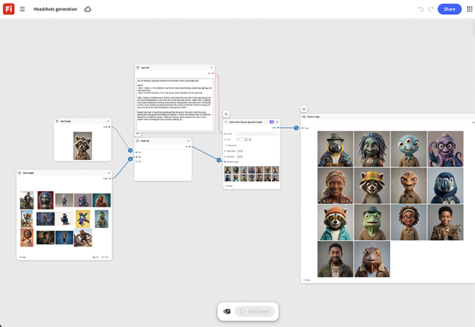

# 헤드샷 세대

여러 회사 헤드샷을 조화롭게 만드는 방법을 알아봅니다. 그래프는 조명, 배경,
한 번에 전체 세트를 자릅니다. [열린 헤드샷 생성 템플릿](https://firefly.adobe.com/graph/edit/id/urn:aaid:sc:US:5da3f95f-63e5-5335-9e10-58cfadd7ad3f).

>[!TIP]
>
>**시작하기 전** - 최상의 결과를 얻으려면 이 템플릿을 나만의 브랜드, 제품 및 워크플로로 사용자 지정하세요. 출력을 사용하기 전에 참조 이미지, 프롬프트 및 사본을 스왑합니다.

[!BADGE 사용 사례]{type=Informative tooltip="사용 사례"}

* **기술** - 모든 신입 사원에 대해 사진 작가를 예약하지 않고도 업데이트된 직원 디렉터리에 대한 일관된 헤드샷 세트를 손쉽게 생성할 수 있습니다.
* **재무** - 팀별 모임 페이지에 대한 관리자 팀의 헤드샷을 표준화합니다.
* **상태** - 통일된 웹 사이트 모양을 위해 여러 클리닉 위치에서 직원 헤드샷을 표준화합니다.

{align="center"}

[Firefly 그래프 시작하기](https://experienceleague.adobe.com/en/docs/creative-cloud-enterprise-learn/cce-learning-hub/fireflyoverview/firefly-graph/overview-firefly-graph)&#x200B;(으)로 돌아갑니다.
