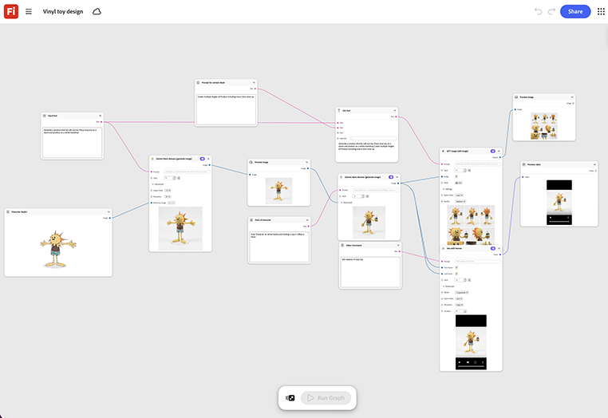

# 비닐 장난감 디자인

캐릭터 또는 마스코트 참조를 입력하고 스타일화된 비닐 장난감 형식으로 렌더링하는 방법을 알아봅니다. 라이선싱 또는 제품 검토 데크에 대한 반환 각도가 있습니다. [비닐 장난감 디자인 템플릿을 엽니다](https://firefly.adobe.com/graph/edit/id/urn:aaid:sc:US:6b1e062a-bf16-5dc9-99dd-c3bd4061e238).

>[!TIP]
>
>**시작하기 전** - 최상의 결과를 얻으려면 이 템플릿을 나만의 브랜드, 제품 및 워크플로로 사용자 지정하세요. 출력을 사용하기 전에 참조 이미지, 프롬프트 및 사본을 스왑합니다.

{align="center"}

[!BADGE 업계 예]{type=Informative tooltip="사용 사례"}

* **리테일** - 로열티 프로그램 시작과 관련된 한정 버전의 컬렉션이 디자인되고, 제조 실행을 커밋하기 전에 개념으로 검토됩니다.
* **음료** - 한정 판매 상품 드롭을 위해 브랜드 마스코트의 수집 가능한 인물을 목격한 것.
* **엔터테인먼트** - 라이선싱 피치 데크에 사용할 캐릭터를 비닐 장난감 형식으로 미리 봅니다.

{align="center"}

[Firefly 그래프 시작하기](https://experienceleague.adobe.com/ko/docs/creative-cloud-enterprise-learn/cce-learning-hub/fireflyoverview/firefly-graph/overview-firefly-graph)&#x200B;(으)로 돌아갑니다.
