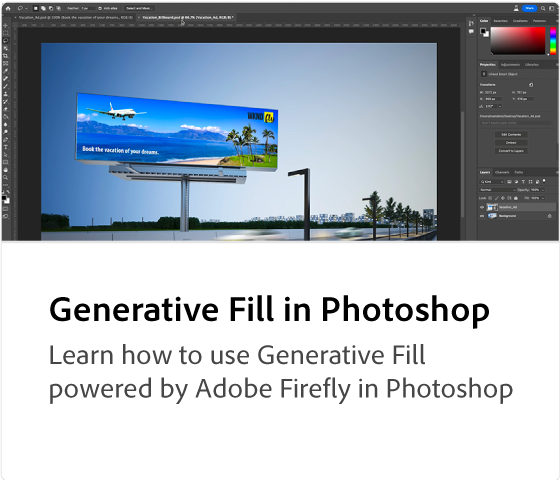

# Adobe [!DNL Firefly] 개요

Firefly은 Adobe 제품에 출시될 크리에이티브 제너레이티브 AI 모델의 새 제품군으로, 처음에는 이미지 및 텍스트 효과 생성에 초점을 맞춥니다. Firefly은 크리에이티브 워크플로우를 크게 개선하면서 새로운 방식으로 아이디어 구상, 제작 및 커뮤니케이션을 제공합니다.

## Adobe Firefly으로 수행할 수 있는 작업 살펴보기

  

>[!VIDEO](https://video.tv.adobe.com/v/3416970t1?quality=12&learn=on&hidetitle=true)

## Firefly 튜토리얼

<table style="table-layout:fixed">
<tr>
   <td>
      
   </td>
   <td>
      
   </td>
   <td>
      
   </td>
   <td>
      
   </td>
</tr>
<tr>
  <td>
      
   </td>
   <td>
      
   </td>
   <td>
      
   </td>
    <td>
      
   </td>
</tr>
<tr>
 <td>
      
   </td>
   <td>
      
   </td>
   <td>
      
   </td>
   <td>
      
   </td>
</tr>
<tr>
  <td>
      
   </td>
  <td>
      
   </td>
  <td>
      
  </td>
  <td>
      
   </td>
</table>
