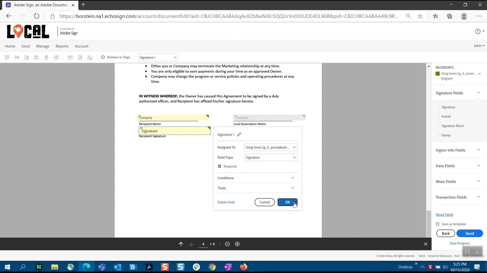
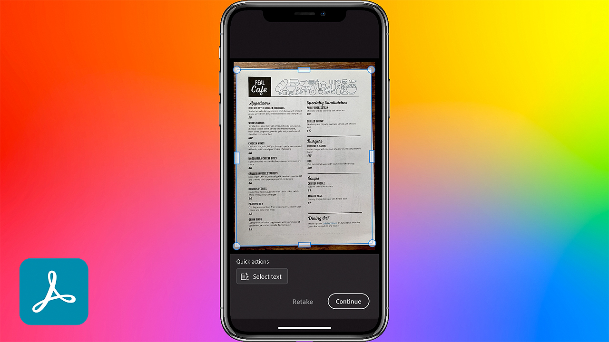

# Acrobat 및 서명

세계 최고의 PDF 및 전자 서명 솔루션이 포함된 Adobe Document Cloud을 사용하여 디지털 혁신을 통해 수동적인 문서 프로세스에서 벗어나십시오. 언제 어디에서나 다양한 화면과 디바이스에서 자주 사용하는 Microsoft 및 엔터프라이즈 앱을 통해 문서, 워크플로우 및 작업을 신속하게 처리할 수 있습니다.

## 제품 Tutorials 찾아보기

<table style="table-layout:fixed">
<tr>
 <td>
   
    

   <a href="acrobat-sign.md#tutorial1"><strong>Acrobat 공유 검토 시작</strong></a>
    

    <em>PDF 문서에 주석을 추가하도록 리뷰어 초대</em>
     
  </td>
  <td>
    
    

    <a href="acrobat-sign.md#tutorial2"><strong>Adobe Sign을 사용하여 온라인 면제 Forms 만들기</strong></a>
    

    <em>문서를 온라인 양식으로 빠르게 변환하여 온라인상에 게시하면 누구나 문서를 채우고 서명할 수 있습니다</em>
     
  </td>
  <td>
   
    

    <a href="acrobat-sign.md#tutorial3"><strong>Adobe Sign으로 서명 요청</strong></a>
    

    <em>Word에서 PDF으로 전환하고 Adobe Sign을 사용하여 서명을 위해 보내기</em>
     
  </td>
</tr>
<tr>
 <td>
   
    

   <a href="acrobat-sign.md#tutorial4"><strong>Liquid Mode로 모바일에서 메뉴 보기</strong></a>
    

    <em>Liquid Mode를 사용하여 모바일 장치에서 PDF의 읽기 환경을 향상합니다.</em>
     
  </td>
  <td>
    
    

    <a href="acrobat-sign.md#tutorial5"><strong>휴대폰에서 문서를 PDF으로 스캔</strong></a>
    

    <em>Adobe Scan을 사용하면 문서, 양식, 명함, 화이트보드를 간편하게 캡처하여 고품질의 Adobe PDF으로 변환할 수 있습니다</em>
     
  </td>
  <td>
    
    

     
  </td>
</tr>
</table>

## Acrobat 공유 검토 시작(3:49) {#tutorial1}

>[!VIDEO](https://video.tv.adobe.com/v/326777?hidetitle=true)

**설명**
PDF 문서에 주석을 추가하도록 리뷰어를 초대합니다.

이 튜토리얼에서는 다음과 같은 방법을 살펴봅니다.
* Document Cloud에서 댓글 달기 호스트 PDF
* 한 곳에서 주석 수집
* 동시 주석 달기로 공동 작업 촉진

**Adobe 검토 및 주석 옵션 비교 PDF**

**프레젠테이션:**
Dan Armstrong, 솔루션 컨설턴트(디지털 미디어) Rick Borstein, 수석 관리자 솔루션 컨설팅(디지털 미디어)

## Adobe Sign을 사용하여 온라인 면제 Forms 만들기(5:19) {#tutorial2}

>[!VIDEO](https://video.tv.adobe.com/v/326776?hidetitle=true)

**설명**
문서를 온라인 양식으로 빠르게 변환하여 온라인상에 게시하면 누구나 문서를 채우고 서명할 수 있습니다.

이 튜토리얼에서는 다음과 같은 방법을 살펴봅니다.
* 종이 양식을 디지털 문서로 변환하여 디지털화
* 고객이 자신의 디바이스에서 액세스할 수 있는 웹 사이트에 디지털 양식 게시
* 완료된 양식은 레코드에 자동으로 보관됩니다.

**프레젠테이션:**
Taylor Kobey, 솔루션 컨설턴트(디지털 미디어) Emily Palmer, 솔루션 컨설턴트(디지털 미디어)

## Adobe Sign으로 서명 요청(3:21) {#tutorial3}

>[!VIDEO](https://video.tv.adobe.com/v/326801?hidetitle=true)

**설명**
Adobe Sign을 사용하여 Word PDF에서 서명을 위해 전송

이 튜토리얼에서는 다음과 같은 방법을 살펴봅니다.
* 일상적으로 사용하는 툴을 활용하여 서명이 필요한 디지털 문서를 전송할 수 있습니다

**프레젠테이션:**
Rick Borstein, 수석 관리자 솔루션 컨설팅(디지털 미디어)

## Liquid Mode로 모바일에서 메뉴 보기(2:57) {#tutorial4}

>[!VIDEO](https://video.tv.adobe.com/v/327093?hidetitle=true)

**설명**
Liquid Mode를 사용하여 모바일 장치에서 PDF의 리더 환경을 향상합니다.

이 튜토리얼에서는 다음과 같은 방법을 살펴봅니다.
* PDF 파일이 모바일 장치에 반응하도록 만들기
* PDF 레이아웃 향상
* 휴대폰과 태블릿에서 문서를 쉽게 읽을 수 있도록 작동 중에 기능을 추가합니다

**프레젠테이션:**
Emilie Enke, Associate Solutions 컨설턴트(디지털 미디어)

## 휴대폰에서 문서를 PDF으로 스캔(5:53) {#tutorial5}

>[!VIDEO](https://video.tv.adobe.com/v/327094?hidetitle=true)

**설명**
Adobe Scan을 사용하면 문서, 양식, 명함, 화이트보드를 간편하게 캡처하여 고품질의 Adobe PDF으로 변환할 수 있습니다.

이 튜토리얼에서는 다음과 같은 방법을 살펴봅니다.
* 스마트폰에서 문서, 양식, 명함, 화이트보드를 캡처하여 고품질의 Adobe PDF으로 변환할 수 있습니다
* 손글씨 또는 인쇄된 텍스트를 자동으로 식별하고 선명하게 하면서 불빛 또는 그림자와 같은 불필요한 요소를 제거합니다
* Acrobat Reader에서 스캔한 PDF을 열어 노트 및 주석을 추가하고, 팀원과 함께 검토할 수 있습니다

**프레젠테이션:**
Emilie Enke, Associate Solutions 컨설턴트(디지털 미디어)

**Acrobat 및 Adobe Sign 리소스**

[학습 및 지원](https://helpx.adobe.com/support/document-cloud.html) 추가 튜토리얼을 제공하는 허브입니다. [새로운 기능](https://helpx.adobe.com/acrobat/using/whats-new.html)및 커뮤니티 포럼으로의 링크입니다.

**2020년 10월 릴리스**

이러한 기능 등을 사용해 보십시오. Creative Cloud 데스크탑 앱에서 최신 업데이트를 다운로드합니다.
