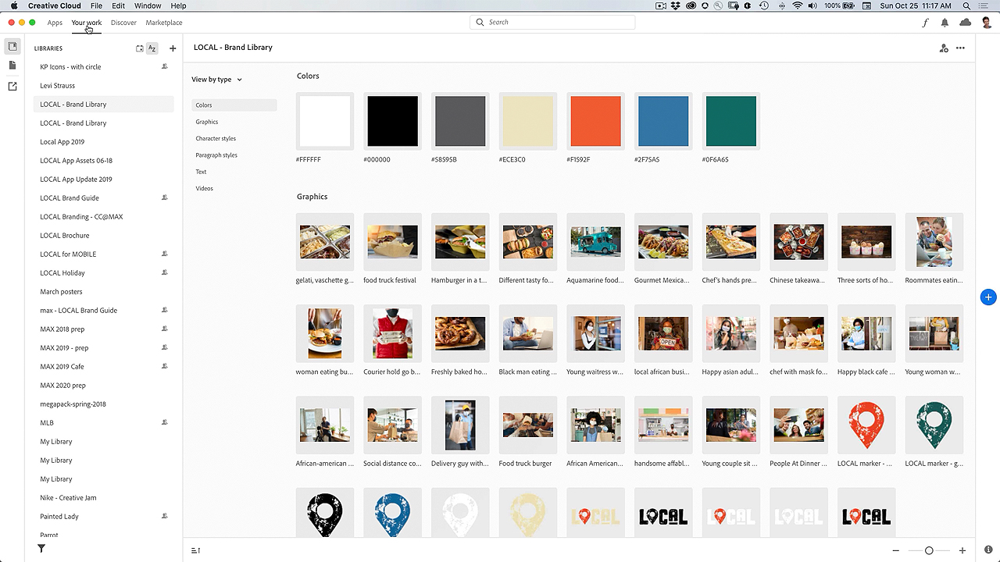

# Creative Cloud 데스크탑 앱

Creative Cloud 데스크탑 앱은 CC 앱, 서비스 및 공동 작업 등을 관리하는 허브입니다.

## 제품 Tutorials 검색

<table style="table-layout:fixed">
<tr>
 <td>
   
    

   <a href="creativeclouddesktopapp.md#tutorial1"><strong>CC 데스크톱 앱 탐색: 허브 
Creative Cloud</strong></a>
    

    <em>Creative Cloud 데스크탑 앱은 CC 앱, 서비스 및 공동 작업 등을 관리하는 허브입니다!</em>
     
  </td>
  <td>
    
    

     
  </td>
  <td>
    
    

     
  </td>
</tr>
</table>

## CC 데스크탑 앱 탐색: Creative Cloud 허브(2:50) {#tutorial1}

>[!VIDEO](https://video.tv.adobe.com/v/327095?hidetitle=true)

**설명**
Creative Cloud 데스크탑 앱은 CC 앱, 서비스 및 공동 작업 등을 관리하는 허브입니다.

이 튜토리얼에서는 다음과 같은 방법을 배웁니다.
* 데스크탑 앱 실행 및 업데이트
* 모바일 및 웹 앱 찾기
* 에셋 관리 및 공유
* Adobe Fonts 액세스
* 튜토리얼 살펴보기
* Behance에서 작업 공유

**제공:**
Patti Sokol, 수석 솔루션 컨설턴트(디지털 미디어)
