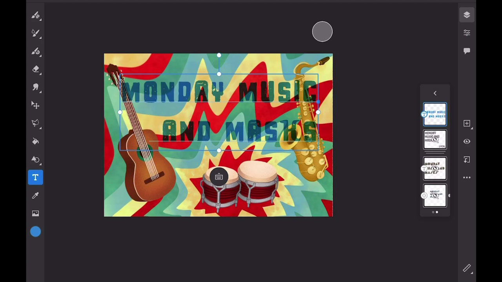

# Fresco

Adobe Fresco은 벡터 및 래스터 워크플로우와 클라우드 문서를 결합하는 브러시 기반 방법을 사용하여 드로잉 및 페인팅을 만들기 위한 크로스 플랫폼 앱입니다.

## 제품 Tutorials 검색

<table style="table-layout:fixed">
<tr>
 <td>
   
    

   <a href="fresco.md#tutorial1"><strong>Adobe Fresco을 사용하여 그리기 소개</strong></a>
    

    <em>Adobe fresco의 강력한 선택 및 색상 편집 도구를 사용하여 기업 브랜딩 요구에 맞게 이미지를 크게 변경하세요</em>
     
  </td>
  <td>
   
    

   <a href="fresco.md#tutorial2"><strong>질감이 있는 아트워크 만들기—Illustrator에 Fresco</strong></a>
    

    <em>Adobe Fresco에서 텍스처를 페인트하고 그려 Illustrator에서 사용하는 방법</em>을 살펴보세요.
     
  </td>
  <td>
    
    

     
  </td>
</tr>
</table>

## Adobe Fresco(19:07)를 사용한 그리기 소개 {#tutorial1}

>[!VIDEO](https://video.tv.adobe.com/v/326946?hidetitle=true)

**설명**
벡터 및 래스터 워크플로우와 클라우드 문서를 결합하는 브러시 기반 방법을 사용하여 드로잉 및 페인팅을 만드는 Adobe Fresco을 살펴보세요.

이 튜토리얼에서는 다음과 같은 방법을 배웁니다.
* 자주 사용하는 픽셀 및 벡터 브러시와 함께 수채화 효과 및 유화 효과를 모방한 독창적인 라이브 브러시를 사용해 보세요
* 다양한 브러시를 레이어로 구성하고 마스크를 사용하여 텍스처 효과 만들기
* iPhone의 새로운 Fresco 앱으로 장소에 상관없이 제작
* 다른 모바일 및 데스크탑 앱에서 사용할 수 있도록 다양한 포맷으로 작업 내보내기

**제공:**
Liz Tanonis, 솔루션 컨설턴트(디지털 미디어)

## 질감이 풍부한 아트워크 만들기—Illustrator(4:10)에 Fresco {#tutorial2}

>[!VIDEO](https://video.tv.adobe.com/v/326947?hidetitle=true)

**설명**
Adobe Fresco에서 텍스처를 페인트하고 그려 Illustrator에서 사용하는 방법을 알아봅니다.

이 튜토리얼에서는 다음과 같은 방법을 배웁니다.
* iPhone용 Adobe Fresco 앱에서 아트워크를 만들고 다른 Creative Cloud 앱에서 사용하도록 내보냅니다.
* Illustrator의 이미지 추적 도구를 사용하여 아트워크를 벡터로 변환
* Illustrator에서 벡터 아트워크에 핸드메이드 텍스처 적용

**제공:**
Liz Tanonis, 솔루션 컨설턴트(디지털 미디어)

**Fresco 리소스**

[학습 및 지원](https://helpx.adobe.com/support/adobe-fresco.html)은(는) 추가 자습서, [새로운 기능](https://helpx.adobe.com/fresco/using/whats-new.html) 및 커뮤니티 포럼에 대한 링크를 위한 허브입니다.

**2020년 10월 릴리스**

이러한 기능 사용을 시작해 보세요! Creative Cloud 데스크탑 앱에서 최신 업데이트를 다운로드합니다.
