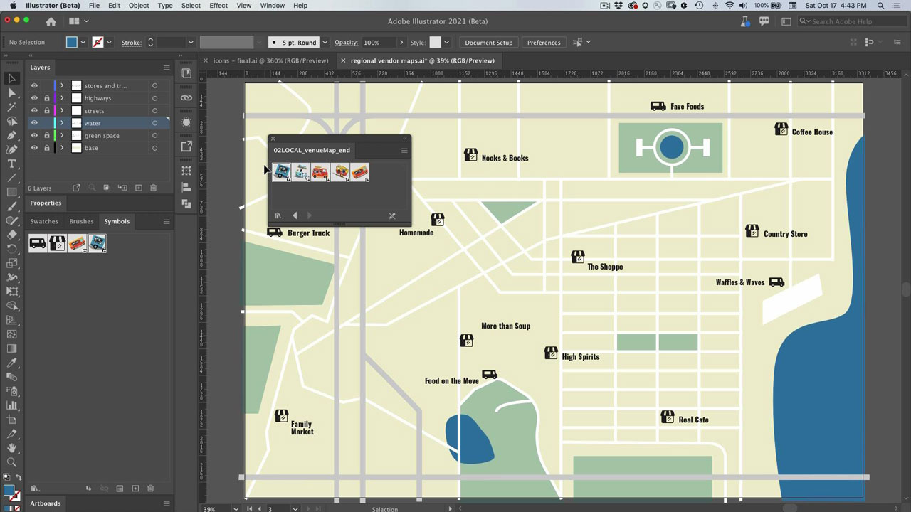
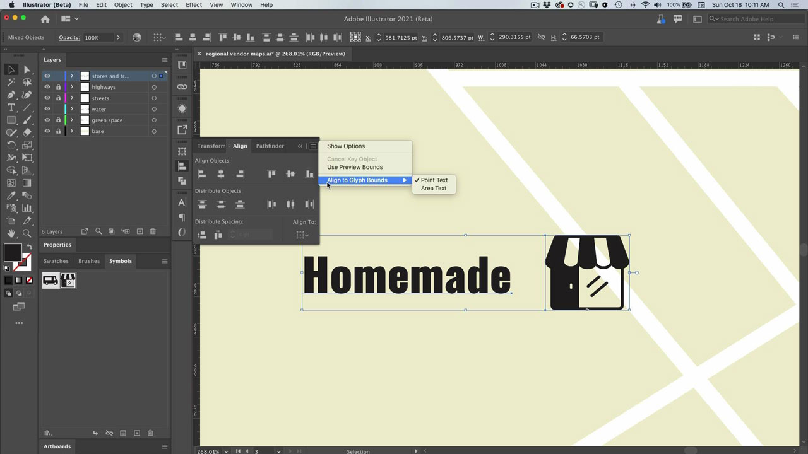

# Illustrator

일러스트레이션 및 그래픽에 사용되는 최신 앱입니다. 로고, 아이콘, 일러스트레이션 및 기타 웹, 모바일 또는 인쇄에 사용할 수 있는 모든 디자인을 제작할 수 있습니다.

## 제품 Tutorials 검색

<table style="table-layout:fixed">
<tr>
 <td>
   
    

   <a href="illustrator.md#tutorial1"><strong>기호를 사용하여 여러 아이콘 인스턴스 업데이트</strong></a>
    

    <em>수동 작업을 줄이고 심볼과의 일관성을 유지합니다</em>
     
  </td>
  <td>
    
    

    <a href="illustrator.md#tutorial2"><strong>글리프 스냅을 사용하여 텍스트 및 이미지 정렬</strong></a>
    

    <em>글리프를 문서의 중요한 영역에 빠르게 스냅</em>
     
  </td>
  <td>
    
    

     
  </td>
</tr>
</table>

## 심볼을 사용하여 여러 아이콘 인스턴스(5:08) 업데이트 {#tutorial1}

>[!VIDEO](https://video.tv.adobe.com/v/326816?hidetitle=true)

**설명**
수동 작업을 줄이고 심볼과 일관성을 유지합니다.

이 튜토리얼에서는 다음과 같은 방법을 배웁니다.
* 수동 작업을 줄이고 심볼과의 일관성을 유지합니다.

**제공:**
Patti Sokol, 수석 솔루션 컨설턴트(디지털 미디어)

## 글리프 스냅을 사용하여 텍스트 및 이미지 정렬(6:48) {#tutorial2}

>[!VIDEO](https://video.tv.adobe.com/v/326817?hidetitle=true)

**설명**
글리프를 문서의 중요한 영역에 빠르게 스냅합니다.

이 튜토리얼에서는 다음과 같은 방법을 배웁니다.
* 글리프를 문서의 중요한 영역에 빠르게 물리기

**제공:**
Patti Sokol, 수석 솔루션 컨설턴트(디지털 미디어)

**Illustrator 리소스**

[학습 및 지원](https://helpx.adobe.com/support/illustrator.html)은(는) 추가 자습서와 커뮤니티 포럼에 대한 링크를 위한 허브입니다.

**2020년 10월 릴리스**

이러한 기능 사용을 시작해 보세요! Creative Cloud 데스크탑 앱에서 최신 업데이트를 다운로드합니다.
