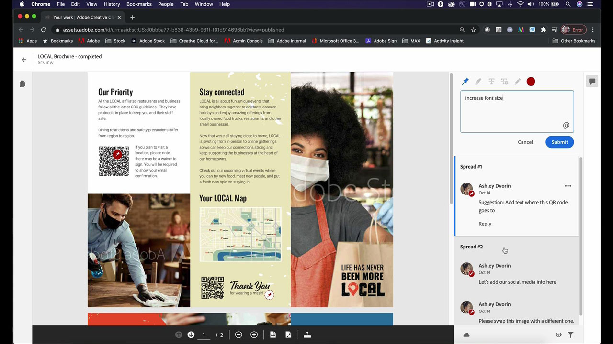

# InDesign

인쇄 및 디지털 출판을 위한 멋진 문서를 제작할 수 있는 업계 표준 앱입니다. e북, 전자 잡지에서 책, 보고서, 백서에 이르기까지 풍부한 디지털 및 인쇄 경험을 제작할 수 있습니다.

## 제품 Tutorials 찾아보기

<table style="table-layout:fixed">
<tr>
 <td>
    
    

    <a href="indesign.md#tutorial1"><strong>QR 코드 생성</strong></a>
    

    <em>웹 사이트에 연결하는 QR 코드 생성</em>
     
  </td>
  <td>
   
    

   <a href="indesign.md#tutorial2"><strong>InDesign에서 검토용으로 공유</strong></a>
    

    <em>디자이너와 해당 팀 멤버를 위한 원활한 크리에이티브 검토 환경</em>
     
  </td>
  <td>
    
    

    <a href="indesign.md#tutorial3"><strong>Document Cloud 검토에서 PDF 주석 가져오기</strong></a>
    

    <em>PDF의 주석을 InDesign으로 직접 가져오고 요청된 변경 사항을 빠르게 적용합니다</em>
     
  </td>
</tr>
<tr>
<td>
   
    

   <a href="indesign.md#tutorial4"><strong>InDesign 문서에 비디오 파일 추가</strong></a>
    

    <em>InDesign에 동영상 추가 온라인으로 PDF 및 게시</em>
     
  </td>
 <td>
    
    

     
 </td>
 <td>
    
    

     
 </td>
</tr>
</table>

## QR 코드 생성(2:34) {#tutorial1}

>[!VIDEO](https://video.tv.adobe.com/v/326818?hidetitle=true)

**설명**
웹 사이트에 연결되는 QR 코드를 생성할 수 있습니다.

이 자습서에서는 다음 방법을 설명합니다.
* 모바일 장치를 통해 웹 콘텐츠에 대한 실습 제공
* 고객의 안전성 보장
* 디지털은 콘텐츠를 최신 상태로 유지하기 쉽다는 것을 의미합니다

**프레젠테이션:**
Patti Sokol, 수석 솔루션 컨설턴트(디지털 미디어)

## InDesign에서 검토용으로 공유(4:04) {#tutorial2}

>[!VIDEO](https://video.tv.adobe.com/v/326824?hidetitle=true)

**설명**
InDesign 검토용으로 공유 기능을 사용하면 디자이너와 해당 팀원에게 보다 원활한 크리에이티브 검토 환경을 제공할 수 있습니다.

이 튜토리얼에서는 다음과 같은 방법을 살펴봅니다.
* PDF을 만들지 않고도 InDesign에서 직접 검토 시작
* 웹 브라우저에서 검토 및 주석 추가
* 한 곳에서 여러 이해 관계자의 피드백 수집
* 변경 사항을 즉시 적용할 수 있는 앱 내 피드백을 관리합니다.

**Adobe 검토 및 주석 옵션 비교 PDF**

**프레젠테이션:**
Emily Palmer, 솔루션 컨설턴트(디지털 미디어)

## Document Cloud 검토에서 PDF 주석 가져오기(4:52) {#tutorial3}

>[!VIDEO](https://video.tv.adobe.com/v/326959?hidetitle=true)

**설명**
PDF의 주석을 InDesign으로 직접 가져오고 요청된 변경 사항을 빠르게 적용할 수 있습니다.

이 튜토리얼에서는 다음과 같은 방법을 살펴봅니다.
* 기존 PDF 주석 달기 작업 과정 지원
* 여러 소스에서 결합된 PDF에 적용

**Adobe 검토 및 주석 옵션 비교 PDF**

**프레젠테이션:**
Michael Murphy, 수석 솔루션 컨설턴트(디지털 미디어)

## InDesign 문서에 비디오 파일 추가(5:58) {#tutorial4}

>[!VIDEO](https://video.tv.adobe.com/v/326757?hidetitle=true)

**설명**
InDesign에 동영상 추가 온라인으로 PDF 및 게시

이 튜토리얼에서는 다음과 같은 방법을 살펴봅니다.
* InDesign에 비디오 추가
* 온라인으로 PDF 및 게시

**프레젠테이션:**
Patti Sokol, 수석 솔루션 컨설턴트(디지털 미디어)

**InDesign 리소스**

[학습 및 지원](https://helpx.adobe.com/support/indesign.html) 추가 튜토리얼을 제공하는 허브입니다. [새로운 기능](https://helpx.adobe.com/indesign/user-guide.html/indesign/using/whats-new.ug.html)및 커뮤니티 포럼으로의 링크입니다.

**2020년 10월 릴리스**

이러한 기능 등을 사용해 보십시오. Creative Cloud 데스크탑 앱에서 최신 업데이트를 다운로드합니다.
