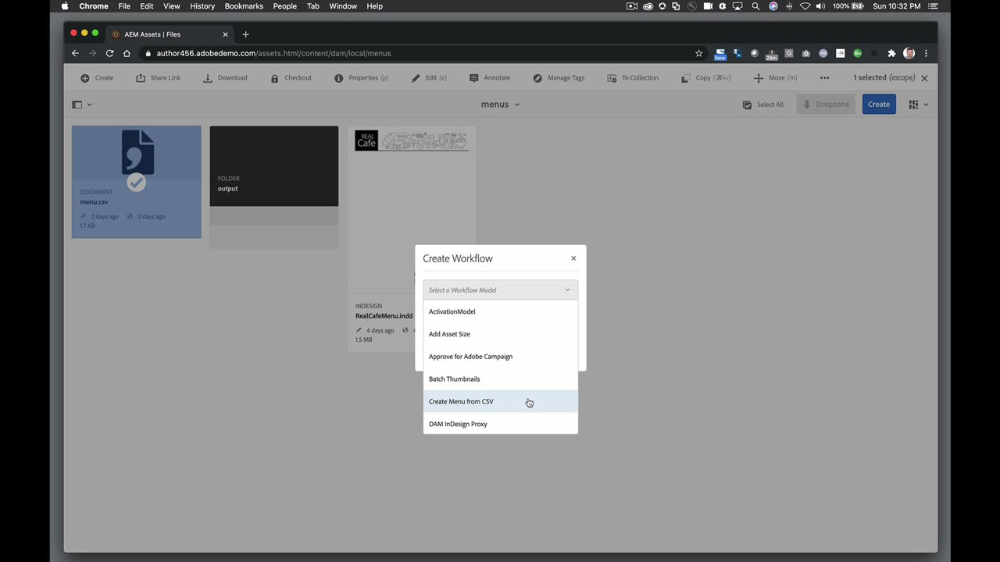

# InDesign Server

Adobe InDesign® 서버 소프트웨어는 InDesign의 디자인, 레이아웃 및 타이포그래피 기능을 활용하는 강력하고 확장 가능한 엔진을 제공하여 프로그래밍 방식으로 시선을 사로잡는 자동화된 문서를 제작할 수 있습니다.

## 제품 Tutorials 검색

<table style="table-layout:fixed">
<tr>
 <td>
   
    

   <a href="indesignserver.md#tutorial1"><strong>데이터 기반 InDesign Server 컨텐츠</strong></a>
    

    <em>데이터 기반 설계는 InDesign Server을 통해 프로그래밍 방식으로 수행할 수 있습니다.</em>
     
  </td>
  <td>
    
    

     
  </td>
  <td>
    
    

     
  </td>
</tr>
</table>

## 데이터 기반 InDesign Server 컨텐츠(4:14) {#tutorial1}

>[!VIDEO](https://video.tv.adobe.com/v/326901?hidetitle=true)

**설명**
데이터 기반 설계는 InDesign Server을 통해 프로그래밍 방식으로 수행할 수 있습니다.

이 튜토리얼에서는 다음과 같은 방법을 배웁니다.
* 서식이 미리 지정된 텍스트 또는 개체 스타일로 InDesign 템플릿 만들기
* 보다 빠른 컨텐츠 개인 맞춤화를 위해 외부 데이터 기반 컨텐츠 흐름
* 레이아웃의 별색 PDF을 생성하거나 다른 AEM 기반 출력 포맷에 연결

**프레젠테이션 대상:**
Eric Rowse, 수석 솔루션 컨설턴트(디지털 미디어)

## 추가 InDesign Server 리소스

<table>
<tr>
 <td>
   
    

   <a href="https://www.adobe.com/products/indesignserver/buying-guide.html"><strong>InDesign Server: 구매 안내서</strong></a>
    

    <em>사내 개발자 또는 파트너가 사용할 수 있는 리소스</em>
     
  </td>
  <td>
   
    

   <a href="https://www.adobe.com/products/indesignserver/partner.html"><strong>InDesign Server: 파트너 찾기</strong></a>
    

    <em>사내에서 개발할 수 있는 전문 지식을 갖추고 있지만, Adobe은 파트너와 협력하여 요구 사항에 맞는 솔루션을 찾는 것이 좋습니다</em>
     
  </td>
  <td>
    
    

     
  </td>
</tr>
</table>

**InDesign Server 리소스**

[학습 및 지원](https://www.adobe.com/products/indesignserver.html) 는 추가 튜토리얼, 새로운 기능, 커뮤니티 포럼 링크를 위한 허브입니다.

**2020년 10월 릴리스**

이러한 기능 사용을 시작해 보세요! Creative Cloud 데스크탑 앱에서 최신 업데이트를 다운로드합니다.
