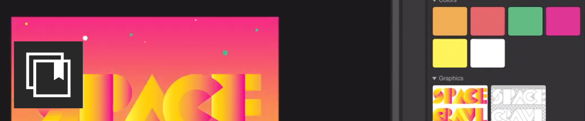

# 튜토리얼

기업 크리에이티브는 분산된 팀과 공동 작업을 수행하고 확장 가능한 프로세스를 수립하며 기업 시스템 및 지침을 준수해야 합니다. 이 자습서는 Creative Cloud 2021년 릴리스의 새로운 기능을 엔터프라이즈 관점에서 학습하는 데 도움이 됩니다.

## 데스크탑 제품별 Tutorials

<table style="table-layout:fixed">
<tr>
 <td>
    
    

    <a href="acrobat-sign.md"><strong>Acrobat 및 Adobe Sign</strong></a>
    

    <em>PDF 문서 및 양식 만들기, 편집 및 서명</em>
     
  </td>
  <td>
    
    

    <a href="dimension.md"><strong>Dimension</strong></a>
    

    <em>브랜딩, 제품 샷 및 패키지 디자인을 위한 사실적인 3D 이미지 만들기</em>
     
  </td>
  <td>
    
    

    <a href="illustrator.md"><strong>Illustrator</strong></a>
    

    <em>벡터 그래픽 및 일러스트레이션</em>
     
  </td>
</tr>
<tr>
 <td>
    
    

    <a href="indesign.md"><strong>InDesign</strong></a>
    

    <em>인쇄 및 디지털 출판을 위한 페이지 디자인 및 레이아웃</em>
     
  </td>
  <td>
    
    

    <a href="photoshop.md"><strong>Photoshop</strong></a>
    

    <em>데스크탑에서 세련된 이미지, 그래픽 및 아트 편집, 합성 및 만들기</em>
     
  </td>
  <td>
    
    

    <a href="rush.md"><strong>Rush</strong></a>
    

    <em>장소에 상관없이 온라인 비디오 만들기 및 공유</em>
     
  </td>
</tr>
<tr>
 <td>
    
    

    <a href="xd.md"><strong>XD</strong></a>
    

    <em>사용자 경험 디자인, 프로토타이핑 및 공유</em>
     
  </td>
  <td>
    
    

     
  </td>
  <td>
    
    

     
  </td>
</tr>
</table>

### 모바일 앱별 Tutorials

<table style="table-layout:fixed">
<tr>
 <td>
    
    

    <a href="capture.md"><strong>Capture</strong></a>
    

    <em>이미지를 색상 테마, 벡터 그래픽, 브러시 등으로 변환</em>
     
  </td>
  <td>
    
    

    <a href="fresco.md"><strong>Fresco</strong></a>
    

    <em>어디에서나 자유롭게 그리기 및 페인팅</em>
     
  </td>
  <td>
    
    

    <a href="illustratoripad.md"><strong>iPad의 Illustrator</strong></a>
    

    <em>벡터 그래픽 및 일러스트레이션</em>
     
  </td>
</tr>
<tr>
 <td>
    
    

    <a href="photoshopipad.md"><strong>iPad의 Photoshop</strong></a>
    

    <em>데스크탑 및 iPad에서 세련된 이미지, 그래픽 및 아트 편집, 합성 및 만들기</em>
     
  </td>
  <td>
    
    

     
  </td>
  <td>
    
    

     
  </td>
</tr>
</table>

### 통합별 Tutorials

<table style="table-layout:fixed">
<tr>
 <td>
    
    

    <a href="aem.md"><strong>AEM Assets 및 Asset Link</strong></a>
    

    <em>차세대 디지털 자산 관리</em>
     
  </td>
  <td>
    
    

    <a href="creativeclouddesktopapp.md"><strong>Creative Cloud 데스크톱 앱</strong></a>
    

    <em>Creative Cloud 데스크탑 앱은 CC 앱, 서비스 및 공동 작업 등을 관리하는 허브입니다!</em>
     
  </td>
  <td>
    
    

    <a href="cclibraries.md"><strong>CC Libraries</strong></a>
    

    <em>에셋을 바로 사용할 수 있고 프로젝트를 브랜드에 보관할 수 있습니다</em>
     
  </td>
</tr>
<tr>
<td>
    
    

    <a href="indesignserver.md"><strong>InDesign Server</strong></a>
    

    <em>사용자 지정된 자동화와 결합된 정교한 InDesign 도구</em>
     
  </td>
 <td>
    
    

    <a href="stock.md"><strong>Adobe [!DNL Stock]</strong></a>
    

    <em>고품질 디지털 이미지, 일러스트레이션, 비디오, 오디오, 템플릿 등</em>
     
  </td>
  <td>
    
    

     
  </td>
</tr>
</table>

### 실습 프로젝트: 나만의 얼굴 마스크 만들기

<table style="table-layout:fixed">
<tr>
 <td>
    
    

    <a href="handsonproject.md"><strong>나만의 얼굴 마스크 만들기</strong></a>
    

    Adobe <em>Design to Print 플러그인을 사용하면 수백 가지 Zazzle 제품에서 디자인을 시각화하고 온라인 마켓플레이스에 바로 게시할 수 있습니다</em>
     
  </td>
  <td>
    
    

     
  </td>
  <td>
    
    

     
  </td>
</tr>
</table>
