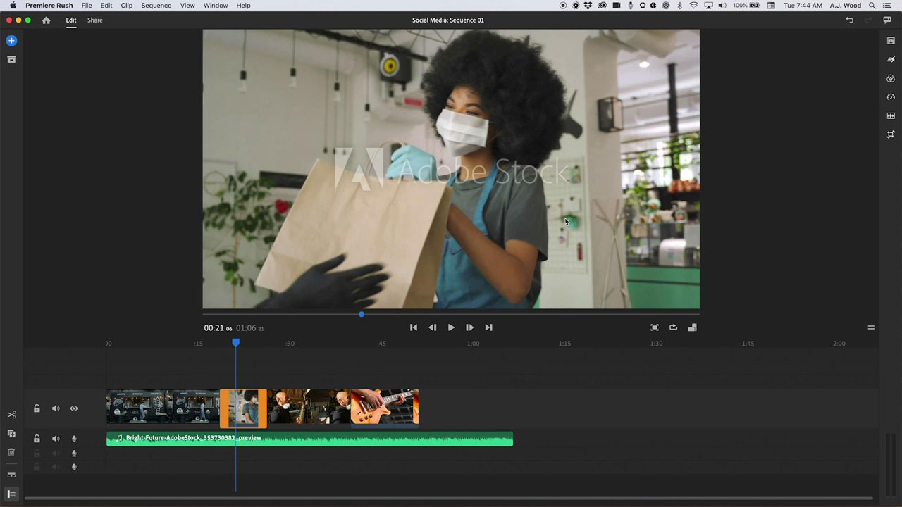

# [!DNL Rush]

Premiere [!DNL Rush]은(는) 그 어느 때보다 쉽게 온라인 콘텐츠를 만들고 공유할 수 있는 최초의 올인원 크로스 디바이스 비디오 편집 앱입니다. 이 통합 데스크탑 및 모바일 솔루션은 프로젝트와 편집 내용을 클라우드에 자동으로 동기화하므로 어디에서나 모든 디바이스에서 작업할 수 있습니다.

## 제품 Tutorials 검색

<table style="table-layout:fixed">
<tr>
 <td>
   
    

   <a href="rush.md#tutorial1"><strong>소셜 미디어 비디오 만들기</strong></a>
    

    <em>Adobe [!DNL Rush]을(를) 사용하면 모든 장치에서 작업할 수 있으며 초보자가 사용할 수 있을 만큼 전문적인 결과물을 쉽게 만들 수 있습니다</em>
     
  </td>
  <td>
    
    

     
  </td>
  <td>
    
    

     
  </td>
</tr>
</table>

## 소셜 미디어 비디오 만들기(18:11) {#tutorial1}

>[!VIDEO](https://video.tv.adobe.com/v/326900?hidetitle=true)

**설명**
[!DNL Stock] Adobe의 비디오와 오디오를 사용하여 스토리를 전달하세요. Adobe [!DNL Rush]을(를) 사용하면 모든 장치에서 작업할 수 있으며 초보자가 사용할 수 있을 만큼 전문적인 결과물을 쉽게 만들 수 있습니다.

이 튜토리얼에서는 다음과 같은 방법을 배웁니다.
* 데스크탑, 태블릿 및 휴대폰에서 원활하게 비디오 편집
* 자동 리프레임 AI 기술 기능을 사용하여 가로, 사각형 및 세로 폼 팩터에 걸쳐 피사체를 중앙에 유지합니다.
* MoGRTS(모션 그래픽 템플릿)를 통해 전문적인 느낌과 쉽게 사용자 정의할 수 있는 타이틀 및 3분의 1 이하를 구현합니다.
* 소셜 미디어 채널로 쉽게 내보내고 바로 게시
* Adobe Premiere Pro에서 [!DNL Rush]개 프로젝트 열기

**제공:**
A.J. Wood, 솔루션 컨설턴트(디지털 미디어)

**[!DNL Rush]개 리소스**

[학습 및 지원](https://helpx.adobe.com/support/premiere-rush.html)은(는) 추가 자습서, [새로운 기능](https://helpx.adobe.com/premiere-rush/user-guide.html/premiere-rush/help/whats-new.ug.html) 및 커뮤니티 포럼에 대한 링크를 위한 허브입니다.

**2020년 10월 릴리스**

이러한 기능 사용을 시작해 보세요! Creative Cloud 데스크탑 앱에서 최신 업데이트를 다운로드합니다.
