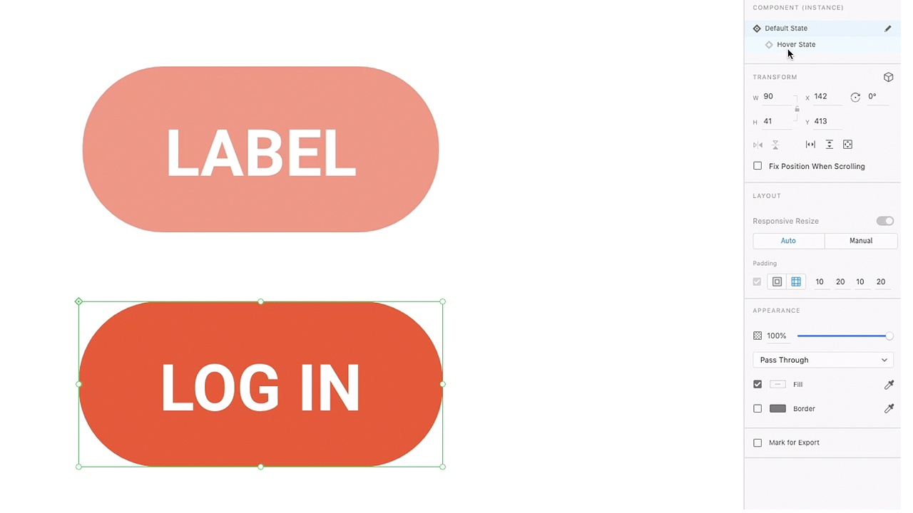

# XD

Adobe XD은 웹 사이트, 앱, 음성 인터페이스, 게임 및 기타 유형의 디지털 경험을 디자인하기 위한 사용자 경험 디자인 및 프로토타이핑 툴입니다.

## 제품 Tutorials 찾아보기

<table style="table-layout:fixed">
<tr>
 <td>
   
    

   <a href="xd.md#tutorial1"><strong>마우스 오버 상태로 구성 요소 만들기</strong></a>
    

    <em>인터랙티브한 디자인을 위한 재사용 가능한 동적 크기 조정 가능한 버튼 만들기</em>
     
  </td>
  <td>
    
    

    <a href="xd.md#tutorial2"><strong>반복 그리드 만들기 및 채우기</strong></a>
    

    <em>클릭-드래그만으로 하나의 요소를 반복 그리드로 변환</em>
     
  </td>
  <td>
   
    

    <a href="xd.md#tutorial3"><strong>스택 작업</strong></a>
    

    <em>stack 속성을 사용하여 요소를 쉽게 재정렬합니다.</em>
     
  </td>
</tr>
<tr>
 <td>
    
    

    <a href="xd.md#tutorial4"><strong>프로토타입 만들기 - 앵커 링크 및 스크롤 그룹</strong></a>
    

    <em>프로토타입에 내비게이션 및 스크롤 추가</em>
     
  </td>
  <td>
    
    

    <a href="xd.md#tutorial5"><strong>프로토타입 생성 - 인터랙티브 구성 요소 상태</strong></a>
    

    <em>프로토타입에 인터랙티브한 요소 및 오버레이 메뉴 추가</em>
     
  </td>
  <td>
   
    

   <a href="xd.md#tutorial7"><strong>이메일 - 반복 그리드 만들기 및 채우기</strong></a>
    

    <em>클릭-드래그만으로 하나의 요소를 반복 그리드로 변환</em>
     
  </td>
</tr>
<tr>
 <td>
    
    

    <a href="xd.md#tutorial7"><strong>전자 메일 - 스택 작업</strong></a>
    

    <em>stack 속성을 사용하여 요소를 쉽게 재정렬합니다.</em>
     
  </td>
  <td>
    
    

     
  </td>
  <td>
    
    

     
  </td>
</tr>
</table>

## 만들기 [!UICONTROL 구성 요소] 마우스 오버 상태 포함(7:35) {#tutorial1}

>[!VIDEO](https://video.tv.adobe.com/v/326874?hidetitle=true)

**설명**
인터랙티브한 디자인을 위한 재사용 가능한 동적 크기 조정 가능한 버튼을 만들 수 있습니다.

이 튜토리얼에서는 다음과 같은 방법을 살펴봅니다.
* 소스 메인 구성 요소에 변경 내용을 적용하면 해당 구성 요소의 모든 인스턴스에 변경 내용이 자동으로 반영됩니다
* 구성 요소를 사용하여 일관성 유지, 시간 절약, 클릭 수 감소

**프레젠테이션:**
Michael Murphy, 수석 솔루션 컨설턴트(디지털 미디어)

## 반복 그리드 만들기 및 채우기(2:57) {#tutorial2}

>[!VIDEO](https://video.tv.adobe.com/v/326955?hidetitle=true)

**설명**
클릭-드래그만으로 하나의 요소를 반복 그리드로 변환할 수 있습니다.

이 튜토리얼에서는 다음과 같은 방법을 살펴봅니다.
* 워크플로우를 향상시키고 그리드를 원하는 크기로 즉시 드래그할 수 있습니다
* 실제 콘텐츠와 데이터를 가져오면 XD에서 격자에 모든 이미지와 텍스트를 자동으로 배치합니다
* 한 번 변경하여 원하는 곳에 원하는 방향으로 적용합니다

**프레젠테이션:**
Ashley Dvorin, 수석 솔루션 컨설턴트(디지털 미디어)

## 스택 작업(5:33) {#tutorial3}

>[!VIDEO](https://video.tv.adobe.com/v/326956?hidetitle=true)

**설명**
stack 속성을 사용하여 요소를 손쉽게 재정렬할 수 있습니다.

이 튜토리얼에서는 다음과 같은 방법을 살펴봅니다.
* 디자인이 바뀌더라도 캔버스에서 오브젝트 간의 위치와 간격을 유지할 수 있습니다
* 스택에 새로운 오브젝트를 추가하거나 스택에서 오브젝트의 순서를 변경하면 다른 설정이 자동으로 조정됩니다

**프레젠테이션:**
Michael Murphy, 수석 솔루션 컨설턴트(디지털 미디어)

## 프로토타입 만들기 - 앵커 링크 및 스크롤 그룹(9:55) {#tutorial4}

>[!VIDEO](https://video.tv.adobe.com/v/326957?hidetitle=true)

**설명**
프로토타입에 내비게이션 및 스크롤을 추가합니다.

이 튜토리얼에서는 다음과 같은 방법을 살펴봅니다.
* 사용자가 동일한 아트보드에서 다른 지점으로 이동하도록 해주는 액션을 사용하여 프로토타입에 링크를 추가할 수 있습니다
* 디자인의 다른 영역에서 독립적으로 스크롤되는 영역을 정의하여 활동 피드, 회전식 이미지, 제품 목록 등을 만들 수 있습니다
* 세로, 가로 또는 양방향으로 스크롤되는 그룹 만들기

**프레젠테이션:**
Michael Murphy, 수석 솔루션 컨설턴트(디지털 미디어)

## 프로토타입 만들기 - 인터랙티브 구성 요소 상태(8:55) {#tutorial5}

>[!VIDEO](https://video.tv.adobe.com/v/326958?hidetitle=true)

**설명**
인터랙티브한 요소와 오버레이 메뉴를 프로토타입에 추가할 수 있습니다.

이 튜토리얼에서는 다음과 같은 방법을 살펴봅니다.
* 추가 아트보드 없이도 비선형 인터랙티브 및 애니메이션 사용자 경험을 만들 수 있습니다
* 하나의 XD 문서에서 여러 프로토타입 또는 인터랙션 플로우를 만든 다음 각 플로우의 공유 가능한 링크를 따로 게시할 수 있습니다

**프레젠테이션:**
Emilie Enke, Associate Solutions 컨설턴트(디지털 미디어)

## 이메일 - 반복 그리드 만들기 및 채우기(4:45) {#tutorial6}

>[!VIDEO](https://video.tv.adobe.com/v/326775?hidetitle=true)

**설명**
클릭-드래그만으로 하나의 요소를 반복 그리드로 변환할 수 있습니다.

이 튜토리얼에서는 다음과 같은 방법을 살펴봅니다.
* 워크플로우를 향상시키고 그리드를 원하는 크기로 즉시 드래그할 수 있습니다
* 실제 콘텐츠와 데이터를 가져오면 XD에서 격자에 모든 이미지와 텍스트를 자동으로 배치합니다
* 한 번 변경하여 원하는 곳에 원하는 방향으로 적용합니다

**프레젠테이션:**
Victoria Torres, 솔루션 컨설턴트(디지털 미디어)

## 전자 메일 - 스택 작업(3:38) {#tutorial7}

>[!VIDEO](https://video.tv.adobe.com/v/326759?hidetitle=true)

**설명**
stack 속성을 사용하여 요소를 손쉽게 재정렬할 수 있습니다.

이 튜토리얼에서는 다음과 같은 방법을 살펴봅니다.
* 디자인이 바뀌더라도 캔버스에서 오브젝트 간의 위치와 간격을 유지할 수 있습니다
* 스택에 새로운 오브젝트를 추가하거나 스택에서 오브젝트의 순서를 변경하면 다른 설정이 자동으로 조정됩니다

**프레젠테이션:**
Victoria Torres, 솔루션 컨설턴트(디지털 미디어)

**XD 리소스**

[학습 및 지원](https://helpx.adobe.com/support/xd.html) 추가 튜토리얼을 제공하는 허브입니다. [새로운 기능](https://helpx.adobe.com/xd/user-guide.html/xd/help/whats-new.ug.html)및 커뮤니티 포럼으로의 링크입니다.

**2020년 10월 릴리스**

이러한 기능 등을 사용해 보십시오. Creative Cloud 데스크탑 앱에서 최신 업데이트를 다운로드합니다.
