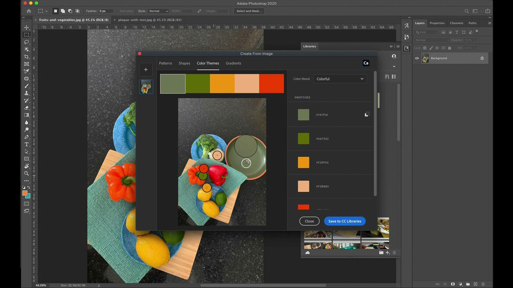

# [!DNL Capture]

Adobe [!DNL Capture]는 휴대폰과 태블릿을 디자인 모음 도구로 바꿉니다. 사용자는 다양한 유형의 에셋(아트웍의 개별 디지털 요소)을 만들 수 있습니다.   이러한 에셋은 다른 데스크톱 및 모바일 Adobe 응용 프로그램과 자동으로 동기화됩니다. 사용자들은 자신들의 창의적인 프로젝트에 참여하거나 쉽게 공동 작업자와 공유할 수 있습니다.

## 제품 자습서 찾아보기

<table style="table-layout:fixed">
<tr>
 <td>
   
    

   <a href="capture.md#tutorial1"><strong>주변 세상의 영감을 포착하십시오.</strong></a>
    

    <em>Adobe 캡처의 강력한 선택 및 색상 편집 도구를 사용하여 기업 브랜딩 요구에 맞게 이미지를 대폭 변경합니다.</em>
     
  </td>
  <td>
    
    

     
  </td>
  <td>
    
    

     
  </td>
</tr>
</table>

## 주변 세상의 영감을 포착합니다(2:56). {#tutorial1}

>[!VIDEO](https://video.tv.adobe.com/v/326825?hidetitle=true)

**설명**
모바일 장치의 이미지와 비디오를 모든 디자인의 창조적인 구성 요소로 변환합니다.

이 자습서에서는 다음 방법을 배웁니다.
* 어디에서나 디자인
* CC 라이브러리를 통해 데스크톱 앱과 통합
* 수천 개의 Adobe 글꼴 액세스

**프레젠테이션:**
Emily Palmer, 솔루션 컨설턴트(디지털 미디어)

**[!DNL Capture]자원**

[학습 및 ](https://helpx.adobe.com/mobile-apps/help/capture-faq.html) 추가 자습서와 커뮤니티 포럼에 대한 링크가 필요한 허브를 지원합니다.

**2020 년 10 월 릴리즈**

이러한 기능 사용 시작 Creative Cloud Desktop App에서 최신 업데이트를 다운로드하는 방법
