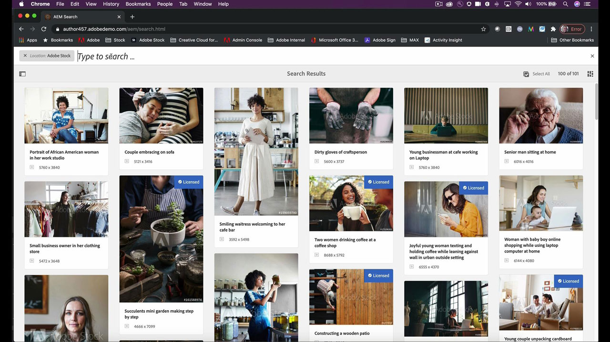

# [!DNL Stock]

!

크리에이터는 관심을 끌고 고정시켜줄 새롭고 시각적으로 매력적인 콘텐츠를 빠르게 전달해야 하는 부담감을 안고 있습니다. Adobe [!DNL Stock] for enterprise를 통해 크리에이티브 팀은 일상적으로 사용하는 Adobe 크리에이티브 앱에서 2억 개 이상의 이미지, 비디오, 템플릿, 일러스트레이션, 오디오 파일 및 3D 에셋을 이용할 수 있습니다.

## 제품 Tutorials 찾아보기

<table style="table-layout:fixed">
<tr>
 <td>
   
    

   <a href="stock.md#tutorial1"><strong>Adobe을 통해 신속하게 최고의 에셋 검색 [!DNL Stock]</strong></a>
    

    <em>AI 엔진인 Adobe Sensei에서 제공하는 보다 빠르고 효율적인 검색 결과를 사용하여 크리에이티브 프로젝트를 향상시킬 수 있는 로열티 프리 스톡 이미지를 찾아 보십시오</em>
     
  </td>
  <td>
   
    

   <a href="stock.md#tutorial2"><strong>검색 및 라이선스 [!DNL Stock] Adobe Experience Manager의 에셋</strong></a>
    

    <em>라이선스가 부여된 Adobe 업로드 프로세스 간소화 [!DNL Stock] 자산을 디지털 자산 관리 시스템에</em>
     
  </td>
  <td>
    
    

     
  </td>
</tr>
</table>

## Adobe을 통해 신속하게 최고의 에셋 검색 [!DNL Stock] (10:49) {#tutorial1}

>[!VIDEO](https://video.tv.adobe.com/v/326951?hidetitle=true)

**설명**
AI 엔진인 Adobe Sensei에서 제공하는 보다 빠르고 효율적인 검색 결과를 사용하여 크리에이티브 프로젝트를 향상시킬 수 있는 로열티 프리 스톡 이미지를 찾아 보십시오.

이 튜토리얼에서는 다음과 같은 방법을 살펴봅니다.
* 고품질 이미지와 비디오를 찾는 데 시간과 노력을 투자하십시오
* 전사적으로 간편하게 에셋 라이선스 및 사용 관리 및 추적
* Adobe Creative Cloud 앱에서 바로 검색, 미리보기 및 라이선스 부여

**프레젠테이션:**

빅토리아 토레스 [!DNL Stock] 솔루션 컨설턴트(디지털 미디어)

## 검색 및 라이선스 [!DNL Stock] AEM의 에셋(6:46) {#tutorial2}

>[!VIDEO](https://video.tv.adobe.com/v/326952?hidetitle=true)

**설명**
라이선스가 부여된 Adobe 업로드 프로세스 간소화 [!DNL Stock] 에셋을 디지털 에셋 관리 시스템에 추가할 수 있습니다.

이 튜토리얼에서는 다음과 같은 방법을 살펴봅니다.
* Adobe 수행 [!DNL Stock] AEM 작업 영역을 종료하지 않고도 에셋 검색
* 라이선스가 부여될 때 라이선스가 부여된 에셋을 AEM 폴더에 직접 저장
* AEM에서 라이선스가 부여된 에셋을 [!DNL Stock] 의 라이선스 내역 [!DNL Stock] 있습니다.

**프레젠테이션:**
Emily Palmer, 솔루션 컨설턴트(디지털 미디어)

![[!DNL Stock] 로고](../assets/st_appicon_96.png)

**Adobe [!DNL Stock] 리소스**

[학습 및 지원](https://helpx.adobe.com/support/stock.html) 추가 자습서와 커뮤니티 포럼 링크를 제공하는 허브입니다.

**2020년 10월 릴리스**

이러한 기능 등을 사용해 보십시오. Creative Cloud 데스크탑 앱에서 최신 업데이트를 다운로드합니다.
