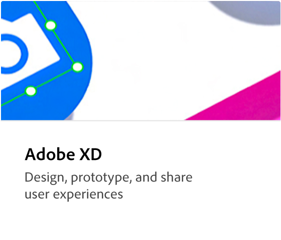

# 기업 튜토리얼에 대한 Creative Cloud

기업 학습 허브에 대한 Creative Cloud을 시작합니다. 여기서는 기업용 Creative Cloud에 중점을 둔 다양한 학습 경험을 찾을 수 있습니다. 튜토리얼, 웨비나 및 사용 사례는 초보자와 관리자 모두가 기업 제품에 대한 Creative Cloud을 빠르게 최신 상태로 만들 수 있도록 설계되었습니다.

## 주제 찾아보기

<table style="table-layout:fixed">
<tr>
  <td>
    
    

    <a href="cce/overview-cce.md">Creative Cloud for enterprise</a>
    

    엔터프라이즈 관점에서 최신 Creative Cloud 릴리스의 새로운 기능에 대해 알아봅니다.
     
  </td>
  <td>
    
    

    <a href="express/overview-express.md">Adobe Express</a>
    

    경험이 필요하지 않은, 사용하기 쉬운 크리에이티브 도구
     
  </td>
  <td>
    
    

    <a href="firefly/overview-firefly.md">Adobe Firefly</a>
    

    Adobe 제품의 새로운 크리에이티브 제너레이티브 AI 모델 패밀리
     
  </td>
  <td>
    
    

    <a href="stock/overview-stock.md">Adobe Stock</a>
    

    고품질 디지털 이미지, 일러스트레이션, 비디오, 오디오, 템플릿 등
     
  </td>
</tr>
  <td>
    
    

    <a href="3di/overview-3di.md">3D 및 VR Adobe</a>
    

    브랜딩, 제품 샷 및 패키지 디자인을 위한 사실적인 3D 이미지 제작
     
  </td>
  <td>
    
    

    <a href="dva/overview-dva.md">Adobe 비디오</a>
    

    비디오 편집, 모션 그래픽, 시각적 효과, 애니메이션 등을 지원하는 앱으로 아이디어를 실현하세요.
     
  </td>
  <td>
    
    

    <a href="xd/overview-xd.md">Adobe XD</a>
    

    사용자 경험 디자인, 프로토타이핑 및 공유
     
  </td>
  <td>
    
    

    <a href="xd/overview-xd.md">Adobe MAX</a>
    

    MAX 2020 엔터프라이즈 세션에 대해 자세히 알아보기
     
  </td>
</tr>
</table>
