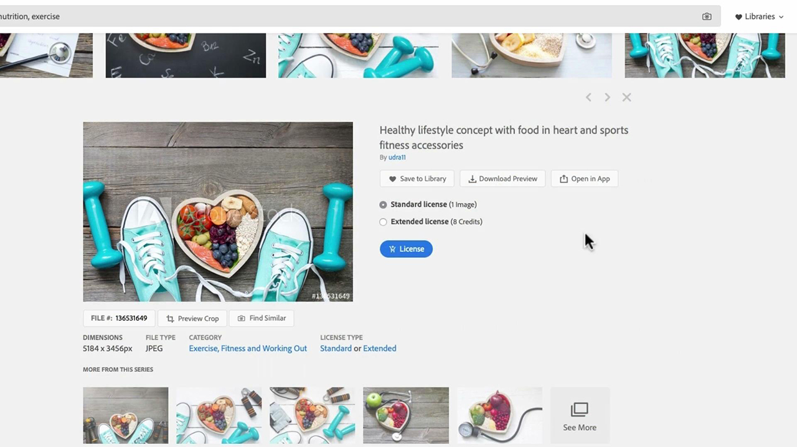
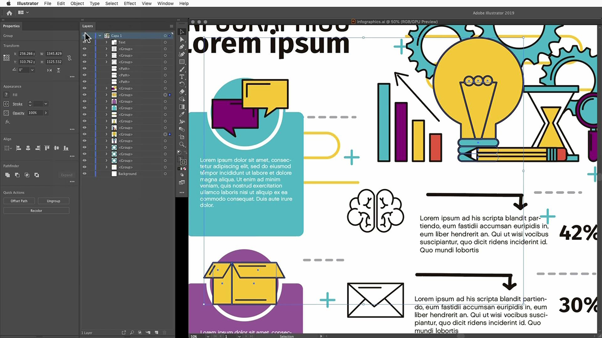
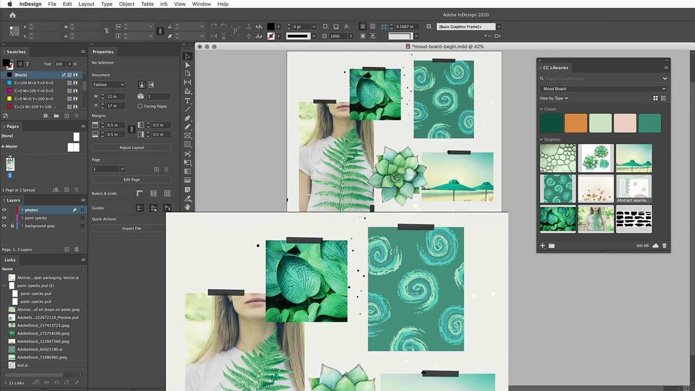
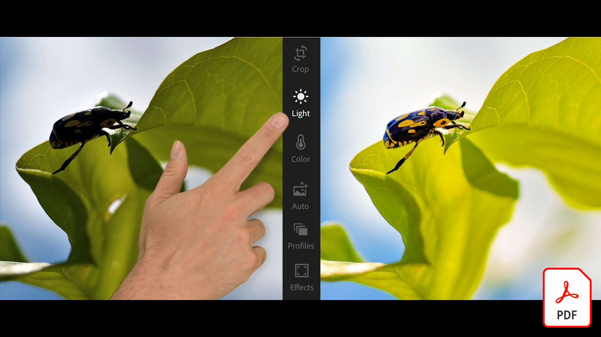

# Adobe [!DNL Stock] 자습서

!

창조자들은 새로운 시각적으로 매력적인 컨텐츠를 신속하게 전달해야 한다는 압박을 받고 있습니다. 엔터프라이즈용 Adobe [!DNL Stock]에서는 제작 팀이 매일 사용하는 Adobe Creative 앱 내에서 2억 개 이상의 이미지, 비디오, 템플릿, 그림, 오디오 파일 및 3D 에셋에 액세스할 수 있습니다.

## Adobe [!DNL Stock] 자습서를 보려면 클릭하십시오.

<table>
<tr>
   <td>
      
      

      <a href="searchstock.md"><strong>Adobe [!DNL Stock] 라이선스 기록 검색</strong></a>
      

      <em>엔터프라이즈용 Creative Cloud에서 조직의 Adobe [!DNL Stock] 라이선스 기록을 빠르게 검색하는 방법 알아보기</em>
       
  </td>
  <td>
      
      

      <a href="handdrawn.md"><strong>Adobe [!DNL Stock] 이미지에 손으로 그린 심미적 추가</strong></a>
      

      <em>iPad용 Photoshop을 사용하여 이미지에 깊이와 치수를 추가하는 고유한 기술을 사용하여 창조적인 마케팅을 강화하십시오.</em>
       
  </td>
  <td>
   
    

   <a href="flairtypography.md"><strong>마스크와 애니메이션이 포함된 입력 체계에 플레어를 추가합니다.</strong></a>
    

    <em>Adobe [!DNL Stock]의 요소 및 After Effects의 애니메이션 스타일로 텍스트를 생생하게 표현합니다.</em>
     
  </td>
</tr>
<tr>
   <td>
      
      

      <a href="animatevector.md"><strong>Photoshop에서 Adobe [!DNL Stock] 벡터 그림 애니메이션 적용</strong></a>
      

      <em>Adobe [!DNL Stock]의 편집 가능한 벡터를 사용하여 뉴스레터 그래픽에 애니메이션 적용</em>
       
  </td>
   <td>
      
      

      <a href="annualreport.md"><strong>Adobe [!DNL Stock] 및 Spark Video를 사용하여 만든 비디오를 사용하여 연간 보고서 시작</strong></a>
      

      <em>Adobe [!DNL Stock] 및 Spark Video를 사용하여 연간 보고서를 이야기로 만듭니다.</em>
       
  </td>
  <td>
      
      

      <a href="customanimations.md"><strong>Adobe [!DNL Stock]의 사용자 지정 애니메이션으로 창의성을 구현하십시오.</strong></a>
      

      <em>Photoshop에서 사용자 정의 애니메이션에 Adobe [!DNL Stock] 이미지, 텍스처, 패턴을 사용합니다.</em>
       
  </td>
</tr>
<tr>
   <td>
      
      

      <a href="changecolors.md"><strong>스토리에 맞게 Adobe [!DNL Stock] 이미지의 색상 변경</strong></a>
      

      <em>Adobe [!DNL Stock]에서 고유한 사진을 찾은 다음 필요에 맞게 Adobe Photoshop에서 색상을 조정합니다.</em>
       
  </td>
  <td>
      
      

      <a href="collage.md"><strong>Adobe [!DNL Stock] 이미지를 사용하여 포스터의 3D 콜라주 만들기</strong></a>
      

      <em>Adobe [!DNL Stock]의 이미지에서 눈에 띄는 3D 효과를 제공하는 Adobe Illustrator의 콜라주 디자인</em>
       
  </td>
  <td>
      
      

      <a href="boldlabel.md"><strong>Adobe [!DNL Stock] 템플릿 및 Photoshop Smart Objects로 굵은 레이블 만들기</strong></a>
      

      <em>Adobe [!DNL Stock]의 실제 패키징 템플릿을 사용하여 사용자 지정 디자인을 디자인 및 시각화합니다.</em>
       
  </td>
</tr>
<tr>
   <td>
      
      

      <a href="infographic.md"><strong>Adobe [!DNL Stock]을(를) 사용하여 회사 지침 정보 만들기</strong></a>
      

      <em>Adobe [!DNL Stock]의 다양한 자산을 결합하여 시각적으로 매력적인 infostgraphics 형식으로 지침 전달</em>
       
  </td>
 <td>
      
      

      <a href="featurecomparison.md"><strong>Adobe [!DNL Stock]을(를) 사용하여 제품 기능 비교 차트 만들기</strong></a>
      

      <em>제품 가격 책정 계획을 비교하여 잠재 고객에게 필요한 정보를 한눈에 제공하는 그래픽 작성</em>
       
  </td>
  <td>
      
      

      <a href="surrealcomposite.md"><strong>Adobe [!DNL Stock]을(를) 사용하여 반진짜 합성 만들기</strong></a>
      

      <em>여러 이미지와 색상, 동작 및 마스킹 효과를 결합하여 기억에 남을 만한 편집 이미지 만들기</em>
       
  </td>
</tr>
<tr>
   <td>
      
      

      <a href="surrealpattern.md"><strong>Adobe [!DNL Stock]을(를) 사용하여 반비현실적인 패턴 만들기</strong></a>
      

      <em>Adobe [!DNL Stock]의 초현실적인 이미지를 기반으로 아름다운 매끄러운 패턴 만들기</em>
       
  </td>
   <td>
      
      

      <a href="productconfigurator.md"><strong>Adobe [!DNL Stock]을(를) 사용하여 대화형 제품 구성 프로그램 만들기</strong></a>
      

      <em>Adobe [!DNL Stock]의 대화형 작업, 애니메이션 및 편집 가능한 아트웍을 사용하여 시각적 방법으로 재무 정보를 제시할 수 있습니다.</em>
       
  </td>
  <td>
      
      

      <a href="interactivetourismphoto.md"><strong>Adobe [!DNL Stock] 및 XD로 대화형 관광 사진 만들기</strong></a>
      

      <em>Adobe [!DNL Stock] 및 XD를 사용하여 웹 사이트 프로토타입 내에서 대화형 사진을 빠르게 만듭니다.</em>
       
  </td>
</tr>
<tr>
   <td>
      
      

      <a href="animationemail.md"><strong>Adobe [!DNL Stock] 및 Photoshop을 사용하여 전자 메일에 대한 애니메이션 만들기</strong></a>
      

      <em>Adobe [!DNL Stock] 및 Photoshop을 사용한 중지 작업 애니메이션으로 전자 메일 기능 강화</em>
       
  </td>
 <td>
      
      

      <a href="brandgradients.md"><strong>아름다운 그래디언트와 Adobe [!DNL Stock] 자산을 사용하여 결합된 브랜드 이미지 만들기</strong></a>
      

      <em>광고 캠페인 전반에 색상과 그라디언트를 결합하여 다양한 이미지를 사용하여 브랜드 통합을 만듭니다.</em>
       
   </td>
  <td>
      
      

      <a href="webgraphics.md"><strong>Adobe [!DNL Stock] 이미지를 CSS와 결합하여 매력적인 웹 그래픽 만들기</strong></a>
      

      <em>광고 캠페인 전반에 색상과 그라디언트를 결합하여 다양한 이미지를 사용하여 브랜드 통합을 만듭니다.</em>
       
  </td>
</tr>
<tr>
   <td>
      
      

      <a href="moodboard.md"><strong>Adobe [!DNL Stock]을(를) 사용하여 빠르게 고무적인 무드 보드를 만듭니다.</strong></a>
      

      <em>팀/클라이언트에 정보, 아이디어, 시각적 개체 및 컬러 팔레트를 전달하는 프로젝트 무드 보드를 만듭니다.</em>
       
  </td>
  <td>
      
      

      <a href="realisticcomposite.md"><strong>Adobe [!DNL Stock] 이미지를 사용하여 실제 사진 합성 만들기</strong></a>
      

      <em>Adobe [!DNL Stock] 사진 두 장을 모아 소셜 게시물에 사람들을 끌어 모으세요.</em>
       
  </td>
   <td>
   
    

   <a href="loadingscreen.md"><strong>Adobe [!DNL Stock] 및 XD를 사용하여 불러오는 화면 애니메이션 사용자 지정</strong></a>
    

    <em>Adobe [!DNL Stock]에서 벡터 아트워크를 사용자 지정하여 모바일 앱에 대한 냉각 로딩 화면 애니메이션을 만듭니다.</em>
     
  </td>
</tr>
<tr>
   <td>
   
    

   <a href="presentationtemplate.md"><strong>Adobe [!DNL Stock] 프레젠테이션 템플릿을 전문가처럼 보이도록 사용자 지정합니다.</strong></a>
    

    <em>Adobe [!DNL Stock]의 이미지 및 템플릿과 몇 가지 하기 쉬운 특수 효과를 사용하여 몇 분 만에 멋진 스타일화된 프레젠테이션을 만듭니다.</em>
     
  </td>
   <td>
   
    

   <a href="customizecolors.md"><strong>Adobe [!DNL Stock] 벡터 그림의 색상 사용자 정의</strong></a>
    

    <em>멋진 그림으로 프로젝트에 광택을 추가합니다. Adobe [!DNL Stock]에서 완벽한 벡터를 찾은 다음 Adobe Illustrator</em>를 사용하여 색상을 프로젝트의 팔레트와 일치시킵니다.
     
  </td>
   <td>
      
      

      <a href="assets/AddMotiontoStillImageswithAdobeStockandPhotoshop.pdf"><strong>Adobe [!DNL Stock] 및 Photoshop(PDF)을 사용하여 스틸 이미지에 동작 추가</strong></a>
      

      <em>어떤 화면이든 영상을 스틸 이미지에 통합하면</em>
       
   </td>
</tr>
<tr>
   <td>
   
    

   <a href="assets/CreateacompositewithPhotoshopontheiPadandAdobeStockimages.pdf"><strong>iPad 및 Adobe [!DNL Stock] 이미지에 Photoshop을 사용하여 합성 만들기(PDF)</strong></a>
    

    <em>iPad에서 Photoshop의 강력한 기능을 사용하여 가장 좋아하는 Adobe Creative Cloud 앱 중 하나를 완전히 새로운 방식으로 사용하는 방법을 알아봅니다.</em>
     
  </td>
   <td>
   
    

   <a href="assets/CreateaUniqueEditorialGraphicwithAfterEffectsandAdobeStock.pdf"><strong>Photoshop에서 Adobe [!DNL Stock] 벡터 그림 애니메이션(PDF)</strong></a>
    

    <em>After Effects와 Adobe [!DNL Stock]을 결합하여 스토리를 시각적으로 표현하는 데 도움이 되는 놀라운 특수 효과를 빠르게 만들 수 있습니다</em>
     
  </td>
   <td>
      
      

      <a href="assets/CreateUniqueGraphicsbyCombiningAdobeStockImages.pdf"><strong>Adobe [!DNL Stock] 이미지를 결합하여 고유한 그래픽 만들기(PDF)</strong></a>
      

      <em>두 개의 다른 이미지를 결합하여 디자인 프로젝트의 완전히 새로운 장면을 만듭니다. Adobe [!DNL Stock] 및 Adobe Photoshop을 사용하면 손쉽게</em>
       
   </td>
</tr>
<tr>
   <td>
      
      

      <a href="assets/CreatingaHalloweenCinemagraphwithPhotoshopCCandAdobeStock.pdf"><strong>Photoshop CC 및 Adobe [!DNL Stock](PDF)을 사용하여 할로윈 극장 만들기</strong></a>
      

      <em>Adobe Photoshop으로 비디오, 그림 및 사진을 합성하여 영화관을 만듭니다.</em>
       
  </td>
   <td>
      
      

      <a href="assets/PutyourDatainMotionwithAdobeStockandPremierePro.pdf"><strong>Adobe [!DNL Stock] 및 Premiere Pro(PDF)를 사용하여 데이터를 움직입니다.</strong></a>
      

      <em>Adobe [!DNL Stock] 및 Adobe Premiere Pro를 사용하여 보다 설득력 있는 이야기를 전달하기 위해 데이터를 생생하게 활용하십시오.</em>
       
  </td>
   <td>
      
      

      <a href="assets/RecolorAdobeStockVectorArtworkwithAdobeIllustratortoGetExactlytheLookYouWant.pdf"><strong>Adobe [!DNL Stock] 벡터 아트워크를 Adobe Illustrator에서 다시 칠하여 원하는 모양을 정확하게 만들기(PDF)</strong></a>
      

      <em>Adobe [!DNL Stock]을 사용하면 고유한 벡터 그래픽을 쉽게 찾을 수 있으며, Adobe Illustrator를 사용하면 창의적 비전에 맞게 벡터 그래픽을 빠르게 수정할 수 있습니다</em>
       
   </td>
 </tr> 
 <tr>
   <td>
      
      

      <a href="assets/ShowOffyourDesignWorkintheRealWorldwithAdobeStockandPhotoshop.pdf"><strong>Adobe [!DNL Stock] 및 Photoshop(PDF)을 사용하여 실제 환경에서 디자인 작업 표시</strong></a>
      

      <em>Adobe Photoshop을 사용하여 실제 모양의 Adobe [!DNL Stock] 템플릿으로 작업을 소개하려면 다음 단계를 따르십시오</em>
       
  </td>
   <td>
      
      

      <a href="assets/UncoveramazingdetailsinAdobeStockimageswithLightroomformobile.pdf"><strong>Lightroom for mobile(PDF)을 사용하여 Adobe [!DNL Stock] 이미지에서 놀라운 세부 정보 확인</strong></a>
      

      <em>모바일 장치에서 Lightroom의 강력한 성능을 통해 이미지의 최상의 성능을 발휘하십시오.</em>
       
  </td>
   <td>
      
      

      <a href="assets/VisualizePosterDesignsintheRealWorldwithAdobeStockandPhotoshop.pdf"><strong>Adobe [!DNL Stock] 및 Photoshop(PDF)을 사용하여 실제 세상에서 포스터 디자인 시각화</strong></a>
      

      <em>실제 환경에서 디자인을 공개하여 세상을 어떻게 바라보는지를 보다 잘 파악할 수 있습니다.</em>
       
  </td>
</tr>
</table>
