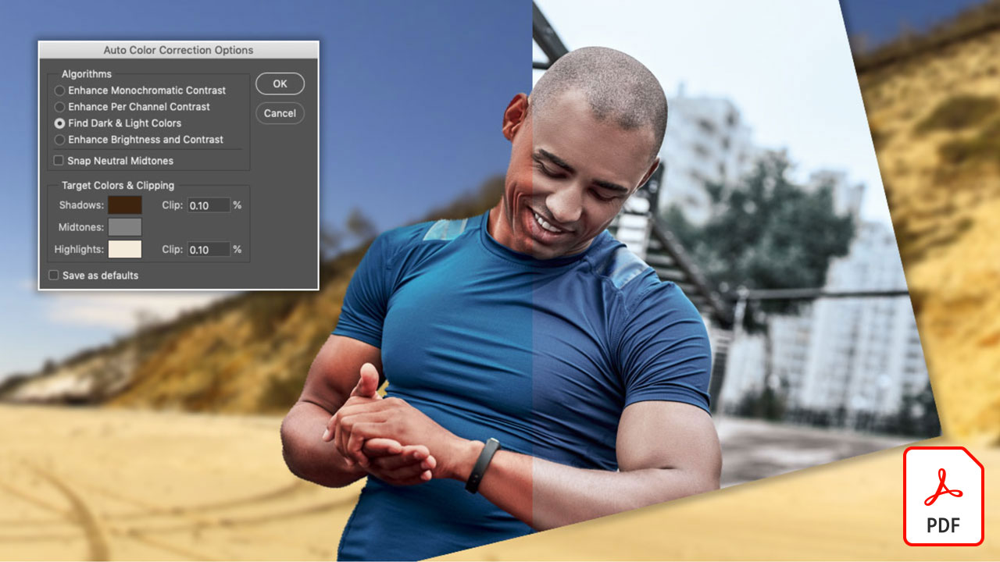

# Adobe [!DNL Stock] 튜토리얼

크리에이터는 매력적인 시각적 콘텐츠를 빠르게 전달해야 하는 부담감을 안고 있습니다. Adobe Stock을 통해 크리에이티브 팀은 매일 사용하는 Creative Cloud 앱에서 3억 개가 넘는 로열티 프리 이미지, 비디오, 오디오 파일, 템플릿, 일러스트레이션, 3D 에셋을 이용할 수 있습니다. Creative Cloud Pro Edition을 통해 Adobe Stock 표준 에셋을 무제한으로 이용할 수 있습니다. stock.adobe.com에서 최신 컬렉션을 살펴보십시오. 튜토리얼을 볼 이미지를 선택합니다.

<table>
<tr>
   <td>
      
      

      <a href="stunning-digital-assets.md"><strong>매력적인 디지털 에셋(PDF)</strong></a>
      

      <em>이 실습 튜토리얼에서는 Adobe Stock과 CC Libraries를 통합하여 인쇄물 및 화면을 위한 일관되고 전문적인 디자인 결과를 만드는 방법을 살펴봅니다</em>
       
  </td>
  <td>
      
      

      <a href="searchstock.md"><strong>검색 Adobe [!DNL Stock] 라이선스 내역</strong></a>
      

      <em>조직의 Adobe을 빠르게 검색하는 방법에 대해 알아봅니다. [!DNL Stock] 기업용 Creative Cloud의 라이선싱 기록</em>
       
  </td>
  <td>
      
      

      <a href="handdrawn.md"><strong>Adobe에 손으로 그린 아트웍 추가 [!DNL Stock] 이미지</strong></a>
      

      <em>Photoshop for iPad을 사용하여 이미지에 입체감을 더해주는 특별한 기법을 통해 크리에이티브 마케팅을 전개할 수 있습니다</em>
       
  </td>
  <td>
   
    

   <a href="flairtypography.md"><strong>마스크와 애니메이션을 사용하여 타이포그래피에 멋스러움 더하기</strong></a>
    

    <em>Adobe 요소를 사용하여 텍스트를 생동감 있게 표현 [!DNL Stock] 및 After Effects 애니메이션 스타일</em>
     
  </td>
</tr>
<tr>
  <td>
      
      

      <a href="animatevector.md"><strong>Adobe 애니메이션 만들기 [!DNL Stock] Photoshop의 벡터 일러스트레이션</strong></a>
      

      <em>Adobe을 위한 편집 가능한 벡터로 뉴스레터 그래픽에 애니메이션을 추가하세요 [!DNL Stock]</em>
       
  </td>
 <td>
      
      

      <a href="annualreport.md"><strong>Adobe으로 제작한 비디오로 연간 보고서 작성 [!DNL Stock] 및 Spark Video</strong></a>
      

      <em>Adobe을 통해 스토리 있는 연간 보고서 만들기 [!DNL Stock] 및 Spark Video</em>
       
  </td>
  <td>
      
      

      <a href="customanimations.md"><strong>Adobe에 따라 개성 있는 애니메이션으로 창의력 발휘 [!DNL Stock]</strong></a>
      

      <em>Adobe 사용 [!DNL Stock] Photoshop에서 사용자 정의 애니메이션에 대한 이미지, 텍스처, 패턴</em>
       
  </td>
  <td>
      
      

      <a href="changecolors.md"><strong>Adobe 변경 [!DNL Stock] 스토리에 맞는 이미지 색상</strong></a>
      

      <em>Adobe에서 독특한 사진 찾기 [!DNL Stock] 필요에 맞게 Adobe Photoshop의 색상을 조정할 수 있습니다</em>
       
  </td>
</tr>
<tr>
 <td>
      
      

      <a href="collage.md"><strong>Adobe을 사용하여 포스터용 3D 콜라주 만들기 [!DNL Stock] 이미지</strong></a>
      

      <em>Adobe Illustrator에서 Adobe의 이미지로 시선을 사로잡는 3D 효과를 연출하는 콜라주 디자인 [!DNL Stock]</em>
       
  </td>
  <td>
      
      

      <a href="boldlabel.md"><strong>Adobe을 사용하여 굵은 레이블 만들기 [!DNL Stock] 템플릿 및 Photoshop 고급 개체</strong></a>
      

      <em>Adobe의 리얼한 패키지 템플릿을 사용하여 개성 있는 디자인을 만들어 보세요 [!DNL Stock]</em>
       
  </td>
  <td>
      
      

      <a href="infographic.md"><strong>Adobe을 사용하여 기업 가이드라인 인포그래픽 만들기 [!DNL Stock]</strong></a>
      

      <em>Adobe에서 다양한 에셋 결합 [!DNL Stock] 시각적으로 매력적인 인포그래픽 형태로 지침을 전달하려면</em>
       
  </td>
 <td>
      
      

      <a href="featurecomparison.md"><strong>Adobe을 사용하여 제품 기능 비교 차트 만들기 [!DNL Stock]</strong></a>
      

      <em>제품 가격 플랜을 비교하여 잠재 고객에게 필요한 정보를 한눈에 제공하는 그래픽을 만듭니다</em>
       
  </td>
</tr>
<tr>
   <td>
      
      

      <a href="surrealcomposite.md"><strong>Adobe을 사용하여 초현실적인 합성 이미지 만들기 [!DNL Stock]</strong></a>
      

      <em>색상, 동작 및 마스크 효과로 여러 이미지를 결합하여 인상적인 에디토리얼 이미지를 만들어 보세요</em>
       
  </td>
   <td>
      
      

      <a href="surrealpattern.md"><strong>Adobe을 사용하여 초현실적인 패턴 만들기 [!DNL Stock]</strong></a>
      

      <em>Adobe의 초현실적인 이미지를 기반으로 매력적이고 매끄러운 패턴을 만들 수 있습니다 [!DNL Stock]</em>
       
  </td>
   <td>
      
      

      <a href="productconfigurator.md"><strong>Adobe을 사용하여 인터랙티브한 상품 구성 앱 만들기 [!DNL Stock]</strong></a>
      

      <em>Adobe에서 강력한 인터랙션, 애니메이션, 편집 가능한 아트웍 사용 [!DNL Stock] 금융 정보를 시각적으로 제시하다</em>
       
  </td>
  <td>
      
      

      <a href="interactivetourismphoto.md"><strong>Adobe을 사용하여 인터랙티브한 관광 사진 만들기 [!DNL Stock] 및 XD</strong></a>
      

      <em>Adobe을 사용하여 웹 사이트 프로토타입에서 인터랙티브한 사진을 빠르게 만들 수 있습니다 [!DNL Stock] 및 XD</em>
       
  </td>
</tr>
<tr>
 <td>
      
      

      <a href="animationemail.md"><strong>Adobe이 포함된 이메일용 애니메이션 만들기 [!DNL Stock] 및 Photoshop</strong></a>
      

      <em>Adobe을 사용하여 스톱 액션 애니메이션으로 이메일을 강화할 수 있습니다. [!DNL Stock] 및 Photoshop</em>
       
  </td>
  <td>
      
      

      <a href="brandgradients.md"><strong>멋진 그레이디언트와 Adobe으로 일관된 브랜드 이미지 만들기 [!DNL Stock] assets</strong></a>
      

      <em>광고 캠페인에서 색상과 그라디언트를 결합하여 다양한 이미지로 브랜드 일관성을 유지하세요</em>
       
   </td>
  <td>
      
      

      <a href="webgraphics.md"><strong>Adobe을 결합하여 매력적인 웹 그래픽 제작 [!DNL Stock] CSS를 사용한 이미지</strong></a>
      

      <em>광고 캠페인에서 색상과 그라디언트를 결합하여 다양한 이미지로 브랜드 일관성을 유지하세요</em>
       
  </td>
  <td>
      
      

      <a href="moodboard.md"><strong>Adobe을 사용하여 신속하게 무드보드 만들기 [!DNL Stock]</strong></a>
      

      <em>프로젝트 무드보드를 만들어 정보, 아이디어, 시각 요소 및 색상 팔레트를 팀/클라이언트에 전달합니다</em>
       
  </td>
</tr>
<tr>
   <td>
      
      

      <a href="realisticcomposite.md"><strong>Adobe을 사용하여 리얼한 합성 사진 만들기 [!DNL Stock] 이미지</strong></a>
      

      <em>탁월한 두 Adobe [!DNL Stock] 소셜 게시물에 사람들을 끌어들이는 사진</em>
       
  </td>
   <td>
   
    

   <a href="loadingscreen.md"><strong>Adobe을 사용하여 로딩 화면 애니메이션 사용자 정의 [!DNL Stock] 및 XD</strong></a>
    

    <em>Adobe에서 벡터 아트웍 사용자 정의 [!DNL Stock] 모바일 앱의 멋진 로딩 화면 애니메이션 만들기</em>
     
  </td>
  <td>
   
    

   <a href="presentationtemplate.md"><strong>Adobe 사용자 정의 [!DNL Stock] 전문가 수준의 시선을 사로잡는 프레젠테이션 템플릿</strong></a>
    

    <em>Adobe의 이미지와 템플릿을 사용하여 멋진 프레젠테이션을 신속하게 만들 수 있습니다 [!DNL Stock] 손쉽게 사용할 수 있는 특수 효과</em>
     
  </td>
   <td>
   
    

   <a href="customizecolors.md"><strong>Adobe의 색상 사용자 정의 [!DNL Stock] 벡터 일러스트레이션</strong></a>
    

    <em>멋진 일러스트레이션으로 프로젝트에 세련미를 더할 수 있습니다. Adobe에서 원하는 벡터 찾기 [!DNL Stock]를 선택하고 Adobe Illustrator을 사용하여 프로젝트의 팔레트에 색상을 일치시킵니다</em>
     
  </td>
</tr>
<tr>
   <td>
      
      

      <a href="assets/AddMotiontoStillImageswithAdobeStockandPhotoshop.pdf"><strong>Adobe을 사용하여 스틸 이미지에 모션 추가 [!DNL Stock] 및 Photoshop(PDF)</strong></a>
      

      <em>동영상을 스틸 이미지에 통합하여 모든 화면에서 시선을 사로잡으십시오</em>
       
   </td>
   <td>
   
    

   <a href="assets/CreateacompositewithPhotoshopontheiPadandAdobeStockimages.pdf" target="_blank"><strong>iPad 및 Adobe에서 Photoshop을 사용하여 합성 이미지 만들기 [!DNL Stock] 이미지(PDF)</strong></a>
    

    <em>iPad에서 강력한 Photoshop 기능을 사용하여 완전히 새로운 방식으로 즐겨 사용하는 Adobe Creative Cloud 앱 중 하나를 사용하는 방법에 대해 알아봅니다</em>
     
  </td>
   <td>
   
    

   <a href="assets/CreateaUniqueEditorialGraphicwithAfterEffectsandAdobeStock.pdf" target="_blank"><strong>Adobe 애니메이션 만들기 [!DNL Stock] Photoshop의 벡터 일러스트레이션(PDF)</strong></a>
    

    <em>After Effects과 Adobe 결합 [!DNL Stock], 스토리를 시각적으로 전달하는 데 도움이 되는 멋진 특수 효과를 빠르게 만들 수 있습니다</em>
     
  </td>
   <td>
      
      

      <a href="assets/CreateUniqueGraphicsbyCombiningAdobeStockImages.pdf" target="_blank"><strong>Adobe을 결합하여 독특한 그래픽 만들기 [!DNL Stock] 이미지(PDF)</strong></a>
      

      <em>서로 다른 두 이미지를 결합하여 디자인 프로젝트에 완전히 새로운 장면을 만들 수 있습니다. Adobe [!DNL Stock] 간편하게 Adobe Photoshop 사용</em>
       
   </td>
</tr>
<tr>
  <td>
      
      

      <a href="assets/CreatingaHalloweenCinemagraphwithPhotoshopCCandAdobeStock.pdf" target="_blank"><strong>Photoshop CC 및 Adobe을 사용하여 할로윈 시네마그래프 만들기 [!DNL Stock] (PDF)</strong></a>
      

      <em>Adobe Photoshop에서 비디오, 일러스트레이션 및 사진을 합성하여 시네마그래프 만들기</em>
       
  </td>
   <td>
      
      

      <a href="assets/PutyourDatainMotionwithAdobeStockandPremierePro.pdf" target="_blank"><strong>Adobe을 통해 데이터 생동감 발휘 [!DNL Stock] 및 Premiere Pro(PDF)</strong></a>
      

      <em>Adobe을 사용하여 데이터를 생동감 있게 표현하고 설득력 있는 스토리텔링을 전달할 수 있습니다 [!DNL Stock] 및 Adobe Premiere Pro</em>
       
  </td>
   <td>
      
      

      <a href="assets/RecolorAdobeStockVectorArtworkwithAdobeIllustratortoGetExactlytheLookYouWant.pdf" target="_blank"><strong>Adobe 색상 변경 [!DNL Stock] Adobe Illustrator을 사용한 벡터 아트웍으로 원하는 룩 완성(PDF)</strong></a>
      

      <em>Adobe [!DNL Stock] 고유한 벡터 그래픽을 쉽게 찾을 수 있으며, Adobe Illustrator을 사용하면 창의적인 구상에 맞게 신속하게 수정할 수 있습니다</em>
       
   </td>
   <td>
      
      

      <a href="assets/ShowOffyourDesignWorkintheRealWorldwithAdobeStockandPhotoshop.pdf" target="_blank"><strong>Adobe을 사용하여 실제 환경에서 디자인 작업 공개 [!DNL Stock] 및 Photoshop(PDF)</strong></a>
      

      <em>다음 단계에 따라 사실적인 Adobe으로 작품을 전시하십시오 [!DNL Stock] Adobe Photoshop을 사용한 템플릿</em>
       
  </td>
 </tr> 
 <tr>
   <td>
      
      

      <a href="assets/UncoveramazingdetailsinAdobeStockimageswithLightroomformobile.pdf" target="_blank"><strong>Adobe에서 디테일 살리기 [!DNL Stock] Lightroom for mobile이 있는 이미지(PDF)</strong></a>
      

      <em>모바일 디바이스에서 강력한 Lightroom을 사용하여 이미지를 돋보이게 만드는 방법을 살펴보세요</em>
       
  </td>
  <td>
      
      

      <a href="assets/VisualizePosterDesignsintheRealWorldwithAdobeStockandPhotoshop.pdf" target="_blank"><strong>Adobe을 통해 실제 환경에서 포스터 디자인 시각화 [!DNL Stock] 및 Photoshop(PDF)</strong></a>
      

      <em>실제 환경에서 디자인을 전시하여 시선을 사로잡는 디자인을 만들 수 있습니다</em>
       
  </td>
  <td>
    
    

     
  </td>
</tr>
</table>
