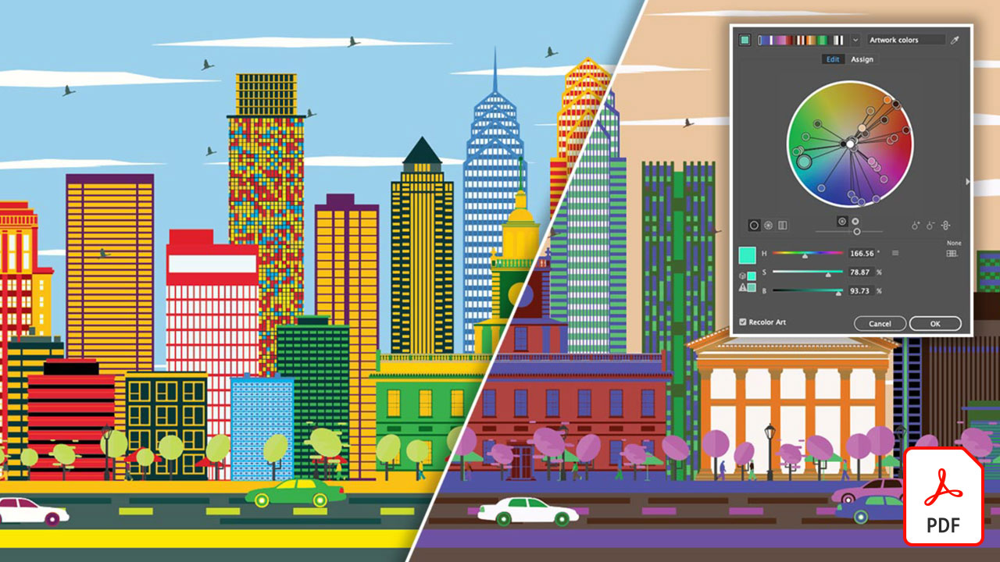

# Adobe [!DNL Stock] 자습서

크리에이터들은 매력적인 시각적 컨텐츠를 신속하게 제공해야 한다는 압박을 받고 있습니다. Adobe Stock은 크리에이티브 팀이 매일 사용하는 Creative Cloud 앱 내에서 3억 개 이상의 로열티 프리 이미지, 비디오, 오디오 파일, 템플릿, 일러스트레이션 및 3D 에셋을 이용할 수 있도록 해 줍니다. Creative Cloud Pro 에디션으로 Adobe Stock 표준 에셋을 무제한으로 이용하세요. stock.adobe.com에서 최신 컬렉션을 살펴보십시오. 튜토리얼을 볼 이미지를 선택합니다.

<table>
<tr>
   <td>
      
      

      <a href="stunning-digital-assets.md"><strong>멋진 디지털 에셋(PDF)</strong></a>
      

      <em>이 실습 튜토리얼에서 Adobe Stock과 CC Libraries을 통합하여 인쇄물과 화면에 대해 일관되고 전문적인 디자인 결과를 만드는 방법을 알아보십시오</em>
       
  </td>
  <td>
      
      

      <a href="searchstock.md"><strong>검색 Adobe [!DNL Stock] 라이선스 내역</strong></a>
      

      <em>Enterprise용 Creative Cloud에서 조직의 Adobe [!DNL Stock] 라이선싱 내역을 빠르게 검색하는 방법</em>을 살펴보세요.
       
  </td>
  <td>
      
      

      <a href="handdrawn.md"><strong>Adobe [!DNL Stock]개의 이미지에 손으로 그린 미적 요소 추가</strong></a>
      

      <em>iPad용 Photoshop을 사용하여 이미지에 깊이와 차원을 더하는 고유한 기술로 창의적인 마케팅을 강화하세요.</em>
       
  </td>
  <td>
   
    

   <a href="flairtypography.md"><strong>마스크와 애니메이션으로 타이포그래피에 감각 더하기</strong></a>
    

    <em>Adobe [!DNL Stock]의 요소와 After Effects의 애니메이션 스타일로 텍스트에 활기 불어넣기</em>
     
  </td>
</tr>
<tr>
  <td>
      
      

      <a href="animatevector.md"><strong>Photoshop에서 Adobe [!DNL Stock] 벡터 일러스트레이션 애니메이트</strong></a>
      

      <em>Adobe [!DNL Stock]</em>에 대한 편집 가능한 벡터로 뉴스레터 그래픽에 애니메이션 적용
       
  </td>
 <td>
      
      

      <a href="annualreport.md"><strong>Adobe [!DNL Stock] 및 Spark Video</strong></a>로 만든 비디오로 연간 보고서 시작
      

      <em>Adobe [!DNL Stock] 및 Spark Video</em>을(를) 사용하여 연간 보고서를 스토리로 만듭니다.
       
  </td>
  <td>
      
      

      <a href="customanimations.md"><strong>[!DNL Stock]</strong></a> Adobe의 사용자 지정 애니메이션으로 창의력 발휘
      

      <em>Photoshop에서 Adobe [!DNL Stock] 이미지, 텍스처, 패턴을 사용하여 맞춤 애니메이션 만들기</em>
       
  </td>
  <td>
      
      

      <a href="changecolors.md"><strong>Adobe [!DNL Stock] 이미지의 색상을 스토리와 일치하도록 변경</strong></a>
      

      <em>Adobe [!DNL Stock]에서 고유한 사진을 찾은 다음 필요에 맞게 Adobe Photoshop에서 색상을 조정하세요.</em>
       
  </td>
</tr>
<tr>
 <td>
      
      

      <a href="collage.md"><strong>Adobe [!DNL Stock] 이미지를 사용하여 포스터의 3D 콜라주 만들기</strong></a>
      

      <em>Adobe Illustrator에서 [!DNL Stock]</em> Adobe의 이미지에서 시선을 사로잡는 3D 효과를 제공하는 콜라주를 디자인하세요.
       
  </td>
  <td>
      
      

      <a href="boldlabel.md"><strong>Adobe [!DNL Stock] 템플릿과 Photoshop 고급 개체로 굵은 레이블 만들기</strong></a>
      

      <em>Adobe [!DNL Stock]</em>의 사실적인 패키지 템플릿을 사용하여 사용자 정의 디자인을 디자인하고 시각화합니다.
       
  </td>
  <td>
      
      

      <a href="infographic.md"><strong>Adobe [!DNL Stock]</strong></a>을(를) 사용하여 회사 지침 인포그래픽 만들기
      

      <em>Adobe [!DNL Stock]의 다양한 에셋을 결합하여 시각적으로 매력적인 인포그래픽 형식으로 지침을 전달하세요.</em>
       
  </td>
 <td>
      
      

      <a href="featurecomparison.md"><strong>Adobe [!DNL Stock]</strong></a>을(를) 사용하여 제품 기능 비교 차트 만들기
      

      <em>제품 가격 계획을 비교하여 잠재 고객에게 필요한 정보를 한 눈에 제공하는 그래픽을 만듭니다.</em>
       
  </td>
</tr>
<tr>
   <td>
      
      

      <a href="surrealcomposite.md"><strong>Adobe [!DNL Stock]</strong></a>을(를) 사용하여 반초현실적 합성 만들기
      

      <em>여러 이미지를 색상, 동작 및 마스킹 효과와 결합하여 인상적인 에디토리얼 이미지 만들기</em>
       
  </td>
   <td>
      
      

      <a href="surrealpattern.md"><strong>Adobe [!DNL Stock]</strong></a>을(를) 사용하여 반초현실적인 패턴 만들기
      

      <em>[!DNL Stock]</em> Adobe에서 초현실적인 이미지를 기반으로 아름답고 매끄러운 패턴 만들기
       
  </td>
   <td>
      
      

      <a href="productconfigurator.md"><strong>Adobe [!DNL Stock]</strong></a>을(를) 사용하여 대화형 제품 구성자 만들기
      

      <em>Adobe [!DNL Stock]에서 대화형 기능, 애니메이션 및 편집 가능한 아트워크를 사용하여 시각적 방식으로 재무 정보를 표시합니다</em>
       
  </td>
  <td>
      
      

      <a href="interactivetourismphoto.md"><strong>Adobe [!DNL Stock] 및 XD</strong></a>로 인터랙티브한 관광 사진 만들기
      

      <em>Adobe [!DNL Stock] 및 XD</em>을(를) 사용하여 웹 사이트 프로토타입에서 인터랙티브한 사진을 빠르게 만듭니다.
       
  </td>
</tr>
<tr>
 <td>
      
      

      <a href="animationemail.md"><strong>Adobe [!DNL Stock] 및 Photoshop</strong></a>로 전자 메일에 대한 애니메이션 만들기
      

      <em>Adobe [!DNL Stock] 및 Photoshop</em>에서 Stop-Action 애니메이션으로 전자 메일 강화
       
  </td>
  <td>
      
      

      <a href="brandgradients.md"><strong>아름다운 그레이디언트와 Adobe [!DNL Stock] 에셋으로 일관된 브랜드 이미지 만들기</strong></a>
      

      <em>광고 캠페인에서 색상과 그라디언트를 결합하여 다양한 이미지로 브랜드 통일성 만들기</em>
       
   </td>
  <td>
      
      

      <a href="webgraphics.md"><strong>Adobe [!DNL Stock] 이미지를 CSS와 결합하여 매력적인 웹 그래픽 만들기</strong></a>
      

      <em>광고 캠페인에서 색상과 그라디언트를 결합하여 다양한 이미지로 브랜드 통일성 만들기</em>
       
  </td>
  <td>
      
      

      <a href="moodboard.md"><strong>Adobe [!DNL Stock]</strong></a>을(를) 사용하여 영감을 주는 무드 보드 빠르게 만들기
      

      <em>정보, 아이디어, 비주얼 및 색상 팔레트를 팀/클라이언트로 전달하기 위한 프로젝트 무드 보드 만들기</em>
       
  </td>
</tr>
<tr>
   <td>
      
      

      <a href="realisticcomposite.md"><strong>Adobe [!DNL Stock]개 이미지로 사실적인 사진 합성 만들기</strong></a>
      

      <em>두 개의 멋진 Adobe [!DNL Stock] 사진을 함께 모아 소셜 게시물에 사람들을 끌어다 놓으세요</em>
       
  </td>
   <td>
   
    

   <a href="loadingscreen.md"><strong>Adobe [!DNL Stock] 및 XD</strong></a>을(를) 사용하여 로딩 화면 애니메이션 사용자 지정
    

    <em>Adobe [!DNL Stock]에서 벡터 아트워크를 맞춤화하여 모바일 앱에 대한 멋진 로딩 화면 애니메이션을 만듭니다</em>
     
  </td>
  <td>
   
    

   <a href="presentationtemplate.md"><strong>Adobe [!DNL Stock] 프레젠테이션 템플릿을 사용자 정의하여 전문적이면서도 시선을 사로잡는 스타일로 만듭니다</strong></a>
    

    <em>Adobe [!DNL Stock]의 이미지 및 템플릿과 간편한 효과를 사용하여 스타일리시한 프레젠테이션을 빠르게 만들어 보세요</em>
     
  </td>
   <td>
   
    

   <a href="customizecolors.md"><strong>Adobe [!DNL Stock] 벡터 일러스트레이션</strong></a>에서 색상 사용자 지정
    

    <em>멋진 일러스트레이션으로 모든 프로젝트에 광택을 더하세요. Adobe [!DNL Stock]에서 완벽한 벡터를 찾은 다음 Adobe Illustrator</em>을 사용하여 색상을 프로젝트의 팔레트와 일치시킵니다.
     
  </td>
</tr>
<tr>
   <td>
      
      

      <a href="assets/AddMotiontoStillImageswithAdobeStockandPhotoshop.pdf"><strong>Adobe [!DNL Stock] 및 Photoshop(PDF)</strong></a>를 사용하여 스틸 이미지에 모션 추가
      

      <em>비디오를 스틸 이미지에 통합하여 모든 화면에서 잠재고객을 사로잡으십시오.</em>
       
   </td>
   <td>
   
    

   <a href="assets/CreateacompositewithPhotoshopontheiPadandAdobeStockimages.pdf" target="_blank"><strong>iPad에서 Photoshop을 사용하여 합성 이미지 만들기 및 [!DNL Stock] 이미지(PDF) Adobe</strong></a>
    

    <em>iPad에서 Photoshop의 강력한 기능을 사용하여 즐겨 사용하는 Adobe Creative Cloud 앱 중 하나를 완전히 새로운 방식으로 사용하는 방법에 대해 알아봅니다.</em>
     
  </td>
   <td>
   
    

   <a href="assets/CreateaUniqueEditorialGraphicwithAfterEffectsandAdobeStock.pdf" target="_blank"><strong>Photoshop(PDF)에서 Adobe [!DNL Stock] 벡터 일러스트레이션 애니메이트</strong></a>
    

    <em>After Effects을 Adobe [!DNL Stock]과(와) 결합하면 시각적으로 스토리를 전달하는 데 도움이 되는 멋진 특수 효과를 빠르게 만들 수 있습니다</em>
     
  </td>
   <td>
      
      

      <a href="assets/CreateUniqueGraphicsbyCombiningAdobeStockImages.pdf" target="_blank"><strong>Adobe [!DNL Stock] 이미지(PDF)를 결합하여 고유한 그래픽 만들기</strong></a>
      

      <em>서로 다른 두 이미지를 모아 디자인 프로젝트에 완전히 새로운 장면을 만듭니다. Adobe [!DNL Stock]과(와) Adobe Photoshop을(를) 사용하여 손쉽게</em>
       
   </td>
</tr>
<tr>
  <td>
      
      

      <a href="assets/CreatingaHalloweenCinemagraphwithPhotoshopCCandAdobeStock.pdf" target="_blank"><strong>Photoshop CC 및 Adobe [!DNL Stock](PDF)을(를) 사용하여 핼러윈 시네마그래프 만들기</strong></a>
      

      <em>Adobe Photoshop으로 비디오, 일러스트레이션 및 사진을 합성하여 시네마그래프 만들기</em>
       
  </td>
   <td>
      
      

      <a href="assets/PutyourDatainMotionwithAdobeStockandPremierePro.pdf" target="_blank"><strong>Adobe [!DNL Stock] 및 Premiere Pro(PDF)</strong></a>를 사용하여 데이터를 이동하세요.
      

      <em>Adobe [!DNL Stock]과(와) Adobe Premiere Pro</em>을(를) 사용하여 데이터를 더욱 설득력 있는 스토리로 구현하세요.
       
  </td>
   <td>
      
      

      <a href="assets/RecolorAdobeStockVectorArtworkwithAdobeIllustratortoGetExactlytheLookYouWant.pdf" target="_blank"><strong>Adobe Illustrator으로 Adobe [!DNL Stock] 벡터 아트웍 색상을 변경하여 원하는 모습(PDF)을 연출하세요.</strong></a>
      

      <em>Adobe [!DNL Stock]을(를) 사용하면 고유한 벡터 그래픽을 쉽게 찾을 수 있으며 Adobe Illustrator을 사용하면 창의적인 시각에 맞게 빠르게 수정할 수 있습니다</em>
       
   </td>
   <td>
      
      

      <a href="assets/ShowOffyourDesignWorkintheRealWorldwithAdobeStockandPhotoshop.pdf" target="_blank"><strong>Adobe [!DNL Stock] 및 Photoshop(PDF)</strong></a>로 실제 디자인 작품을 선보이세요.
      

      <em>다음 단계에 따라 Adobe Photoshop을 사용하여 사실적인 Adobe [!DNL Stock] 템플릿으로 내 작품을 선보이세요.</em>
       
  </td>
 </tr> 
 <tr>
   <td>
      
      

      <a href="assets/UncoveramazingdetailsinAdobeStockimageswithLightroomformobile.pdf" target="_blank"><strong>Lightroom for mobile(PDF)를 사용하여 [!DNL Stock] Adobe 이미지에서 놀라운 세부 사항 발견</strong></a>
      

      <em>모바일 디바이스에서 Lightroom의 강력한 기능을 사용하여 이미지의 완성도를 높여보세요</em>
       
  </td>
  <td>
      
      

      <a href="assets/VisualizePosterDesignsintheRealWorldwithAdobeStockandPhotoshop.pdf" target="_blank"><strong>Adobe [!DNL Stock] 및 Photoshop(PDF)</strong></a>를 사용하여 포스터 디자인을 실제 세계에서 시각화
      

      <em>실제 환경에서 디자인을 선보여 디자인이 세상에 어떻게 보이는지 더 잘 파악하세요.</em>
       
  </td>
  <td>
    
    

     
  </td>
</tr>
</table>
