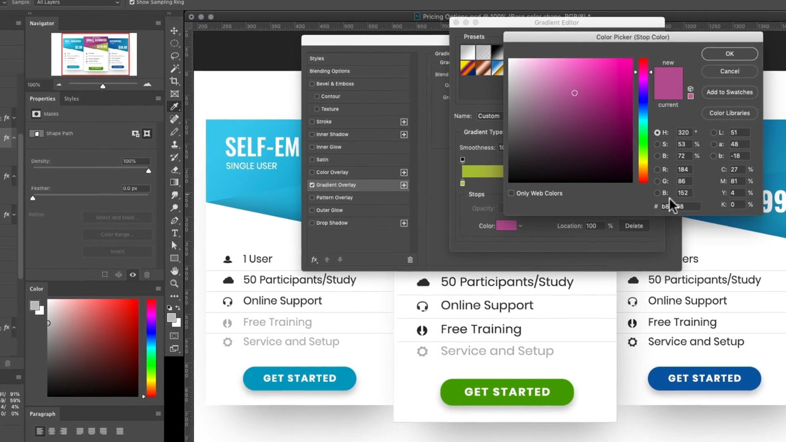

# Adobe [!DNL Stock] 자습서

크리에이터들은 매력적인 시각적 컨텐츠를 신속하게 제공해야 한다는 압박을 받고 있습니다. Adobe Stock은 크리에이티브 팀이 매일 사용하는 Creative Cloud 앱 내에서 3억 개 이상의 로열티 프리 이미지, 비디오, 오디오 파일, 템플릿, 일러스트레이션 및 3D 에셋을 이용할 수 있도록 해 줍니다. Creative Cloud Pro 에디션으로 Adobe Stock 표준 에셋을 무제한으로 이용하세요. stock.adobe.com에서 최신 컬렉션을 살펴보십시오. 튜토리얼을 볼 이미지를 선택합니다.

<table>
<tr>
   <td>
      
      

      <a href="stunning-digital-assets.md"><strong>멋진 디지털 에셋(PDF)</strong></a>
      

      <em>Adobe Stock을 CC Libraries와 통합하여 인쇄와 화면에 대해 일관되고 전문적인 디자인 결과를 만드는 방법에 대한 실습 튜토리얼입니다</em>
       
  </td>
  <td>
      
      

      <a href="searchstock.md"><strong>Adobe 검색 [!DNL Stock] 라이선스 내역</strong></a>
      

      <em>조직의 Adobe을 빠르게 검색하는 방법 알아보기 [!DNL Stock] 기업용 Creative Cloud의 라이선스 내역</em>
       
  </td>
  <td>
      
      

      <a href="handdrawn.md"><strong>Adobe에 손으로 그린 심미적 요소 추가 [!DNL Stock] 이미지</strong></a>
      

      <em>iPad용 Photoshop을 사용하여 이미지에 깊이와 차원을 더하는 고유한 기법으로 크리에이티브 마케팅을 강화하세요.</em>
       
  </td>
  <td>
   
    

   <a href="flairtypography.md"><strong>마스크와 애니메이션을 사용하여 타이포그래피에 멋스러움 더하기</strong></a>
    

    <em>Adobe의 요소를 사용하여 텍스트에 생기 불어넣기 [!DNL Stock] 및 After Effects 애니메이션 스타일</em>
     
  </td>
</tr>
<tr>
  <td>
      
      

      <a href="animatevector.md"><strong>Adobe 애니메이션 적용 [!DNL Stock] Photoshop의 벡터 일러스트레이션</strong></a>
      

      <em>편집 가능한 Adobe 벡터로 뉴스레터 그래픽에 애니메이션 적용 [!DNL Stock]</em>
       
  </td>
 <td>
      
      

      <a href="annualreport.md"><strong>Adobe으로 만든 비디오로 연간 보고서 시작 [!DNL Stock] 및 Spark Video</strong></a>
      

      <em>Adobe을 사용하여 연간 보고서 스토리 만들기 [!DNL Stock] 및 Spark Video</em>
       
  </td>
  <td>
      
      

      <a href="customanimations.md"><strong>Adobe의 맞춤형 애니메이션으로 창의력 발휘 [!DNL Stock]</strong></a>
      

      <em>Adobe 사용 [!DNL Stock] Photoshop의 이미지, 텍스처, 패턴을 맞춤 애니메이션으로 만들기</em>
       
  </td>
  <td>
      
      

      <a href="changecolors.md"><strong>Adobe 변경 [!DNL Stock] 스토리에 어울리는 이미지 색상</strong></a>
      

      <em>Adobe에서 개성 있는 사진 찾기 [!DNL Stock] 필요에 맞게 Adobe Photoshop의 색상 조정</em>
       
  </td>
</tr>
<tr>
 <td>
      
      

      <a href="collage.md"><strong>Adobe을 사용하여 포스터의 3D 콜라주 만들기 [!DNL Stock] 이미지</strong></a>
      

      <em>Adobe Illustrator에서 Adobe 이미지의 시선을 사로잡는 3D 효과를 제공하는 콜라주를 디자인하세요 [!DNL Stock]</em>
       
  </td>
  <td>
      
      

      <a href="boldlabel.md"><strong>Adobe으로 굵은 레이블 만들기 [!DNL Stock] 템플릿 및 Photoshop 고급 개체</strong></a>
      

      <em>Adobe의 사실적인 패키지 템플릿을 사용하여 개성 있는 디자인을 제작하고 시각화하세요 [!DNL Stock]</em>
       
  </td>
  <td>
      
      

      <a href="infographic.md"><strong>Adobe으로 회사 지침 인포그래픽 만들기 [!DNL Stock]</strong></a>
      

      <em>Adobe에서 다양한 에셋 결합 [!DNL Stock] 지침을 시각적으로 매력적인 인포그래픽 형태로 전달합니다.</em>
       
  </td>
 <td>
      
      

      <a href="featurecomparison.md"><strong>Adobe을 사용하여 제품 기능 비교 차트 만들기 [!DNL Stock]</strong></a>
      

      <em>제품 가격 계획을 비교하여 잠재 고객에게 필요한 정보를 한 눈에 제공하는 그래픽을 만듭니다.</em>
       
  </td>
</tr>
<tr>
   <td>
      
      

      <a href="surrealcomposite.md"><strong>Adobe을 사용하여 반초현실 합성 만들기 [!DNL Stock]</strong></a>
      

      <em>여러 이미지를 색상, 동작 및 마스크 효과와 결합하여 기억에 남는 에디토리얼 이미지 만들기</em>
       
  </td>
   <td>
      
      

      <a href="surrealpattern.md"><strong>Adobe을 사용하여 반초현실 패턴 만들기 [!DNL Stock]</strong></a>
      

      <em>Adobe의 초현실적인 이미지를 기반으로 아름답고 매끄러운 패턴 만들기 [!DNL Stock]</em>
       
  </td>
   <td>
      
      

      <a href="productconfigurator.md"><strong>Adobe을 사용하여 대화형 제품 구성자 만들기 [!DNL Stock]</strong></a>
      

      <em>인터랙티브한 요소, 애니메이션 및 Adobe 아트웍의 강력한 기능 사용 [!DNL Stock] 시각적 방식으로 재무 정보를 표현하다</em>
       
  </td>
  <td>
      
      

      <a href="interactivetourismphoto.md"><strong>Adobe을 사용하여 인터랙티브한 관광 사진 만들기 [!DNL Stock] 및 XD</strong></a>
      

      <em>Adobe을 사용하여 웹 사이트 프로토타입에서 인터랙티브한 사진을 빠르게 만듭니다 [!DNL Stock] 및 XD</em>
       
  </td>
</tr>
<tr>
 <td>
      
      

      <a href="animationemail.md"><strong>Adobe이 포함된 이메일용 애니메이션 만들기 [!DNL Stock] 및 Photoshop</strong></a>
      

      <em>Adobe을 사용하여 정지 액션 애니메이션으로 전자 메일에 권한 부여 [!DNL Stock] 및 Photoshop</em>
       
  </td>
  <td>
      
      

      <a href="brandgradients.md"><strong>아름다운 그레이디언트와 Adobe으로 일관된 브랜드 이미지 만들기 [!DNL Stock] 에셋</strong></a>
      

      <em>광고 캠페인에서 색상과 그라디언트를 결합하여 다양한 이미지로 브랜드 일관성을 유지하세요</em>
       
   </td>
  <td>
      
      

      <a href="webgraphics.md"><strong>Adobe을 결합하여 매력적인 웹 그래픽 만들기 [!DNL Stock] CSS를 사용한 이미지</strong></a>
      

      <em>광고 캠페인에서 색상과 그라디언트를 결합하여 다양한 이미지로 브랜드 일관성을 유지하세요</em>
       
  </td>
  <td>
      
      

      <a href="moodboard.md"><strong>Adobe을 사용하여 영감을 주는 무드 보드를 빠르게 제작 [!DNL Stock]</strong></a>
      

      <em>프로젝트 무드 보드를 만들어 팀/클라이언트에 정보, 아이디어, 비주얼 및 색상 팔레트를 전달합니다.</em>
       
  </td>
</tr>
<tr>
   <td>
      
      

      <a href="realisticcomposite.md"><strong>Adobe을 사용하여 사실적인 사진 합성 이미지 만들기 [!DNL Stock] 이미지</strong></a>
      

      <em>두 가지 멋진 Adobe 함께 가져오기 [!DNL Stock] 소셜 게시물에 사람을 그리는 사진</em>
       
  </td>
   <td>
   
    

   <a href="loadingscreen.md"><strong>Adobe을 사용하여 로딩 화면 애니메이션 사용자 정의 [!DNL Stock] 및 XD</strong></a>
    

    <em>Adobe에서 벡터 아트워크 맞춤화 [!DNL Stock] 모바일 앱의 놀라운 로딩 화면 애니메이션 만들기</em>
     
  </td>
  <td>
   
    

   <a href="presentationtemplate.md"><strong>Adobe 사용자 정의 [!DNL Stock] 전문적인 프레젠테이션 템플릿이지만 눈길을 사로잡기</strong></a>
    

    <em>Adobe의 이미지와 템플릿을 사용하여 스타일리시한 프레젠테이션을 신속하게 만들어 보세요 [!DNL Stock] and some easy쉬운 to do쉬운 special특별한 effects효과</em>
     
  </td>
   <td>
   
    

   <a href="customizecolors.md"><strong>Adobe 색상 사용자 정의 [!DNL Stock] 벡터 일러스트레이션</strong></a>
    

    <em>멋진 일러스트레이션으로 모든 프로젝트에 광택을 추가합니다. Adobe에서 완벽한 벡터 찾기 [!DNL Stock]을 입력한 다음 Adobe Illustrator을 사용하여 프로젝트 팔레트에 색상을 일치시킵니다</em>
     
  </td>
</tr>
<tr>
   <td>
      
      

      <a href="assets/AddMotiontoStillImageswithAdobeStockandPhotoshop.pdf"><strong>Adobe을 사용하여 스틸 이미지에 모션 추가 [!DNL Stock] 및 Photoshop (PDF)</strong></a>
      

      <em>비디오를 스틸 이미지에 통합하여 모든 화면에서 관객을 놀라게 할 수 있습니다</em>
       
   </td>
   <td>
   
    

   <a href="assets/CreateacompositewithPhotoshopontheiPadandAdobeStockimages.pdf" target="_blank"><strong>iPad 및 Adobe에서 Photoshop을 사용하여 합성 이미지 만들기 [!DNL Stock] 이미지(PDF)</strong></a>
    

    <em>iPad에서 Photoshop의 강력한 기능을 사용하여 완전히 새로운 방식으로 즐겨 사용하는 Adobe Creative Cloud 앱 중 하나를 사용하는 방법을 알아봅니다.</em>
     
  </td>
   <td>
   
    

   <a href="assets/CreateaUniqueEditorialGraphicwithAfterEffectsandAdobeStock.pdf" target="_blank"><strong>Adobe 애니메이션 적용 [!DNL Stock] Photoshop(PDF)의 벡터 일러스트레이션</strong></a>
    

    <em>After Effects과 Adobe 결합 [!DNL Stock], 시각적으로 스토리를 전달하는 데 도움이 되는 멋진 특수 효과를 빠르게 만들 수 있습니다</em>
     
  </td>
   <td>
      
      

      <a href="assets/CreateUniqueGraphicsbyCombiningAdobeStockImages.pdf" target="_blank"><strong>Adobe을 결합하여 독창적인 그래픽 만들기 [!DNL Stock] 이미지(PDF)</strong></a>
      

      <em>서로 다른 두 이미지를 하나로 결합하여 디자인 프로젝트에 전혀 새로운 장면을 만듭니다. Adobe [!DNL Stock] 간편한 Adobe Photoshop</em>
       
   </td>
</tr>
<tr>
  <td>
      
      

      <a href="assets/CreatingaHalloweenCinemagraphwithPhotoshopCCandAdobeStock.pdf" target="_blank"><strong>Photoshop CC 및 Adobe으로 핼러윈 영화 만들기 [!DNL Stock] (PDF)</strong></a>
      

      <em>Adobe Photoshop을 사용하여 비디오, 일러스트레이션 및 사진을 합성하여 시네마그래프 만들기</em>
       
  </td>
   <td>
      
      

      <a href="assets/PutyourDatainMotionwithAdobeStockandPremierePro.pdf" target="_blank"><strong>Adobe을 사용하여 데이터 이동 [!DNL Stock] 및 Premiere Pro(PDF)</strong></a>
      

      <em>Adobe을 사용하여 데이터를 생동감 있게 표현해 보다 설득력 있는 스토리 전달 [!DNL Stock] 및 Adobe Premiere Pro</em>
       
  </td>
   <td>
      
      

      <a href="assets/RecolorAdobeStockVectorArtworkwithAdobeIllustratortoGetExactlytheLookYouWant.pdf" target="_blank"><strong>Adobe 색상 변경 [!DNL Stock] Adobe Illustrator을 사용한 벡터 아트워크로 원하는 모양(PDF)을 정확히 얻을 수 있습니다</strong></a>
      

      <em>Adobe [!DNL Stock] 고유한 벡터 그래픽을 쉽게 찾을 수 있으며, Adobe Illustrator을 사용하면 창의적인 시각에 맞게 빠르게 수정할 수 있습니다</em>
       
   </td>
   <td>
      
      

      <a href="assets/ShowOffyourDesignWorkintheRealWorldwithAdobeStockandPhotoshop.pdf" target="_blank"><strong>Adobe을 사용하여 디자인 작품을 만들어 보세요. [!DNL Stock] 및 Photoshop (PDF)</strong></a>
      

      <em>다음 단계에 따라 작품을 사실적인 Adobe으로 선보이세요 [!DNL Stock] Adobe Photoshop을 사용한 템플릿</em>
       
  </td>
 </tr> 
 <tr>
   <td>
      
      

      <a href="assets/UncoveramazingdetailsinAdobeStockimageswithLightroomformobile.pdf" target="_blank"><strong>Adobe에서 놀라운 디테일 발견 [!DNL Stock] Lightroom for mobile(PDF)를 사용한 이미지</strong></a>
      

      <em>모바일 디바이스에서 Lightroom을 사용하여 최고의 이미지 품질을 경험해 보십시오.</em>
       
  </td>
  <td>
      
      

      <a href="assets/VisualizePosterDesignsintheRealWorldwithAdobeStockandPhotoshop.pdf" target="_blank"><strong>Adobe을 사용하여 포스터 디자인을 실제 세계에서 시각화 [!DNL Stock] 및 Photoshop (PDF)</strong></a>
      

      <em>실제 환경에서 디자인을 선보임으로써 세상이 어떻게 펼쳐지는지 더 잘 파악할 수 있습니다.</em>
       
  </td>
  <td>
    
    

     
  </td>
</tr>
</table>
